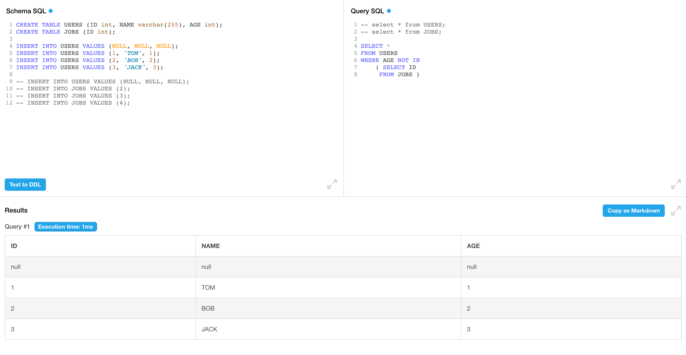

**SQL:**

```sql
SELECT *
FROM users
WHERE age NOT IN
    ( SELECT id
     FROM jobs )
```

**Plan:**

```sql
EnumerableProject(ID=[$0], NAME=[$1], AGE=[$2])
  EnumerableFilter(condition=[OR(=($3, 0), AND(IS NULL($5), >=($4, $3), IS NOT NULL($2)))])
    EnumerableProject(ID=[$0], NAME=[$1], AGE=[$2], c=[$3], ck=[$4], i=[$6])
      EnumerableHashJoin(condition=[=($2, $5)], joinType=[left])
        EnumerableNestedLoopJoin(condition=[true], joinType=[inner])
          EnumerableTableScan(table=[users])
          EnumerableHashAggregate(group=[{}], c=[COUNT()], ck=[COUNT($0)])
            EnumerableTableScan(table=[jobs])
        EnumerableProject(id=[$0], i=[true])
          EnumerableHashAggregate(group=[{0}])
            EnumerableTableScan(table=[jobs])
```

**Plan 转回 SQL**

```sql
SELECT ID,
       NAME,
       AGE
FROM
  (SELECT users.ID,
          users.NAME,
          users.AGE
          t.c,
          t.ck,
          t1.i
   FROM default.users
   CROSS JOIN
     (SELECT COUNT(1) AS c,
             COUNT(ID) AS ck
      FROM default.jobs) AS t
   LEFT JOIN
     (SELECT ID AS id,
             TRUE AS i
      FROM default.jobs
      GROUP BY ID) AS t1 ON users.AGE = t1.id) AS t2
WHERE t2.c = 0
  OR t2.i IS NULL
  AND (t2.ck >= t2.c
       AND t2.AGE IS NOT NULL)
```

NOT IN 转换成了两个 join, 一个是 cross join, 另一个是 left join, 下面对这俩 join 进行分析

### cross join

```sql
EnumerableNestedLoopJoin(condition=[true], joinType=[inner])
  EnumerableTableScan(table=[users])
  EnumerableHashAggregate(group=[{}], c=[COUNT()], ck=[COUNT($0)])
    EnumerableTableScan(table=[jobs])
```

这里先对 jobs 求了 count(*) 和 count(id), 如果 id 没有 null 值, c 和 ck 的值应该是一样的, 注意这个语句只会出来一行数据, 然后这个 cross join 相当于users 拼上了两列(c, ck)

### left join

```sql
EnumerableHashJoin(condition=[=($2, $5)], joinType=[left])
  EnumerableNestedLoopJoin(condition=[true], joinType=[inner])
  EnumerableProject(id=[$0], i=[true])
    EnumerableHashAggregate(group=[{0}])
      EnumerableTableScan(table=[jobs])
```

把上面的 cross join 作为输入, 并且再次 join 了一次 jobs 表(on age = id), 注意, 这里是把 age 和 id 相等的值 join 了起来, 由于是 left join, 右表无匹配则为 null

### filter

小知识点: AND 级别高于 OR, 并不是左结合

```sql
WHERE t2.c = 0
  OR t2.i IS NULL
  AND (t2.ck >= t2.c
       AND t2.AGE IS NOT NULL)
```

最后看下这个 filter, 这个 filter 比较复杂, 还是直接举例把:

原表:


经过两轮 join 之后的表(USERS.ID=JOBS.AGE):


------

首先来断下句: `t2.c = 0 OR (t2.i IS NULL AND (t2.ck >= t2.c AND t2.AGE IS NOT NULL))`

1. `t2.c = 0`:当 JOBS 表为空时的条件, 直接把 USERS 表所有数据选出即可.
2. `t2.i IS NULL AND (t2.ck >= t2.c AND t2.AGE IS NOT NULL)`

- `t2.i IS NULL`: 是当 JOBS 表不为空, i 为 null 代表没有 join 上的值, 符合 not in 语义, 上面例子选出这俩条

| ID   | NAME | AGE  | JOBS.ID | C    | CK   | I    |
| :--- | :--- | :--- | :------ | :--- | :--- | :--- |
| NULL | NULL | NULL | NULL    | NULL | NULL | NULL |
| 1    | TOM  | 1    | NULL    | NULL | NULL | NULL |

- `t2.ck >= t2.c`: 当 JOBS 表ID有 NULL 值时, 整个查询返回空. 举个例子更容易理解: `select 'true' where 3 not in (1, 2, null)`, 这个返回是空, 直接看 not in 比较难理解, 可以改成=, <>来看: `select 'true' where 3 <> 1 and 3 <> 2 and 3 <> null`, `3 <> null` 为UNKNOWN, 既不是 true 也不是 false, 所以这里没有数据返回.
- `t2.AGE IS NOT NULL`: 当 JOBS 表不为空, 需要剔除 USERS 表 age 为 NULL 的行, NULL not in tbl 无法出来值(当 tbl 表有数据时), 再剔除第一条为 null 的, 得到结果

| ID   | NAME | AGE  | JOBS.ID | C    | CK   | I    |
| :--- | :--- | :--- | :------ | :--- | :--- | :--- |
| 1    | TOM  | 1    | NULL    | NULL | NULL | NULL |

### 思考

为什么不直接把 `a.id not in(select id from b)` 转换成 `left join on a.id = b.id where b.id IS NULL`, 需要增加一个 cross join? 答案是当 a.id 存在 null 且 b 表有数据, 会把 null 这行多选出来. 如果再加上 `a.id IS NOT NULL`可行吗? 答案还是不行的, 因为当 b 表无数据, 需要把 a.id null 这行取出来(令人头疼).所以这里加了个 cross join 是非常巧妙的.

### p.s.

SQL 是个三值系统 TRUE/FALSE/UNKNOWN, 其中 NULL 和所有值比较都是 UNKNOWN, 所以你不能写 col = null, 即使 col 真的有 null 值, 也出不来true, 只会出来 UNKNOWN, 正确的 NULL 值判断是 IS NULL/IS NOT NULL

所以这里 xxx NOT IN 也不会把这条NULL值选出来, NULL NOT IN/IN 都不会选出任何值, 他们的结果既不为 TRUE, 也不为 FALSE.

可以看到 jobs 插入了一个 users 不存在的值, 选出的结果会把 null 这行排除掉


但是有一种例外, 当 A not in B, B表是个空表时, 可以选出 A 表所有数据, 可以看到 null 这行数据选了出来

