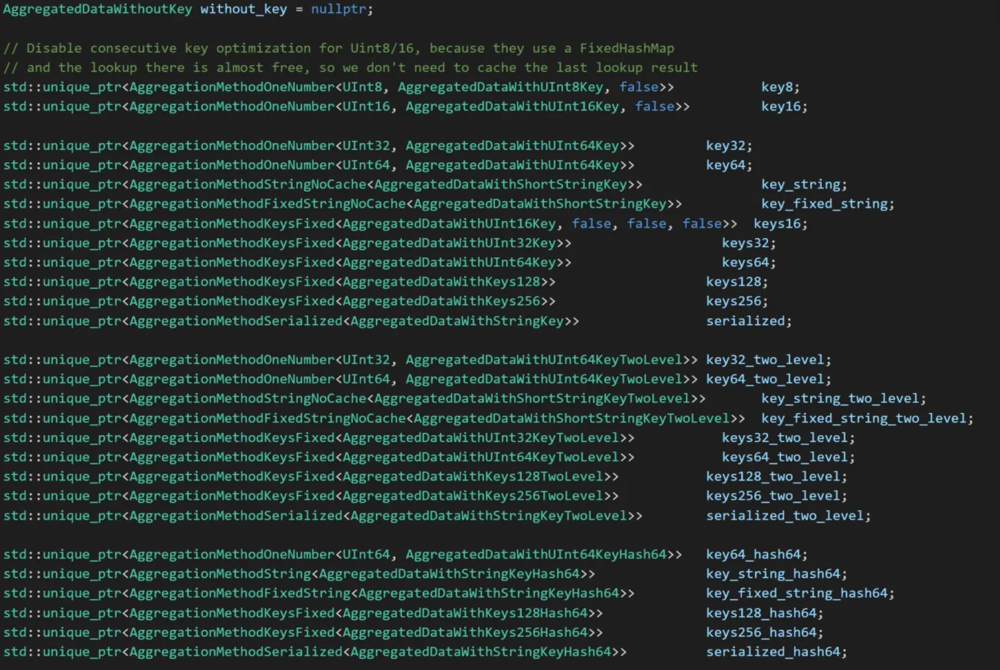

原文转发自
- 知乎叶绿素: https://zhuanlan.zhihu.com/p/591575835
- [ClickHouse源码笔记5:聚合函数的源码再梳理](https://www.cnblogs.com/happenlee/p/14681401.html)
- [ClickHouse源码笔记2:聚合流程的实现 ](https://www.cnblogs.com/happenlee/p/13328977.html)

# ClickHouse之聚合功能源码分析

## 从InterpreterSelectQuery::buildQueryPlan开始

在ClickHouse中，一条SQL语句的处理流程是：

sql -> ast -> query_plan -> pipeline -> execute

本文不关注sql解析到ast的过程（我也没看过...看其他文章，clickhouse手写了个递归下降的语法分析器），从构造query_plan开始分析。query_plan由具有执行先后顺序的query_plan_step组成，聚合操作本身作为一个query_plan_step，排在where操作之后：


## InterpreterSelectQuery::executeAggregation

```cpp
void InterpreterSelectQuery::executeAggregation(QueryPlan & query_plan, const ActionsDAGPtr & expression, bool overflow_row, bool final, InputOrderInfoPtr group_by_info)
{
    ...
    AggregateDescriptions aggregates = query_analyzer->aggregates();
    ...
    // 我们先不关心GROUPING SETS modifier，这个配置项忽略
    auto grouping_sets_params = getAggregatorGroupingSetsParams(*query_analyzer, keys);

    SortDescription group_by_sort_description;

    // 先不关心GROUP BY Optimization Depending on Table Sorting Key这个优化，即默认group_by_info == nullptr;
    if (group_by_info && settings.optimize_aggregation_in_order && !query_analyzer->useGroupingSetKey())
        group_by_sort_description = getSortDescriptionFromGroupBy(getSelectQuery());
    else
        group_by_info = nullptr;

    auto merge_threads = max_streams;
    // aggregation_memory_efficient_merge_threads这个配置项和分布式查询相关，用来降低内存使用的，先不关心。
    auto temporary_data_merge_threads = settings.aggregation_memory_efficient_merge_threads
        ? static_cast<size_t>(settings.aggregation_memory_efficient_merge_threads)
        : static_cast<size_t>(settings.max_threads);

    bool storage_has_evenly_distributed_read = storage && storage->hasEvenlyDistributedRead();

    // 分布式查询相关，先不关心
    const bool should_produce_results_in_order_of_bucket_number
        = options.to_stage == QueryProcessingStage::WithMergeableState && settings.distributed_aggregation_memory_efficient;

    auto aggregating_step = std::make_unique<AggregatingStep>(
        query_plan.getCurrentDataStream(),
        std::move(aggregator_params),
        std::move(grouping_sets_params),
        final,
        settings.max_block_size,
        settings.aggregation_in_order_max_block_bytes,
        merge_threads,
        temporary_data_merge_threads,
        storage_has_evenly_distributed_read,
        settings.group_by_use_nulls,
        std::move(group_by_info),
        std::move(group_by_sort_description),
        should_produce_results_in_order_of_bucket_number);
    query_plan.addStep(std::move(aggregating_step));
}
```

executeAggregation函数的主要流程是，初始化各种配置项，构造AggregatingStep，并将其添加到query_plan中。

## AggregatingStep::transformPipeline

在query_plan构造pipeline时，实际上是调用每个step的transformPipeline函数完成：

```cpp
void AggregatingStep::transformPipeline(QueryPipelineBuilder & pipeline, const BuildQueryPipelineSettings & settings)
{
    ...
    bool allow_to_use_two_level_group_by = pipeline.getNumStreams() > 1 || params.max_bytes_before_external_group_by != 0;

    /// optimize_aggregation_in_order
    if (group_by_info)
    {
        ...
    }

    if (!allow_to_use_two_level_group_by)
    {
        params.group_by_two_level_threshold = 0;
        params.group_by_two_level_threshold_bytes = 0;
    }

    /** Two-level aggregation is useful in two cases:
      * 1. Parallel aggregation is done, and the results should be merged in parallel.
      * 2. An aggregation is done with store of temporary data on the disk, and they need to be merged in a memory efficient way.
      */
    const auto src_header = pipeline.getHeader();
    auto transform_params = std::make_shared<AggregatingTransformParams>(src_header, std::move(params), final);

    // 默认为空，不关心GROUPING SETS modifier
    if (!grouping_sets_params.empty())
    {
        ...
    }

    // 不关心GROUP BY Optimization Depending on Table Sorting Key这个优化，即默认group_by_info == nullptr;
    if (group_by_info)
    {
        ...
    }

    /// If there are several sources, then we perform parallel aggregation
    if (pipeline.getNumStreams() > 1)
    {
        /// Add resize transform to uniformly distribute data between aggregating streams.
        if (!storage_has_evenly_distributed_read)
            pipeline.resize(pipeline.getNumStreams(), true, true);

        auto many_data = std::make_shared<ManyAggregatedData>(pipeline.getNumStreams());

        size_t counter = 0;
        pipeline.addSimpleTransform([&](const Block & header)
        {
            return std::make_shared<AggregatingTransform>(header, transform_params, many_data, counter++, merge_threads, temporary_data_merge_threads);
        });

        /// We add the explicit resize here, but not in case of aggregating in order, since AIO don't use two-level hash tables and thus returns only buckets with bucket_number = -1.
        pipeline.resize(should_produce_results_in_order_of_bucket_number ? 1 : params.max_threads, true /* force */);

        aggregating = collector.detachProcessors(0);
    }
    else
    {
        pipeline.addSimpleTransform([&](const Block & header) { return std::make_shared<AggregatingTransform>(header, transform_params); });

        pipeline.resize(should_produce_results_in_order_of_bucket_number ? 1 : params.max_threads, false /* force */);

        aggregating = collector.detachProcessors(0);
    }
}
```

ClickHouse中对于每个上游的数据流，会构造一个AggregatingTransform的节点进行预聚合，当所有AggregatingTransform节点预聚合完毕后，会通过ExpandPipeline扩展新的节点，这些新的节点负责将预聚合的数据进行合并（Merge）。

也就是说，ClickHouse中的聚合操作整体上分为两个阶段：**预聚合**阶段和**合并**阶段，预聚合阶段是可以并行进行的，（合并阶段在使用两层哈希的情况下也是可以并行的，详见后续）。

注意到，pipeline最后resize了一下，手动调整了output_port的数量，开始我并不明白这里resize的意义是什么，后来搜了一下issue，找到了[这个](https://link.zhihu.com/?target=https%3A//github.com/ClickHouse/ClickHouse/issues/35096) ，里面介绍了在某些情况下会产生性能问题，这里不再展开，感兴趣的朋友可以跳转过去看看。

## AggregatingTransform

AggregatingTransform的工作主要分为两个阶段：

1. 预聚合阶段，通过调用aggregator.executeOnBlock(...)函数执行预聚合。
2. 合并阶段，当预聚合阶段结束（上游通道关闭，或者聚合行数到达了设定的上限），通过扩展pipeline替换上游节点，然后等待合并数据。

注意：

- aggregator这个对象是真正封装了具体的聚合函数、参数、预聚合操作、合并操作的对象，并提供了将聚合结果转换为Blocks的接口，我们暂且可以将aggregator当做一个**黑盒子**，其内部实现涉及到很多优化细节，包括内存池、针对特定类型的哈希表、单层哈希转两层哈希表等等。
- 虽然AggregatingTransform有合并阶段，但真正的合并操作不在这个节点上执行，而是由其扩展的节点执行，这个阶段它只负责传递数据。
- 只有最后一个完成第一阶段的AggregatingTransform才会扩展pipeline，见源码：

```cpp
void AggregatingTransform::work()
{
    if (is_consume_finished)
        initGenerate();
    else
    {
        consume(std::move(current_chunk));
        read_current_chunk = false;
    }
}
```

many_data在所有的AggregatingTransform节点中共享。

```cpp
void AggregatingTransform::initGenerate()
{
    ...
    if (many_data->num_finished.fetch_add(1) + 1 < many_data->variants.size())
        return;
}
```

### AggregatingTransform之扩展pipeline

```cpp
void AggregatingTransform::initGenerate()
{
    ...
    if (many_data->num_finished.fetch_add(1) + 1 < many_data->variants.size())
        return;

    if (!params->aggregator.hasTemporaryData())
    {
        auto prepared_data = params->aggregator.prepareVariantsToMerge(many_data->variants);
        auto prepared_data_ptr = std::make_shared<ManyAggregatedDataVariants>(std::move(prepared_data));
        processors.emplace_back(std::make_shared<ConvertingAggregatedToChunksTransform>(params, std::move(prepared_data_ptr), max_threads));
    }
    else
    {
        ...
        const auto & tmp_data = params->aggregator.getTemporaryData();

        Pipe pipe;
        {
            Pipes pipes;

            for (auto * tmp_stream : tmp_data.getStreams())
                pipes.emplace_back(Pipe(std::make_unique<SourceFromNativeStream>(tmp_stream)));

            pipe = Pipe::unitePipes(std::move(pipes));
        }
        ...
        addMergingAggregatedMemoryEfficientTransform(pipe, params, temporary_data_merge_threads);

        processors = Pipe::detachProcessors(std::move(pipe));
    }
}
```


```cpp
void addMergingAggregatedMemoryEfficientTransform(
    Pipe & pipe,
    AggregatingTransformParamsPtr params,
    size_t num_merging_processors)
{
    pipe.addTransform(std::make_shared<GroupingAggregatedTransform>(pipe.getHeader(), pipe.numOutputPorts(), params));

    if (num_merging_processors <= 1)
    {
        /// --> GroupingAggregated --> MergingAggregatedBucket -->
        pipe.addTransform(std::make_shared<MergingAggregatedBucketTransform>(params));
        return;
    }

    /// -->                                        --> MergingAggregatedBucket -->
    /// --> GroupingAggregated --> ResizeProcessor --> MergingAggregatedBucket --> SortingAggregated -->
    /// -->                                        --> MergingAggregatedBucket -->

    pipe.resize(num_merging_processors);

    pipe.addSimpleTransform([params](const Block &)
    {
        return std::make_shared<MergingAggregatedBucketTransform>(params);
    });

    pipe.addTransform(std::make_shared<SortingAggregatedTransform>(num_merging_processors, params));
}
```

扩展pipeline的具体逻辑在initGenerate()函数中，这里根据aggregator在预聚合过程中是否因为**限制内存使用而将数据写到磁盘文件**，扩展的节点是不同的，

- 如果没有写到磁盘文件，扩展ConvertingAggregatedToChunksTransform节点
- 否则扩展：

1. SourceFromNativeStream节点（每个磁盘文件扩展一个SourceFromNativeStream节点）+
2. GroupingAggregatedTransform（一个）+
3. MergingAggregatedBucketTransform（一个或多个，如果一个则结束）+
4. SortingAggregatedTransform

在进行下面的分析之前，这里需要介绍一下aggregator的两层哈希表机制：

aggregator的预聚合操作，其内部数据是通过哈希表存储的，哈希表的键是“grouping key” value（举例：如果sql语句中group by b，那么哈希表的键是表中b的所有不同的值）。这个哈希表是动态的，随着键数量的增加，ClickHouse会将其切换到两级哈希表以提升性能；另外对于不同的键类型，ClickHouse提供了很多特化版本，以针对特定类型进行优化。

对于单层哈希表，aggregator转化的block是single_level block，对于双层哈希表，aggregator转化的block是two_level block，two_level block会有一个block_num，**可以认为block_num就是双层哈希表的第一层的键**。使用two_level block有两个好处：

1. 可以将执行预聚合的多个节点的相同block_num的block进行组合，那么**不同的组合可以并行的执行合并操作**
2. 如果限制产生two_level block的节点必须按照block_num递增的顺序，那么可以减少内存使用量，因为**需要执行合并操作的数据一定在同一个组合内，当看到一个新的block_num时，意味着所有之前的合并操作已经完成。**

实际上上文将数据写到磁盘文件的分支，就是做了这样的优化。在GroupingAggregatedTransform节点中，会将single_level block转化为two_level block，并按照block_num进行组合，然后交给MergingAggregatedBucketTransform进行合并操作，因为MergingAggregatedBucketTransform可以有多个，因此**合并阶段也可以是并行的**。最后交给SortingAggregatedTransform节点根据block_num进行排序。（老实说不清楚为啥要排序，哈希结果乱序有啥问题呢？）

对于数据没写到磁盘文件的分支，可以看下ConvertingAggregatedToChunksTransform节点的注释：

```text
/// Generates chunks with aggregated data.
/// In single level case, aggregates data itself.
/// In two-level case, creates `ConvertingAggregatedToChunksSource` workers:
///
/// ConvertingAggregatedToChunksSource ->
/// ConvertingAggregatedToChunksSource -> ConvertingAggregatedToChunksTransform -> AggregatingTransform
/// ConvertingAggregatedToChunksSource ->
///
/// Result chunks guaranteed to be sorted by bucket number.
class ConvertingAggregatedToChunksTransform : public IProcessor
```

如果预聚合数据是two_level block，则扩展节点进行并行合并，然后在本节点进行sort；否则直接在本节点合并，这个分支就不详细展开了，如果熟悉了ClickHouse的套路，其实看懂就很简单了。

现在回来说说AggregatingTransform是如何从预聚合阶段切换到合并阶段的，这部分内容也是典型的运行时扩展Pipeline的案例：需要根据计算时的数据动态的判断之后需要执行的节点类型和结构。老实说之前在看Pipeline执行引擎的时候并不理解为什么需要这样的功能，ClickHouse的Pipeline执行引擎真的好强大。（**这部分内容需要你理解Pipeline执行引擎的内部实现**）

- 在预聚合阶段，AggregatingTransform只有一个input_port，这个是原始的上游数据流，节点执行预聚合直到这个input_port被关闭，这时设置is_consume_finished = true并返回Status::Ready;
- 下次执行work()函数的时候会调用initGenerate()函数，这个函数在上面分析过，根据预聚合的数据生成扩展的节点，并且设置is_generate_initialized=true。
- 下次执行prepare()函数的时候会返回Status::ExpandPipeline，见代码：

```cpp
    if (is_generate_initialized && !is_pipeline_created && !processors.empty())
        return Status::ExpandPipeline;
```

- Pipeline执行引擎看到这个状态，调用节点的expandPipeline()函数拿到扩展的节点，并合并到初始的pipeline中：

```cpp
Processors AggregatingTransform::expandPipeline()
{
    if (processors.empty())
        throw Exception("Can not expandPipeline in AggregatingTransform. This is a bug.", ErrorCodes::LOGICAL_ERROR);
    auto & out = processors.back()->getOutputs().front();
    inputs.emplace_back(out.getHeader(), this);
    connect(out, inputs.back());
    is_pipeline_created = true;
    return std::move(processors);
}
```

在这个函数中，AggregatingTransform构造了一个新的input_port，和扩展节点中的最下游节点的output_port连接起来。

- 下次执行prepare()函数的时候，获取的input_port是新构造的那个，**这里实际上等价于切换了上游数据流，切换完成。**

## aggregator

aggregator的类型是Aggregator，它封装了封装了具体的聚合和合并操作。首先来看它的构造函数：

```cpp
Aggregator::Aggregator(const Block & header_, const Params & params_)
    : header(header_)
    , keys_positions(calculateKeysPositions(header, params_))
    , params(params_)
    , tmp_data(params.tmp_data_scope ? std::make_unique<TemporaryDataOnDisk>(params.tmp_data_scope, CurrentMetrics::TemporaryFilesForAggregation) : nullptr)
    , min_bytes_for_prefetch(getMinBytesForPrefetch())
{
    /// Use query-level memory tracker
    // 记录预聚合前的内存使用，作为后续是否写入磁盘文件的依据
    if (auto * memory_tracker_child = CurrentThread::getMemoryTracker())
        if (auto * memory_tracker = memory_tracker_child->getParent())
            memory_usage_before_aggregation = memory_tracker->get();

    aggregate_functions.resize(params.aggregates_size);
    for (size_t i = 0; i < params.aggregates_size; ++i)
        aggregate_functions[i] = params.aggregates[i].function.get();

    /// Initialize sizes of aggregation states and its offsets.
    offsets_of_aggregate_states.resize(params.aggregates_size);
    total_size_of_aggregate_states = 0;
    all_aggregates_has_trivial_destructor = true;

    // aggregate_states will be aligned as below:
    // |<-- state_1 -->|<-- pad_1 -->|<-- state_2 -->|<-- pad_2 -->| .....
    //
    // pad_N will be used to match alignment requirement for each next state.
    // The address of state_1 is aligned based on maximum alignment requirements in states
    for (size_t i = 0; i < params.aggregates_size; ++i)
    {
        offsets_of_aggregate_states[i] = total_size_of_aggregate_states;

        total_size_of_aggregate_states += params.aggregates[i].function->sizeOfData();

        // aggregate states are aligned based on maximum requirement
        align_aggregate_states = std::max(align_aggregate_states, params.aggregates[i].function->alignOfData());

        // If not the last aggregate_state, we need pad it so that next aggregate_state will be aligned.
        if (i + 1 < params.aggregates_size)
        {
            size_t alignment_of_next_state = params.aggregates[i + 1].function->alignOfData();
            if ((alignment_of_next_state & (alignment_of_next_state - 1)) != 0)
                throw Exception("Logical error: alignOfData is not 2^N", ErrorCodes::LOGICAL_ERROR);

            /// Extend total_size to next alignment requirement
            /// Add padding by rounding up 'total_size_of_aggregate_states' to be a multiplier of alignment_of_next_state.
            total_size_of_aggregate_states = (total_size_of_aggregate_states + alignment_of_next_state - 1) / alignment_of_next_state * alignment_of_next_state;
        }

        if (!params.aggregates[i].function->hasTrivialDestructor())
            all_aggregates_has_trivial_destructor = false;
    }

    method_chosen = chooseAggregationMethod();
    HashMethodContext::Settings cache_settings;
    cache_settings.max_threads = params.max_threads;
    aggregation_state_cache = AggregatedDataVariants::createCache(method_chosen, cache_settings);

#if USE_EMBEDDED_COMPILER
    compileAggregateFunctionsIfNeeded();
#endif
}
```

构造函数中主要做了以下几件事：

- 记录预聚合前的内存使用，作为是否将预聚合数据写入磁盘文件的依据
- 每个聚合函数有个对应的State对象，该对象作为预聚合过程中内部数据的存储点，一个sql语句中可以有多个聚合函数，ClickHouse中是将多个聚合函数的State对象分配在一整块内存上的，因此，这里需要计算每个State对象的大小和偏移量。
- 根据键类型选择合适的哈希表，代码见下：

```cpp
AggregatedDataVariants::Type Aggregator::chooseAggregationMethod()
{
    /// If no keys. All aggregating to single row.
    if (params.keys_size == 0)
        return AggregatedDataVariants::Type::without_key;
    ...

    if (has_nullable_key)
    {
        if (params.keys_size == num_fixed_contiguous_keys && !has_low_cardinality)
        {
             ...
        }

        if (has_low_cardinality && params.keys_size == 1)
        {
            ...
        }
    }

    /// No key has been found to be nullable.

    /// Single numeric key.
    if (params.keys_size == 1 && types_removed_nullable[0]->isValueRepresentedByNumber())
    {
        ...
    }

    if (params.keys_size == 1 && isFixedString(types_removed_nullable[0]))
    {
        ...
    }

    /// If all keys fits in N bits, will use hash table with all keys packed (placed contiguously) to single N-bit key.
    if (params.keys_size == num_fixed_contiguous_keys)
    {
        ...
    }

    /// If single string key - will use hash table with references to it. Strings itself are stored separately in Arena.
    if (params.keys_size == 1 && isString(types_removed_nullable[0]))
    {
        ...
    }

    return AggregatedDataVariants::Type::serialized;
}
```

这里根据“grouping key” 的数量、特点（lowCardinality、isNullable、isFixedString）等性质，选择合适的哈希表类型（具体细节各位可以看下源码），默认选择serialized类型的哈希表，这个哈希表的键就是将多个“grouping key”拼接。

- 针对个别类型的哈希表，构造cache，本文不关注。

这里我们总结一下，aggregator的预聚合阶段使用哈希表来存储数据，这个哈希表的键由“grouping key”决定，值就是分配有多个state对象的那块内存。根据“grouping key” 的数量和特点，Clickhouse提供了很多版本的哈希表。

### Aggregator::executeOnBlock

executeOnBlock是执行预聚合的接口

```cpp
bool Aggregator::executeOnBlock(Columns columns,
    size_t row_begin, size_t row_end,
    AggregatedDataVariants & result,
    ColumnRawPtrs & key_columns,
    AggregateColumns & aggregate_columns,
    bool & no_more_keys) const
{
    /// `result` will destroy the states of aggregate functions in the destructor
    result.aggregator = this;

    /// How to perform the aggregation?
    if (result.empty())
    {
        initDataVariantsWithSizeHint(result, method_chosen, params);
        result.keys_size = params.keys_size;
        result.key_sizes = key_sizes;
        LOG_TRACE(log, "Aggregation method: {}", result.getMethodName());
    }

    /** Constant columns are not supported directly during aggregation.
      * To make them work anyway, we materialize them.
      */
    Columns materialized_columns;

    /// Remember the columns we will work with
    for (size_t i = 0; i < params.keys_size; ++i)
    {
        materialized_columns.push_back(recursiveRemoveSparse(columns.at(keys_positions[i]))->convertToFullColumnIfConst());
        key_columns[i] = materialized_columns.back().get();
        ...
    }

    NestedColumnsHolder nested_columns_holder;
    AggregateFunctionInstructions aggregate_functions_instructions;
    prepareAggregateInstructions(columns, aggregate_columns, materialized_columns, aggregate_functions_instructions, nested_columns_holder);

    if ((params.overflow_row || result.type == AggregatedDataVariants::Type::without_key) && !result.without_key)
    {
        AggregateDataPtr place = result.aggregates_pool->alignedAlloc(total_size_of_aggregate_states, align_aggregate_states);
        createAggregateStates(place);
        result.without_key = place;
    }

    if (result.type == AggregatedDataVariants::Type::without_key)
    {
        executeWithoutKeyImpl<false>(result.without_key, row_begin, row_end, aggregate_functions_instructions.data(), result.aggregates_pool);
    }
    else
    {
        /// This is where data is written that does not fit in `max_rows_to_group_by` with `group_by_overflow_mode = any`.
        AggregateDataPtr overflow_row_ptr = params.overflow_row ? result.without_key : nullptr;
        executeImpl(result, row_begin, row_end, key_columns, aggregate_functions_instructions.data(), no_more_keys, overflow_row_ptr);
    }

    size_t result_size = result.sizeWithoutOverflowRow();
    Int64 current_memory_usage = 0;
    if (auto * memory_tracker_child = CurrentThread::getMemoryTracker())
        if (auto * memory_tracker = memory_tracker_child->getParent())
            current_memory_usage = memory_tracker->get();

    /// Here all the results in the sum are taken into account, from different threads.
    auto result_size_bytes = current_memory_usage - memory_usage_before_aggregation;

    bool worth_convert_to_two_level = worthConvertToTwoLevel(
        params.group_by_two_level_threshold, result_size, params.group_by_two_level_threshold_bytes, result_size_bytes);

    /** Converting to a two-level data structure.
      * It allows you to make, in the subsequent, an effective merge - either economical from memory or parallel.
      */
    if (result.isConvertibleToTwoLevel() && worth_convert_to_two_level)
        result.convertToTwoLevel();

    /// Checking the constraints.
    if (!checkLimits(result_size, no_more_keys))
        return false;

    /** Flush data to disk if too much RAM is consumed.
      * Data can only be flushed to disk if a two-level aggregation structure is used.
      */
    if (params.max_bytes_before_external_group_by
        && result.isTwoLevel()
        && current_memory_usage > static_cast<Int64>(params.max_bytes_before_external_group_by)
        && worth_convert_to_two_level)
    {
        size_t size = current_memory_usage + params.min_free_disk_space;
        writeToTemporaryFile(result, size);
    }

    return true;
}
```

这个函数主要做了以下工作：

- initDataVariantsWithSizeHint

result（类型AggregatedDataVariants）是一个out型参数，实际的哈希表也是在这个对象中，这里会执行初始化操作，即根据aggregator选择的哈希表类型来初始化对应的哈希表，略微截图给大家看一下：



直接将各种哈希表硬编码进AggregatedDataVariants类型中，太暴力了。

- materialize columns

ClickHouse中有些列不能在聚合操作中直接使用，比如Const Column、Sparse Column等。这里对“grouping key”中这些列做了具化处理（即格式转换为普通格式）。

- prepareAggregateInstructions

这个函数内部是聚合函数的参数拼接的过程，聚合函数的参数，根据名字找到对应的列数据。

- executeWithoutKeyImpl / executeImpl

执行聚合操作，下面分析

- if convertToTwoLevel
- if writeToTemporaryFile

聚合操作之后，判断是否要将单层哈希表转换为双层，以及是否将数据写到磁盘文件中。

### executeWithoutKeyImpl / executeImpl

executeWithoutKeyImpl实际上是没有group by语句时的聚合操作，比较简单，我们分析executeImpl，executeImpl实际上转发到了executeImplBatch：

```cpp
template <bool no_more_keys, bool use_compiled_functions, bool prefetch, typename Method>
void NO_INLINE Aggregator::executeImplBatch(
    Method & method,
    typename Method::State & state,
    Arena * aggregates_pool,
    size_t row_begin,
    size_t row_end,
    AggregateFunctionInstruction * aggregate_instructions,
    AggregateDataPtr overflow_row) const
{
    ...
    /// NOTE: only row_end-row_start is required, but:
    /// - this affects only optimize_aggregation_in_order,
    /// - this is just a pointer, so it should not be significant,
    /// - and plus this will require other changes in the interface.
    std::unique_ptr<AggregateDataPtr[]> places(new AggregateDataPtr[row_end]);

    /// For all rows.
    for (size_t i = row_begin; i < row_end; ++i)
    {
        AggregateDataPtr aggregate_data = nullptr;

        if constexpr (!no_more_keys)
        {
            ...
            auto emplace_result = state.emplaceKey(method.data, i, *aggregates_pool);

            /// If a new key is inserted, initialize the states of the aggregate functions, and possibly something related to the key.
            if (emplace_result.isInserted())
            {
                /// exception-safety - if you can not allocate memory or create states, then destructors will not be called.
                emplace_result.setMapped(nullptr);

                aggregate_data = aggregates_pool->alignedAlloc(total_size_of_aggregate_states, align_aggregate_states);
                ...
                {
                    createAggregateStates(aggregate_data);
                }

                emplace_result.setMapped(aggregate_data);
            }
            else
                aggregate_data = emplace_result.getMapped();

            assert(aggregate_data != nullptr);
        }
        else
        {
            /// Add only if the key already exists.
            auto find_result = state.findKey(method.data, i, *aggregates_pool);
            if (find_result.isFound())
                aggregate_data = find_result.getMapped();
            else
                aggregate_data = overflow_row;
        }

        places[i] = aggregate_data;
    }
    ...
    /// Add values to the aggregate functions.
    for (size_t i = 0; i < aggregate_functions.size(); ++i)
    {
        AggregateFunctionInstruction * inst = aggregate_instructions + i;

        if (inst->offsets)
            inst->batch_that->addBatchArray(row_begin, row_end, places.get(), inst->state_offset, inst->batch_arguments, inst->offsets, aggregates_pool);
        else if (inst->has_sparse_arguments)
            inst->batch_that->addBatchSparse(row_begin, row_end, places.get(), inst->state_offset, inst->batch_arguments, aggregates_pool);
        else
            inst->batch_that->addBatch(row_begin, row_end, places.get(), inst->state_offset, inst->batch_arguments, aggregates_pool);
    }
}
```

这个函数做了以下工作：

- 遍历需要聚合的行，对每一行我们计算其哈希表中的键，如果这个键在哈希表中不存在，则通过aggregates_pool->alignedAlloc申请一个内存块，并在内存块上初始化每个聚合函数的State对象
- 遍历聚合函数，依次执行预聚合操作（addBatchArray / addBatchSparse / addBatch）。

这部分内容分析到此为止，ClickHouse对聚合函数的封装可以参考[这篇文章](https://link.zhihu.com/?target=https%3A//www.cnblogs.com/happenlee/p/14681401.html) 。

***

# ClickHouse 聚合流程的实现

- **Aggregator::Params类**
  **Aggregator::Params类**是**Aggregator**的内部类。这个类是整个聚合过程之中最重要的类，**查询解析优化后生成聚合查询的执行计划。** 而对应的执行计划的参数都通过**Aggregator::Params类**来初始化，比如**那些列要进行聚合，选取的聚合算子等等**，并传递给对应的Aggregator来实现对应的聚合逻辑。

```cpp
 struct Params
    {
        /// Data structure of source blocks.
        Block src_header;
        /// Data structure of intermediate blocks before merge.
        Block intermediate_header;

        /// What to count.
        const ColumnNumbers keys;
        const AggregateDescriptions aggregates;
        const size_t keys_size;
        const size_t aggregates_size;

        /// The settings of approximate calculation of GROUP BY.
        const bool overflow_row;    /// Do we need to put into AggregatedDataVariants::without_key aggregates for keys that are not in max_rows_to_group_by.
        const size_t max_rows_to_group_by;
        const OverflowMode group_by_overflow_mode;


        /// Settings to flush temporary data to the filesystem (external aggregation).
        const size_t max_bytes_before_external_group_by;        /// 0 - do not use external aggregation.

        /// Return empty result when aggregating without keys on empty set.
        bool empty_result_for_aggregation_by_empty_set;

        VolumePtr tmp_volume;

        /// Settings is used to determine cache size. No threads are created.
        size_t max_threads;

        const size_t min_free_disk_space;
        Params(
            const Block & src_header_,
            const ColumnNumbers & keys_, const AggregateDescriptions & aggregates_,
            bool overflow_row_, size_t max_rows_to_group_by_, OverflowMode group_by_overflow_mode_,
            size_t group_by_two_level_threshold_, size_t group_by_two_level_threshold_bytes_,
            size_t max_bytes_before_external_group_by_,
            bool empty_result_for_aggregation_by_empty_set_,
            VolumePtr tmp_volume_, size_t max_threads_,
            size_t min_free_disk_space_)
            : src_header(src_header_),
            keys(keys_), aggregates(aggregates_), keys_size(keys.size()), aggregates_size(aggregates.size()),
            overflow_row(overflow_row_), max_rows_to_group_by(max_rows_to_group_by_), group_by_overflow_mode(group_by_overflow_mode_),
            group_by_two_level_threshold(group_by_two_level_threshold_), group_by_two_level_threshold_bytes(group_by_two_level_threshold_bytes_),
            max_bytes_before_external_group_by(max_bytes_before_external_group_by_),
            empty_result_for_aggregation_by_empty_set(empty_result_for_aggregation_by_empty_set_),
            tmp_volume(tmp_volume_), max_threads(max_threads_),
            min_free_disk_space(min_free_disk_space_)
        {
        }

        /// Only parameters that matter during merge.
        Params(const Block & intermediate_header_,
            const ColumnNumbers & keys_, const AggregateDescriptions & aggregates_, bool overflow_row_, size_t max_threads_)
            : Params(Block(), keys_, aggregates_, overflow_row_, 0, OverflowMode::THROW, 0, 0, 0, false, nullptr, max_threads_, 0)
        {
            intermediate_header = intermediate_header_;
        }
    };
```

- Aggregator类

  顾名思义，这个是一个实际进行聚合工作展开的类。它最为核心的方法是下面两个函数：

  - **execute函数**：将输入流的stream依照次序进行blcok迭代处理，将聚合的结果写入result之中。
  - **mergeAndConvertToBlocks函数**：将聚合的结果转换为输入流，并通过输入流的read函数将结果继续返回给上一层。
    通过上面两个函数的调用，我们就可以完成**被聚合的数据输入-》 数据聚合 -》 数据输出**的流程。具体的细节笔者会在下一章详细的进行剖析。

```cpp
class Aggregator
{
public:
    Aggregator(const Params & params_);

    /// Aggregate the source. Get the result in the form of one of the data structures.
    void execute(const BlockInputStreamPtr & stream, AggregatedDataVariants & result);

    using AggregateColumns = std::vector<ColumnRawPtrs>;
    using AggregateColumnsData = std::vector<ColumnAggregateFunction::Container *>;
    using AggregateColumnsConstData = std::vector<const ColumnAggregateFunction::Container *>;
    using AggregateFunctionsPlainPtrs = std::vector<IAggregateFunction *>;

    /// Process one block. Return false if the processing should be aborted (with group_by_overflow_mode = 'break').
    bool executeOnBlock(const Block & block, AggregatedDataVariants & result,
        ColumnRawPtrs & key_columns, AggregateColumns & aggregate_columns,    /// Passed to not create them anew for each block
        bool & no_more_keys);

    bool executeOnBlock(Columns columns, UInt64 num_rows, AggregatedDataVariants & result,
        ColumnRawPtrs & key_columns, AggregateColumns & aggregate_columns,    /// Passed to not create them anew for each block
        bool & no_more_keys);

    /** Convert the aggregation data structure into a block.
      * If overflow_row = true, then aggregates for rows that are not included in max_rows_to_group_by are put in the first block.
      *
      * If final = false, then ColumnAggregateFunction is created as the aggregation columns with the state of the calculations,
      *  which can then be combined with other states (for distributed query processing).
      * If final = true, then columns with ready values are created as aggregate columns.
      */
    BlocksList convertToBlocks(AggregatedDataVariants & data_variants, bool final, size_t max_threads) const;

    /** Merge several aggregation data structures and output the result as a block stream.
      */
    std::unique_ptr<IBlockInputStream> mergeAndConvertToBlocks(ManyAggregatedDataVariants & data_variants, bool final, size_t max_threads) const;
    ManyAggregatedDataVariants prepareVariantsToMerge(ManyAggregatedDataVariants & data_variants) const;

    /** Merge the stream of partially aggregated blocks into one data structure.
      * (Pre-aggregate several blocks that represent the result of independent aggregations from remote servers.)
      */
    void mergeStream(const BlockInputStreamPtr & stream, AggregatedDataVariants & result, size_t max_threads);

    using BucketToBlocks = std::map<Int32, BlocksList>;
    /// Merge partially aggregated blocks separated to buckets into one data structure.
    void mergeBlocks(BucketToBlocks bucket_to_blocks, AggregatedDataVariants & result, size_t max_threads);

    /// Merge several partially aggregated blocks into one.
    /// Precondition: for all blocks block.info.is_overflows flag must be the same.
    /// (either all blocks are from overflow data or none blocks are).
    /// The resulting block has the same value of is_overflows flag.
    Block mergeBlocks(BlocksList & blocks, bool final);

     std::unique_ptr<IBlockInputStream> mergeAndConvertToBlocks(ManyAggregatedDataVariants & data_variants, bool final, size_t max_threads) const;

    using CancellationHook = std::function<bool()>;

    /** Set a function that checks whether the current task can be aborted.
      */
    void setCancellationHook(const CancellationHook cancellation_hook);

    /// Get data structure of the result.
    Block getHeader(bool final) const;
```

### 2.聚合流程的实现

这里我们就从上文提到的**Aggregator::execute(const BlockInputStreamPtr & stream, AggregatedDataVariants & result)**函数作为起点来梳理一下ClickHouse的聚合实现：

```cpp
void Aggregator::execute(const BlockInputStreamPtr & stream, AggregatedDataVariants & result)
{
    Stopwatch watch;

    size_t src_rows = 0;
    size_t src_bytes = 0;

    /// Read all the data
    while (Block block = stream->read())
    {
        if (isCancelled())
            return;

        src_rows += block.rows();
        src_bytes += block.bytes();

        if (!executeOnBlock(block, result, key_columns, aggregate_columns, no_more_keys))
            break;
    }
```

由上述代码可以看出，**这里就是依次读取子节点流生成的Block，然后继续调用executeOnBlock方法来执行聚合流程处理每一个Block的聚合。**接着我们按图索骥，继续看下去，这个函数比较长，我们拆分成几个部分，并且把无关紧要的代码先去掉：**这部分主要完成的工作就是将param之中指定的key列与聚合列的指针作为参数提取出来，并且和聚合函数一起封装到AggregateFunctionInstructions的结构之中。**

```cpp
bool Aggregator::executeOnBlock(Columns columns, UInt64 num_rows, AggregatedDataVariants & result,
    ColumnRawPtrs & key_columns, AggregateColumns & aggregate_columns, bool & no_more_keys)
{
    /// `result` will destroy the states of aggregate functions in the destructor
    result.aggregator = this;

    /// How to perform the aggregation?
    if (result.empty())
    {
        result.init(method_chosen);
        result.keys_size = params.keys_size;
        result.key_sizes = key_sizes;
        LOG_TRACE(log, "Aggregation method: " << result.getMethodName());
    }

    for (size_t i = 0; i < params.aggregates_size; ++i)
        aggregate_columns[i].resize(params.aggregates[i].arguments.size());

    /** Constant columns are not supported directly during aggregation.
      * To make them work anyway, we materialize them.
      */
    Columns materialized_columns;

    /// Remember the columns we will work with
    for (size_t i = 0; i < params.keys_size; ++i)
    {
        materialized_columns.push_back(columns.at(params.keys[i])->convertToFullColumnIfConst());
        key_columns[i] = materialized_columns.back().get();

        if (!result.isLowCardinality())
        {
            auto column_no_lc = recursiveRemoveLowCardinality(key_columns[i]->getPtr());
            if (column_no_lc.get() != key_columns[i])
            {
                materialized_columns.emplace_back(std::move(column_no_lc));
                key_columns[i] = materialized_columns.back().get();
            }
        }
    }

    AggregateFunctionInstructions aggregate_functions_instructions(params.aggregates_size + 1);
    aggregate_functions_instructions[params.aggregates_size].that = nullptr;

    std::vector<std::vector<const IColumn *>> nested_columns_holder;
    for (size_t i = 0; i < params.aggregates_size; ++i)
    {
        for (size_t j = 0; j < aggregate_columns[i].size(); ++j)
        {
            materialized_columns.push_back(columns.at(params.aggregates[i].arguments[j])->convertToFullColumnIfConst());
            aggregate_columns[i][j] = materialized_columns.back().get();

            auto column_no_lc = recursiveRemoveLowCardinality(aggregate_columns[i][j]->getPtr());
            if (column_no_lc.get() != aggregate_columns[i][j])
            {
                materialized_columns.emplace_back(std::move(column_no_lc));
                aggregate_columns[i][j] = materialized_columns.back().get();
            }
        }

        aggregate_functions_instructions[i].arguments = aggregate_columns[i].data();
        aggregate_functions_instructions[i].state_offset = offsets_of_aggregate_states[i];
        auto that = aggregate_functions[i];
        /// Unnest consecutive trailing -State combinators
        while (auto func = typeid_cast<const AggregateFunctionState *>(that))
            that = func->getNestedFunction().get();
        aggregate_functions_instructions[i].that = that;
        aggregate_functions_instructions[i].func = that->getAddressOfAddFunction();

        if (auto func = typeid_cast<const AggregateFunctionArray *>(that))
        {
            /// Unnest consecutive -State combinators before -Array
            that = func->getNestedFunction().get();
            while (auto nested_func = typeid_cast<const AggregateFunctionState *>(that))
                that = nested_func->getNestedFunction().get();
            auto [nested_columns, offsets] = checkAndGetNestedArrayOffset(aggregate_columns[i].data(), that->getArgumentTypes().size());
            nested_columns_holder.push_back(std::move(nested_columns));
            aggregate_functions_instructions[i].batch_arguments = nested_columns_holder.back().data();
            aggregate_functions_instructions[i].offsets = offsets;
        }
        else
            aggregate_functions_instructions[i].batch_arguments = aggregate_columns[i].data();

        aggregate_functions_instructions[i].batch_that = that;
    }
```

将需要准备的参数准备好了之后，后续就通过按部就班的调用**executeImpl(\*result.NAME, result.aggregates_pool, num_rows, key_columns, aggregate_functions_instructions.data(),
no_more_keys, overflow_row_ptr)**聚合运算了。我们来看看它的实现，它是一个模板函数，内部通过调用了 **executeImplBatch(method, state, aggregates_pool, rows, aggregate_instructions)**来实现的，数据库都会通过Batch的形式，一次性提交一组需要操作的数据来减少虚函数调用的开销。

```cpp
template <typename Method>
void NO_INLINE Aggregator::executeImpl(
    Method & method,
    Arena * aggregates_pool,
    size_t rows,
    ColumnRawPtrs & key_columns,
    AggregateFunctionInstruction * aggregate_instructions,
    bool no_more_keys,
    AggregateDataPtr overflow_row) const
{
    typename Method::State state(key_columns, key_sizes, aggregation_state_cache);

    if (!no_more_keys)
        executeImplBatch(method, state, aggregates_pool, rows, aggregate_instructions);
    else
        executeImplCase<true>(method, state, aggregates_pool, rows, aggregate_instructions, overflow_row);
}
```

那我们就继续看下去，executeImplBatch同样也是一个模板函数。

- 首先，它构造了一个AggregateDataPtr的数组places，这里是这就是后续我们实际聚合结果存放的地方。这个数据的长度也就是这个Batch的长度，也就是说，聚合结果的指针也作为一组列式的数据，参与到后续的聚合运算之中。
- 接下来，通过一个for循环，依次调用state.emplaceKey，计算每列聚合key的hash值，进行分类，并且将对应结果依次和places对应。
- 最后，通过一个for循环，调用聚合函数的addBatch方法，（这个函数我们在上一篇之中介绍过）。每个AggregateFunctionInstruction都有一个制定的places_offset和对应属于进行聚合计算的value列，这里通过一个for循环调用AddBatch，将places之中对应的数据指针和聚合value列进行聚合，最终形成所有的聚合计算的结果。

到这里，整个聚合计算的核心流程算是完成了，后续就是将result的结果通过上面的convertToBlock的方式转换为BlockStream流，继续返回给上层的调用方。

```rust
template <typename Method>
void NO_INLINE Aggregator::executeImplBatch(
    Method & method,
    typename Method::State & state,
    Arena * aggregates_pool,
    size_t rows,
    AggregateFunctionInstruction * aggregate_instructions) const
{
    PODArray<AggregateDataPtr> places(rows);

    /// For all rows.
    for (size_t i = 0; i < rows; ++i)
    {
        AggregateDataPtr aggregate_data = nullptr;

        auto emplace_result = state.emplaceKey(method.data, i, *aggregates_pool);

        /// If a new key is inserted, initialize the states of the aggregate functions, and possibly something related to the key.
        if (emplace_result.isInserted())
        {
            /// exception-safety - if you can not allocate memory or create states, then destructors will not be called.
            emplace_result.setMapped(nullptr);

            aggregate_data = aggregates_pool->alignedAlloc(total_size_of_aggregate_states, align_aggregate_states);
            createAggregateStates(aggregate_data);

            emplace_result.setMapped(aggregate_data);
        }
        else
            aggregate_data = emplace_result.getMapped();

        places[i] = aggregate_data;
        assert(places[i] != nullptr);
    }

    /// Add values to the aggregate functions.
    for (AggregateFunctionInstruction * inst = aggregate_instructions; inst->that; ++inst)
    {
        if (inst->offsets)
            inst->batch_that->addBatchArray(rows, places.data(), inst->state_offset, inst->batch_arguments, inst->offsets, aggregates_pool);
        else
            inst->batch_that->addBatch(rows, places.data(), inst->state_offset, inst->batch_arguments, aggregates_pool);
    }
```

# ClickHouse 聚合函数的源码再梳理

### 1.IAggregateFunction接口梳理

话不多说，直接上代码，笔者这里会将所有聚合函数的核心接口代码全部列出，一一梳理各个部分：

##### 构造函数

```javascript
 IAggregateFunction(const DataTypes & argument_types_, const Array & parameters_)
        : argument_types(argument_types_), parameters(parameters_) {}
```

上面的代码实现了`IAggregateFunction`接口的构造函数，初始化了该接口的两个成员变量：

- `argument_type`：函数的参数类型，比如函数`select sum(a), sum(b), c from test group by c`, 这里`a`, `b`分别是UInt16类型与Double类型，那么这个`sum(a)`与`sum(b)`的参数就不同。
- `parameters`: 参数，实际类型为`std::vector<Field>`。它代表着函数的除了数据的输入参数之外的其他参数。比如聚合函数`topk`，其中需要传入的`k`的值就在`parameters`之中。

##### 内存分配接口

在Clickhouse的聚合执行过程之中，所有的聚合函数都是通过列来进行的。而这里有两个重要的问题：

- 列内存从哪里分配
- 分配的内存结构，长度是如何的
  笔者在梳理下面代码的过程之中给出解答,

```cpp
    /** Create empty data for aggregation with `placement new` at the specified location.
      * You will have to destroy them using the `destroy` method.
      */
    virtual void create(AggregateDataPtr place) const = 0;

    /// Delete data for aggregation.
    virtual void destroy(AggregateDataPtr place) const noexcept = 0;
```

`IAggregateFunction`定义的两个接口`create`与`destory`接口完成了内存结构与长度的确定，这里可能描述的不是很明白，这里了解Doris聚合实现的同学可以这样理解。`create`函数本身就是完成了Doris聚合函数之中`init`函数所完成的工作。这里通过子类`IAggregateFunctionDataHelper`的实现代码来进一步理解它做了什么事情：

```cpp
    void create(AggregateDataPtr place) const override
    {
        new (place) Data;
    }

    void destroy(AggregateDataPtr place) const noexcept override
    {
        data(place).~Data();
    }
```

这部分代码很简单，`Data`就是模板派生的类型，然后通过`placement new`与`placement delete`的方式完成了`Data`类型的构造与析构。而这个`Data`类型就是聚合函数存储中间结果的类型，比如`sum`的聚合函数的派生类型是类`AggregateFunctionSumData`的内存结构，它不仅包含了聚合结果的数据`sum`同时也包含了一组进行聚合计算的函数接口`add`,`merge`等:

```cpp
template <typename T>
struct AggregateFunctionSumData
{
    T sum{};

    void add(T value)
    {
        sum += value;
    }

    void merge(const AggregateFunctionSumData & rhs)
    {
        sum += rhs.sum;
    }

    T get() const
    {
        return sum;
    }
};
```

这里就是通过`create`与`destory`函数调用`AggregateFunctionSumData`的构造函数与析构函数。而问题又绕回第一个问题了，这部分内存是在哪里分配的呢？

```lisp
 aggregate_data = aggregates_pool->alignedAlloc(total_size_of_aggregate_states, align_aggregate_states);
 createAggregateStates(aggregate_data);
```

在进行聚合运算时，通过`Aggregator`之中的内存池进行单行所有的聚合函数的数据结果的内存分配。并且调用`createAggregateStates`依次调用各个聚合函数的`create`方法进行构造函数的调用。这部分可能有些难理解，我们接着看下面的流程图，来更好的帮助理解：


通过上述流程图可以看到，`create`这部分就是在构造聚合hash表时，进行内存初始化工作的，而这部分内存不仅仅包含了聚合函数的结果数据，还包含了对应聚合算子的函数指针。后文我们分析计算接口的时候也会同样看到。接下来，来看`destory`就很容易理解了，就是在聚合计算结束或取消时，遍历hash表，并调用析构函数对hash表中存储的`Data`类型调用析构函数，而最终的内存伴随着`aggregates_pool`内存池的析构而同时释放。


##### 函数计算接口

接下来就是聚合函数最核心的部分，聚合函数的计算。

```cpp
/** Adds a value into aggregation data on which place points to.
     *  columns points to columns containing arguments of aggregation function.
     *  row_num is number of row which should be added.
     *  Additional parameter arena should be used instead of standard memory allocator if the addition requires memory allocation.
     */
    virtual void add(AggregateDataPtr place, const IColumn ** columns, size_t row_num, Arena * arena) const = 0;

    /// Merges state (on which place points to) with other state of current aggregation function.
    virtual void merge(AggregateDataPtr place, ConstAggregateDataPtr rhs, Arena * arena) const = 0;

    /** Contains a loop with calls to "add" function. You can collect arguments into array "places"
      *  and do a single call to "addBatch" for devirtualization and inlining.
      */
    virtual void addBatch(size_t batch_size, AggregateDataPtr * places, size_t place_offset, const IColumn ** columns, Arena * arena) const = 0;
```

`IAggregateFunction`定义的3个接口:

- `add`函数将**对应AggregateDataPtr指针之中数据取出，与列columns中的第row_num的数据进行对应的聚合计算**。
- `addBatch`函数：这是函数也是非常重要的，虽然它仅仅实现了一个for循环调用add函数。它通过这样的方式来减少虚函数的调用次数，并且增加了编译器内联的概率，同样，它实现了高效的向量化。
- `merge`函数：将两个聚合结果进行合并的函数，通常用在并发执行聚合函数的过程之中，需要将对应的聚合结果进行合并。

这里的两个函数类似Doris之中聚合函数的`update`与`merge`。接下来我们看它是如何完成工作的。

首先看聚合节点Aggregetor是如何调用`addBatch`函数：

```rust
   /// Add values to the aggregate functions.
    for (AggregateFunctionInstruction * inst = aggregate_instructions; inst->that; ++inst)
        inst->that->addBatch(rows, places.data(), inst->state_offset, inst->arguments, aggregates_pool);
```

这里依次遍历`AggregateFunction`，并调用`addBatch`接口。而`addBatch`接口就是一行行的遍历列，将参数列`inst->arguments`与上文提到`create`函数构造的聚合数据结构的两列列数据进行聚合计算:

```cpp
    void addBatch(size_t batch_size, AggregateDataPtr * places, size_t place_offset, const IColumn ** columns, Arena * arena) const override
    {
        for (size_t i = 0; i < batch_size; ++i)
            static_cast<const Derived *>(this)->add(places[i] + place_offset, columns, i, arena);
    }
```

这里还是调用了`add`函数，我们通过`AggregateFunctionSum`作为子类来具体看一下add的具体实现:

```cpp
   void add(AggregateDataPtr place, const IColumn ** columns, size_t row_num, Arena *) const override
    {
        const auto & column = static_cast<const ColVecType &>(*columns[0]);
        this->data(place).add(column.getData()[row_num]);
    }
```

这里其实还是调用上文提到的`AggregateFunctionSumData`的内存结构的`add`函数完成聚合计算。而这个`add`函数就是一个简单的相加逻辑，这样就完成了简单的一次聚合运算。

```javascript
   void add(T value)
    {
        sum += value;
    }
```

而`merge`函数的实现逻辑类似于`add`函数，这里就不展开再次分析了。

##### 函数结果输出接口

最后就是聚合函数结果输出接口，将聚合计算的结果重新组织为列存。

```cpp
  /// Inserts results into a column.
    virtual void insertResultInto(ConstAggregateDataPtr place, IColumn & to) const = 0;
```

首先看聚合节点`Aggregator`是如何调用`insertResultInto`函数的

```scss
 data.forEachValue([&](const auto & key, auto & mapped)
    {
        method.insertKeyIntoColumns(key, key_columns, key_sizes);

        for (size_t i = 0; i < params.aggregates_size; ++i)
            aggregate_functions[i]->insertResultInto(
                mapped + offsets_of_aggregate_states[i],
                *final_aggregate_columns[i]);
    });
```

`Aggregetor`同样是遍历hash表之中的结果，将`key`列先组织成列存，然后调用`insertResultInto`函数将聚合计算的结果也转换为列存。
这里我们找一个`sum`函数的实现，来看看`insertResultInto`函数接口是如何工作的：

```cpp
    void insertResultInto(ConstAggregateDataPtr place, IColumn & to) const override
    {
        auto & column = static_cast<ColVecResult &>(to);
        column.getData().push_back(this->data(place).get());
    }
```

其实很简单，就是调用`AggregateDataPtr`,也就是`AggregateFunctionSumData`的`get()`函数获取`sum`计算的结果，然后添加到列内存之中。

`get`函数接口的实现如下：

```csharp
    T get() const
    {
        return sum;
    }
```

### 2.聚合函数的注册流程

有了上述的背景知识，我们接下来举个**栗子**。来看看一个聚合函数的实现细节，以及它是如何被使用的。

#### AggregateFunctionSum

这里选取了一个很简单的聚合算子Sum，我们来看看它实现的代码细节。
这里我们可以看到`AggregateFunctionSum`是个final类，无法被继承了。而它继承`IAggregateFunctionHelp`类与`IAggregateFunctionDataHelper`类。

- `IAggregateFunctionHelp`类 通过**CRTP**让父类可以直接调用子类的`add`函数指针而避免了虚函数调用的开销。
- `IAggregateFunctionHelper`类则包含了`Data`的模板数据类型，也就是上文提及的`AggregateFunctionSumData`进行内存结构的`create`，`destory`等等。

这里我们就重点看，这个类override了`getName`方法，返回了对应的名字时`sum`。并且实现了我们上文提到核心方法。

```cpp
template <typename T, typename TResult, typename Data>
class AggregateFunctionSum final : public IAggregateFunctionDataHelper<Data, AggregateFunctionSum<T, TResult, Data>>
{
public:
    using ResultDataType = std::conditional_t<IsDecimalNumber<T>, DataTypeDecimal<TResult>, DataTypeNumber<TResult>>;
    using ColVecType = std::conditional_t<IsDecimalNumber<T>, ColumnDecimal<T>, ColumnVector<T>>;
    using ColVecResult = std::conditional_t<IsDecimalNumber<T>, ColumnDecimal<TResult>, ColumnVector<TResult>>;

    String getName() const override { return "sum"; }

    AggregateFunctionSum(const DataTypes & argument_types_)
        : IAggregateFunctionDataHelper<Data, AggregateFunctionSum<T, TResult, Data>>(argument_types_, {})
        , scale(0)
    {}

    AggregateFunctionSum(const IDataType & data_type, const DataTypes & argument_types_)
        : IAggregateFunctionDataHelper<Data, AggregateFunctionSum<T, TResult, Data>>(argument_types_, {})
        , scale(getDecimalScale(data_type))
    {}

    DataTypePtr getReturnType() const override
    {
        if constexpr (IsDecimalNumber<T>)
            return std::make_shared<ResultDataType>(ResultDataType::maxPrecision(), scale);
        else
            return std::make_shared<ResultDataType>();
    }

    void add(AggregateDataPtr place, const IColumn ** columns, size_t row_num, Arena *) const override
    {
        const auto & column = static_cast<const ColVecType &>(*columns[0]);
        this->data(place).add(column.getData()[row_num]);
    }

    void merge(AggregateDataPtr place, ConstAggregateDataPtr rhs, Arena *) const override
    {
        this->data(place).merge(this->data(rhs));
    }

    void serialize(ConstAggregateDataPtr place, WriteBuffer & buf) const override
    {
        this->data(place).write(buf);
    }

    void deserialize(AggregateDataPtr place, ReadBuffer & buf, Arena *) const override
    {
        this->data(place).read(buf);
    }

    void insertResultInto(ConstAggregateDataPtr place, IColumn & to) const override
    {
        auto & column = static_cast<ColVecResult &>(to);
        column.getData().push_back(this->data(place).get());
    }

private:
    UInt32 scale;
};
```

之前我们讲到`AggregateFunction`的函数就是通过`AggregateDataPtr`指针来获取`AggregateFunctionSumData`的地址，来调用add实现聚合算子的。我们可以看到`AggregateFunctionSumData`实现了前文提到的`add, merge, write,read`四大方法，正好与接口`IAggregateFunction`一一对应上了。

```cpp
template <typename T>
struct AggregateFunctionSumData
{
    T sum{};

    void add(T value)
    {
        sum += value;
    }

    void merge(const AggregateFunctionSumData & rhs)
    {
        sum += rhs.sum;
    }

    void write(WriteBuffer & buf) const
    {
        writeBinary(sum, buf);
    }

    void read(ReadBuffer & buf)
    {
        readBinary(sum, buf);
    }

    T get() const
    {
        return sum;
    }
};
```

ClickHouse在Server启动时。main函数之中会调用`registerAggregateFunction`的初始化函数注册所有的聚合函数。
然后调用到下面的函数注册`sum`的聚合函数：

```javascript
void registerAggregateFunctionSum(AggregateFunctionFactory & factory)
{
    factory.registerFunction("sum", createAggregateFunctionSum<AggregateFunctionSumSimple>, AggregateFunctionFactory::CaseInsensitive);
}
```

也就是完成了这个`sum`聚合函数的注册，后续我们get出来就可以愉快的调用啦。（这部分有许多模板派生的复杂代码，建议与源码结合梳理才能事半功倍~~）

### 3.要点梳理

第二小节解析了一个聚合函数与接口意义对应的流程，这里重点梳理聚合函数实现的源码要点：

1. 各个聚合函数核心的实现`add`,`merge`与序列化，内存结构初始化，内存结构释放的接口。
2. 各个函数的实现需要继承**IAggregateFunctionDataHelper**的接口，而它的父类是`IAggregateFunctionHelper`与`IAggregateFunction`接口。
3. ClickHouse的聚合函数保证了每次循环遍历一个Block只调用一个`IAggregateFunction`的聚合函数，这样最大程度上确保了向量化执行的可能性，减少了数据偏移与依赖。