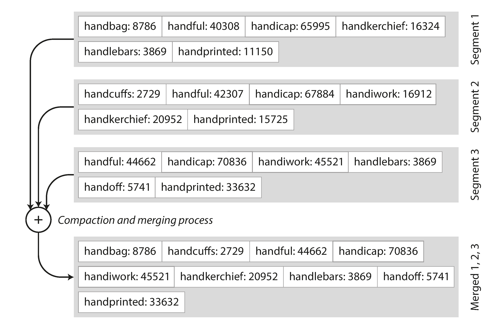

# Index 基础
log:泛指 append only 的记录序列.不一定要人可读, 可以是 binary 的.

log 文件是 append only, 而且一旦生成就不可变, 所以对并发和崩溃恢复很友好. 如果用 update 方式来修改值的话, 崩溃时会有很多不可预期的行为.

核心, 就是要减少扫的数据量. full scan (O(n)) 肯定最慢, 扫的时间和数据量成正比.

index 的也就是存出一些额外的信息, 这样的话帮助你定位到你的数据. 管理额外的信息是有开销的:存储(写入) 管理(更新), 所以 db 不会索引所有值.

## Hash Index
要找 key 为123456的 content, 只需要先在内存 map 中找到它的 byte offset , 只要一次 seek 过去,读到和下一个 key 的 offset相减的 content. 读的很精准.

> Storing a log of key-value pairs in a CSV-like format, indexed with an in-memory hash map.

通过追加的方式, 可能会造成一个文件太大了, 解决方案是把当 log 到一定 size, 就拆分一个新 segment 文件. 后面我们可以对这些 segments 进行 compaction. compact 会去除 dup 的 key, 留下最新的版本.

还可以对多个 seg 进行 merge.

>对一个 seg 进行 compact

>对 seg 进行 compact, 同时进行 merge.

### 局限
1. 散列表必须能放进内存. 原则上可以在磁盘上保留一个哈希映射, 但是磁盘哈希映射很难表现优秀, 它需要大量的随机访问I/O, 当它变满时增长也是很昂贵的,并且散列冲突需要很多的逻辑
2. 范围查询效率不高, 必须在散列映射中单独查找每个键.

## SSLTables and LSM-Trees
之前的 log 文件里 record 的顺序是他们写入的顺序.我们现在有个新的要求, 就是写入的 k-v 对要根据 key 排序, 且每个 key 在每个 seg 中只出现一次, 这种 format 叫做 Sorted String Table(SSTable)

### 优势
1. 可以 merge 比内存还大的多的 seg(使用 merge sort), 对于多个 seg 中都出现的值, 只需要留最新的 seg 中的值就可以了.

2. index 不用保留所有的 key, 因为你所有的 key 都是保序的, 所以只要有几个作为base, 其他的可以在这几个 base 之间去找. 假设你正在内存中寻找键 handiwork，但是你不知道段文件中该关键字的确切偏移量. 然而，你知道 handbag 和 handsome 的偏移，而且由于排序特性，你知道 handiwork 必须出现在这两者之间. 这意味着您可以跳到 handbag 的偏移位置并从那里扫描，直到您找到 handiwork(或没找到，如果该文件中没有该键)

这样, 你内存中的索引就可以很稀疏, 每几千字节的段文件就有一个键就足够了，因为几千字节可以很快被扫描.

如果所有的 k-v 都是 fix length 的, 你可以用 binary search. 这样可以省去整个内存中的索引.不过 in practice 一般都是变长的.

### 维护和构建 SSTables
在磁盘上维护一个有序的数据结构是可能的(见 B Tree), 但是在内存中维护会更加简单.类似的结构有 red-black trees, AVL tress.

#### 工作流

1. 写入时将其添加到内存中的平衡树数据结构(例如, 红黑树). 这个内存树有时被称为内存表(mem table).
2. 当内存表大于某个阈值(通常为几兆字节)时, 将其作为 SSTable 文件写入磁盘.新的 SSTable 文件成为数据库的最新部分.当 SSTable 被写入磁盘时, 写入可以继续到一个新的内存表实例.
3. 当读的时候, 首先尝试在内存表中找到关键字, 然后在最近的磁盘段中, 然后在下一个较旧的段中找到该关键字.
4. 可以在后台运行合并和压缩过程以组合段文件并丢弃覆盖或删除的值.

基于这种合并和压缩排序文件原理的存储引擎通常被称为 LSM 存储引擎(LevelDB, RocksDB, HBase, BigTable)

##### 性能优化
1. 当查找数据库中不存在的值时, LSM 会慢, 因为要找到最老的 seg, 解决方法是用 Bloom Filter(粗糙集理论也可以了解下). 节省为不存在的键浪费的 IO.
2. 还有不同的策略来确定 SSTables 如何被压缩和合并的顺序和时间. 最常见的选择是 size-tiered 和 leveled compaction. LevelDB 和 RocksDB 使用平坦压缩(LevelDB 因此得名), HBase 使用size-tiered , Cassandra 同时支持.

即使有很多可选优化, 但是 LSM-trees 的基本 idea:保存一系列在后台合并的 SSTables, 简单且有效. 即使数据集比可用内存大的多, 也可以支持高效的范围查询, 而且支持非常高的写入.

##### 问题&解决
如果数据库崩溃, 则最近的写入(在内存表中, 但尚未写入磁盘)将丢失, 解决方案: WAL(write ahead log), 和前面的一样, 这也是个 log 文件, 写入的时候先写到磁盘上. 但 mem table => SSTable 的时候, WAL 可以被丢弃.

## B-Trees
像 SSTables 一样, B 树保持按键排序的键值对, 这允许高效的键值查找和范围查询, 但B 树有着非常不同的设计理念.

我们前面看到的日志结构索引将数据库分解为可变大小的段, 通常是几兆字节或更大的大小; B 树将数据库分解成固定大小的块或页面, 传统上大小为 4KB.并且一次只能读取或写入一个页面. 这种设计更接近于底层硬件.因为磁盘也被安排在固定大小的块中.

每个页面都可以使用地址或位置来标识, 这允许一个页面引用另一个页面 —— 类似于指针, 但在磁盘而不是在内存中. 我们可以使用这些页面引用来构建一个页面树.

我们要找251, 于是在[200, 300] 中间找

在 B 树的一个页面中对子页面的引用的数量称为分支因子, 在上面图中, 分支因子是6. 在实践中, 分支因子取决于存储页面参考和范围边界所需的空间量, 但通常是几百个

如果要更新 B 树中现有键的值, 则搜索包含该键的叶页, 更改该页中的值, 并将该页写回到磁盘(对该页的任何引用保持有效). 如果你想添加一个新的键, 你需要找到其范围包含新键的页面, 并将其添加到该页面.如果页面中没有足够的可用空间容纳新键, 则将其分成两个半满页面, 并更新父页面以解释键范围的新分区

该算法确保树保持平衡:具有 n 个键的 B 树总是具有 O(log n)的深度.大多数数据库可以放入一个三到四层的 B 树, 所以你不需要遵追踪多页面引用来找到你正在查找的页面. 分支因子为 500 的 4KB 页面的四级树可以存储多达 256TB.

B 树的基本底层写操作是用新数据覆盖磁盘上的页面, 但是引用不变, 这个和 LSM Tree 正好相反(只附加, 从不修改文件).

### 问题
1. 需要拆分页面的时候, 要更新父页面对两个子页面的引用. 因为数据库随时可能崩溃. 解决方案: WAL(redo log), 这个日志被用来使 B 树恢复到一致的状态.
2. 如果多个线程要同时访问 B 树, 则需要仔细的并发控制(latches).
3. B 树索引必须至少两次写入每一段数据:一次写入预先写入日志, 一次写入树页面本身（也许再次分页）. 即使在该页面中只有几个字节发生了变化, 也需要一次编写整个页面的开销. 有些存储引擎甚至会覆盖同一个页面两次, 以免在电源故障的情况下导致页面部分更新.

### 优化
1. 一些数据库(如 LMDB)使用写时复制方案, 而不是覆盖页面并维护 WAL 进行崩溃恢复.修改的页面被写入到不同的位置, 并且树中的父页面的新版本被创建, 指向新的位置. 这种方法对于并发控制也很有用.
2. 可以通过不存储整个 key 来节省空间. key 只需要提供足够的信息来充当 key range 的边界. 一个 page 有更多的 key, 运行树有更高的分支因子, 减少层数.
3. 通常, page 可以放置在磁盘上的任何位置, 如果查询需要按照排序顺序扫描大部分关键字范围, 那么每个页面的布局可能会非常不方便, 因为每个读取的页面都可能需要磁盘查找. 因此许多 B 树实现尝试叶子页面按顺序出现在磁盘上, 但是随着树的增长,维持这个顺序是很困难的. 由于 LSM 树在合并过程中一次又一次地重写存储的大部分, 所以它们更容易使顺序键在磁盘上彼此靠近.
4. 添加额外的指针, eg:每个叶子页面可以在左边和右边具有对其兄弟页面的引用, 这样就能顺序扫描 key 而不跳回父页面.

### LSM Tree VS B Tree
#### LSM
1. LSM 写快, B 读快. LSM 顺序地写入紧凑的 SSTable 文件而不是必须覆盖树中的几个页面.
2. LSM 树可以被压缩得更好, B 树存储引擎会由于分割而留下一些未使用的磁盘空间.
3. 在许多 SSD 上, 固件内部使用日志结构化算法, 将随机写入转变为顺序写入底层存储芯片. 但是较低的写入放大率和减少的碎片对 SSD 仍然有利: 更紧凑地表示数据可在可用的 I/O 带宽内提供更多的读取和写入请求.

#### B Tree
1. 日志结构存储的缺点是压缩过程有时会干扰正在进行的读写操作, 很容易发生请求需要等待而磁盘完成昂贵的压缩操作. 对吞吐量和平均响应时间的影响通常很小, 但是在更高百分比的情况下（参阅 “描述性能”）, 对日志结构化存储引擎的查询响应时间有时会相当长, 而 B 树的行为则相对更具可预测性.
2. 压缩的另一个问题出现在高写入吞吐量: 磁盘的有限写入带宽需要在初始写入(记录和刷新内存表到磁盘)和在后台运行的压缩线程之间共享. 写入空数据库时, 可以使用全磁盘带宽进行初始写入, 但数据库越大, 压缩所需的磁盘带宽就越多. 如果写入吞吐量很高, 并且压缩没有仔细配置, 压缩跟不上写入速率. 在这种情况下, 磁盘上未合并段的数量不断增加, 直到磁盘空间用完, 读取速度也会减慢, 因为它们需要检查更多段文件. 通常情况下, 即使压缩无法跟上, 基于 SSTable 的存储引擎也不会限制传入写入的速率, 所以需要进行明确的监控来检测这种情况
3. B 树的一个优点是每个键只存在于索引中的一个位置, 而日志结构化的存储引擎可能在不同的段中有相同键的多个副本. 这个方面使得 B 树在想要提供强大的事务语义的数据库中很有吸引力. 在许多关系数据库中, 事务隔离是通过在键范围上使用锁来实现的, 在 B 树索引中, 这些锁可以直接连接到它.

# 列存储
如果一列的值, count 很大, 但是基数不大, 可以使用 bit map. 可以很高效的压缩.

## vectorized process
除了减少需要从磁盘加载的数据量以外, 面向列的存储布局也可以有效利用 CPU 周期. 例如 query engine 可以把一块(chunk) 的  compressed column data(为了单位信息密度更大) 放到 CPU 的 L1 cache. 前面说的按位与/或可以直接 apply 到这些 chunk 上.

