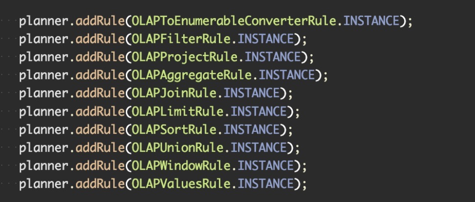
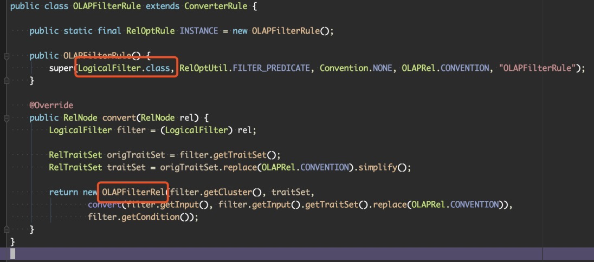
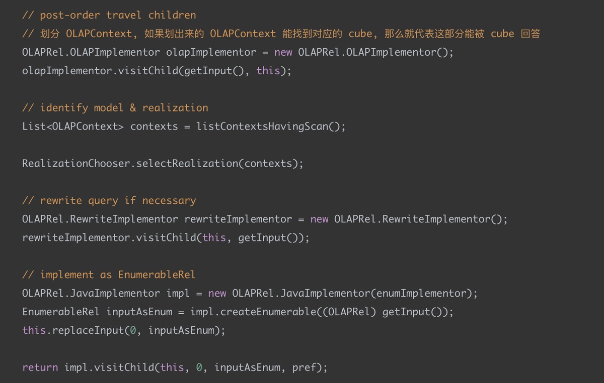
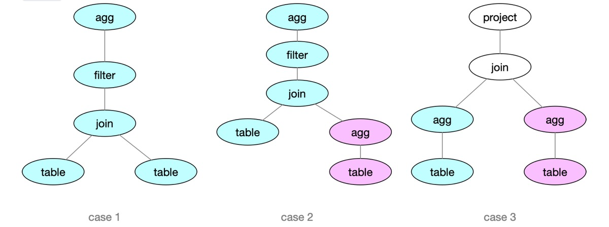
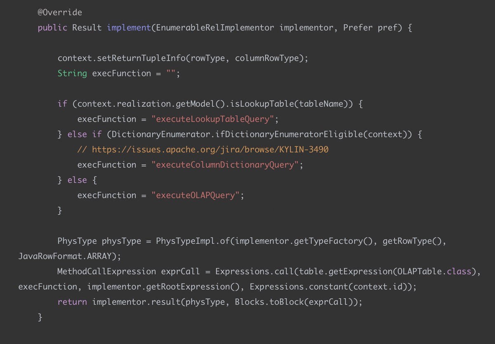

# 1.查询入口

Kylin server 接到用户端的查询后, 会使用 JDBC 与 Calcite 连接, 并告诉 Calcite 要查询的表的 schema 信息, 并且注册一系列转化的 RULE 到 calcite.

Calcite 作为一个通用的 SQL 框架, 他出发点是希望能为不同计算存储引擎提供统一的 SQL 查询引擎, 它本身不知道也不关心底层的 storage, 所以使用 Calcite 框架, 需要注意两点:

1. schema 信息(通过 JDBC 的 Properties 传入)
2. TableScan 如何读取数据(需要框架使用方自己实现, 后面讲代码生成时会提到)




# 2.定义规则 Hook 到 Calcite

Kylin 使用上面注册进去的这些 Rule 把各个 Calcite 逻辑执行计划节点转换成 Kylin 的逻辑执行计划节点(OLAP*Rel)

1. OLAPRel 也继承自RelNode(Calcite 的逻辑执行计划), 简单来说每个OLAP*Rel只是包了下 Calcite 的逻辑执行计划节点, 只是为了多加一些自己的抽象方法, 需要各个子类去实现, 后面会详细介绍
2. 这些抽象方法是用来完成[查询信息收集/选 Cube/rewrite 执行计划/生成具体的物理执行计划]


1. 可以看到这个 Rule 当遇到 LogicalFilter 时, 会把它转换成 OLAPFilterRel, 他们都是 RelNode 的子类.



1. 这里有一个在 calcite 代码里 Hack 的点, 就是所有生成的查询计划树, 头结点一定会是 OLAPToEnumerableConverter, 如果不是, 会抛错.


这个是串起整个代码流程的关键位置, 下面会详细讲解:

**OLAPToEnumerableConverter.implement**



# 3.切分 OLAPContext与选择 Cube

OLAPContext 与 Cube 一一对应, 它定义了很多属性, 帮助我们定位一个 OLAPContext 是否有 Cube 与其对应.

所以当我们把一颗执行计划树分解成一个个 OLAPContext, 并且找到这一个个 OLAPContext 有哪些对应的 cube 的时候, 我们就知道了这个查询中, 哪些部分能够用 Cube 来回答, 哪些部分不能.

**OLAPContext记录的信息:**

```
Aggregations
Filter columns
Group by columns
Joins
Tables
 ...
```

## 3.1 如何切分 OLAPContext

```
OLAPRel.OLAPImplementor olapImplementor = new OLAPRel.OLAPImplementor();
olapImplementor.visitChild(getInput(), this);
```

OLAPRel 接口有个方法: implementOLAP,之前通过 Rule 转化成的各种 OLAP*Rel 都实现了这个方法, 从根节点OLAPToEnumerableConverter 开始, 使用 Visitor 模式访问, 当如果遇到 aggregation 就需要划分一个新的 OLAPContext.

对于 case1 , 在 Visitor 模式下, 会访问根节点 agg, 这需要先访问它的⼦子节点 filter, 类似的, 访问 filter 节点需要先访问其⼦子节点 join节点 …, 当所 有的⼦子节点全部访问完重新回到 agg时, 这时候需要划分出⼀一个 OLAPContext.同理理, case2 和 case3 会 被拆成两个 OLAPContext.

注意, case2 虽然有两个 OLAPContext, 但是左边那个 OLAPContext 无法对应一个 cube, 真正 cube 能加速的部分是右下角红色的那个OLAPContext, 同理 case3, 上面白色的两个算子都需要现算.



## 3.2 选择 cube

根据 context 选择 Cube 的逻辑在: RealizationChooser.selectRealization(contexts);其实现比较简单, 就是遍历得到的所有 contexts, 再遍历cube, 看看其度量和维度是不是和我们提前定义的 cube 中的是一致的, 如果一致, 则表示这个 OC 可以用 cube 来回答.

```java
Collection unmatchedDimensions = unmatchedDimensions(dimensionColumns, cube);
Collection unmatchedAggregations = unmatchedAggregations(aggrFunctions, cube);
```

# 4. Rewrite 执行计划

```java
// rewrite query if necessary
OLAPRel.RewriteImplementor rewriteImplementor = new OLAPRel.RewriteImplementor();
rewriteImplementor.visitChild(this, getInput());
```

经过上面那步, Kylin 已经对用户的查询选出 cube 去回答了, 但是用户 SQL的语义到这里还并没有改变.

假设用户想查商品的 PV: SELECT item, COUNT(user_id) FROM stock GROUP BY item, 定义的 Cube 维度为 item, date, 度量为 COUNT(user_id), 到这一步, 执行计划的 agg 的节点里, 还是一个count() 的函数, 如果我们想用已经预计算过后的 cube 来回答这个SQL, 就会导致问题:

1. 根本没有 user_id 这个列, 预计算过的 Cube 有三个列: user/date 以及一个 M_开头的度量列, 比如 M_C
2. 即使是对这个度量列求 COUNT, 结果也不对, 因为这是预计算过后的条数, 最终改写的 SQL 应该是 SELECT item, SUM(M_C) FROM cuboid GROUP BY item, 为什么还要保留这个 group by 呢? 对于上文定义的 cube, 不是精确回答这句查询, 还需要从 item, date 聚合出 item_name 来, 但是相比较于从源表聚合, input 以及少了很多了

同理, rewrite 这步也是一个 visitor 模式, 每个算子都实现了 implementRewrite, 由每个算子自行决定要不要 rewrite 执行计划, 像 filter/limit 等算子, 是啥都不干的.

# 5.生成物理执行计划

**注意: 这是老的实现, 新架构用 Spark 进行计算, 不走这边了**

```java
// implement as EnumerableRel
OLAPRel.JavaImplementor impl = new OLAPRel.JavaImplementor(enumImplementor);
EnumerableRel enumerable = impl.visitChild((OLAPRel) getInput());
```

同上面两步一样, 这里同样是一个 visitor 方法: EnumerableRel implementEnumerable(List inputs), 每个 OLAP*Rel 都实现了这个方法, 将每一个 `OLAP*Rel` 根据本次查询的参数, 生成 Calcite 自身的 EnumerableXXX 算子执行, 即逻辑节点转为物理节点.

这里用到的 Calcite 的 Enumerable 的机制, 这是 Calcite 默认的物理算子, 可以生成执行的代码. 等于说刚刚从正常的 Calite 逻辑执行计划转到 Kylin 的逻辑执行计划, 再进行改写, 都是 Kylin 为了预计算叉出去的, 现在又叉回到了 Calcite 本来的轨道上来, 但是这时候你的执行计划已经是改变过后的了, 对应生成的物理执行计划也可以用于查询 Cube 的数据.

**OLAPSortRel#implementEnumerable**


**注意**

特别需要注意的是: OLAPTableScan 这个算子很特殊, 他们没有转回到 Calcite, 而是自己实现了EnumerableRel, 直接返回 this.

原因是因为这个算子是真正读取数据的地方, Kylin 需要在这个算子中, 接入 Cube 数据, 由于涉及到一些代码生成的东西, 所以下节介绍.

# 6.物理执行计划生成代码真正执行

```java
OLAPRel.JavaImplementor impl = new OLAPRel.JavaImplementor(enumImplementor);
this.replaceInput(0, enumerable);
return impl.visitChild(this, 0, enumerable, pref);
```

同样还是 visitor 方法: Result implement(EnumerableRelImplementor implementor, Prefer pref);,每个 EnumerableRel 都实现了这个方法

截图是 EnumerableSort 生成代码的使用的代码, 用了 linq4j, 仿照的是 C# 的 linq, 也是 Calcite 作者 Julian 的大作, 大家有兴趣的可以自行研究下.

**EnumerableSort#implement**


上文提到使用 Calcite 框架, 需要注意的第二点: TableScan 如何读取数据 接下来介绍, 这个很重要:

## 6.1 TableScan 如何读取数据

上文提到 OLAPTableScan 没有转换回 Calcite 的物理执行计划, 而是自己实现了EnumerableRel 的接口,也就说他自己实现了 implement 方法来读取数据:

**OLAPTableScan#implement**



我们只需要关注 execFunction, 这个是最后生产代码取数据会执行的函数, 如果击中cube, 会走到 executeOLAPQuery, 这个方法在:OLAPTable#executeOLAPQuery

```java
public Enumerable executeOLAPQuery(DataContext optiqContext, int ctxSeq) {
  return new OLAPQuery(optiqContext, EnumeratorTypeEnum.OLAP, ctxSeq);
}
```

一路追下去, 会调用到 OLAPEnumerator.queryStorage, 这里就是具体 query storage 的地方:

```java
private Iterator queryStorage() {
  logger.debug("query storage...");
  // query storage engine
  IStorageQuery storageEngine = StorageFactory.createQuery(olapContext.realization);
  ITupleIterator iterator = storageEngine.search(olapContext.storageContext, sqlDigest, olapContext.returnTupleInfo);
  return iterator;
}
```

再追下去就是具体从 Hbase 扫数据等流程了, 这里就先不看了, 感兴趣的同学可以自己看, 欢迎随时交流

## 6.2 生成代码摘录

摘一个生成的代码, 注意这个不是 spark 的全阶段代码生成, 是一个算子自己的一份代码, 还是传统的火山模型, 所以还会有迭代器的开销.

整个计算过程迭代的读取指定 cuboid 数据，并执行相应的计算逻辑，是一个基于内存的单机计算过程(calcite 的计算是单机的! 大数据时代你敢信?).

可以看到整个数据是从 executeOLAPQuery 读上来, 假设后面有了新的 storage, 我们只需要做在 executeOLAPQuery 中就可以了.

```java
*// _inputEnumerable 为 OLAPQuery 类型，OLAPQuery*
final org.apache.calcite.linq4j.Enumerable _inputEnumerable = ((org.apache.kylin.query.schema.OLAPTable) root.getRootSchema().getSubSchema("DEFAULT").getTable("KYLIN_SALES")).executeOLAPQuery(root, 0);
final org.apache.calcite.linq4j.AbstractEnumerable child = new org.apache.calcite.linq4j.AbstractEnumerable(){
 public org.apache.calcite.linq4j.Enumerator enumerator() {
  return new org.apache.calcite.linq4j.Enumerator(){
    *// 类型，OLAPQuery.enumerator() 得到的 inputEnumerator 为 OLAPEnumerator 类型*
    *// inputEnumerator 会调用 StorageEngine 去 HBase 中查询指定 cube、指定 cuboid（及可能的 filter 下推）数据*
    public final org.apache.calcite.linq4j.Enumerator inputEnumerator = _inputEnumerable.enumerator();
    public void reset() {
     inputEnumerator.reset();
    }
    public boolean moveNext() {
     while (inputEnumerator.moveNext()) {
      final Integer inp4_ = (Integer) ((Object[]) inputEnumerator.current())[4];
      if (inp4_ != null && inp4_.intValue() != 1000) {
       return true;
      }
     }
     return false;
    }
    public void close() {
     inputEnumerator.close();
    }
    public Object current() {
     final Object[] current = (Object[]) inputEnumerator.current();
     return new Object[] {
       current[0],
       current[5],
       current[13],
       current[11],
       current[10]};
    }
   };
 }
};
return child.groupBy(new org.apache.calcite.linq4j.function.Function1() {
  public Long apply(Object[] a0) {
   return (Long) a0[0];
  }
  public Object apply(Object a0) {
   return apply(
    (Object[]) a0);
  }
 }
 , new org.apache.calcite.linq4j.function.Function0() {
  public Object apply() {
   java.math.BigDecimal a0s0;
   boolean a0s1;
   a0s1 = false;
   a0s0 = new java.math.BigDecimal(0L);
   long a1s0;
   a1s0 = 0;
   Record3_0 record0;
   record0 = new Record3_0();
   record0.f0 = a0s0;
   record0.f1 = a0s1;
   record0.f2 = a1s0;
   return record0;
  }
 }
 , new org.apache.calcite.linq4j.function.Function2() {
  public Record3_0 apply(Record3_0 acc, Object[] in) {
   final java.math.BigDecimal inp4_ = in[4] == null ? (java.math.BigDecimal) null : org.apache.calcite.runtime.SqlFunctions.toBigDecimal(in[4]);
   if (inp4_ != null) {
    acc.f1 = true;
    acc.f0 = acc.f0.add(inp4_);
   }
   acc.f2 = acc.f2 + org.apache.calcite.runtime.SqlFunctions.toLong(in[3]);
   return acc;
  }
  public Record3_0 apply(Object acc, Object in) {
   return apply(
    (Record3_0) acc,
    (Object[]) in);
  }
 }
 , new org.apache.calcite.linq4j.function.Function2() {
  public Object[] apply(Long key, Record3_0 acc) {
   return new Object[] {
     key,
     acc.f1 ? acc.f0 : (java.math.BigDecimal) null,
     acc.f2};
  }
  public Object[] apply(Object key, Object acc) {
   return apply(
    (Long) key,
    (Record3_0) acc);
  }
 }
 ).orderBy(new org.apache.calcite.linq4j.function.Function1() {
  public Long apply(Object[] v) {
   return (Long) v[0];
  }
  public Object apply(Object v) {
   return apply(
    (Object[]) v);
  }
 }
 , org.apache.calcite.linq4j.function.Functions.nullsComparator(false, false)).take(10);
```

# Ref

[Kylin执行查询流程分析](https://blog.csdn.net/yu616568/article/details/50838504)