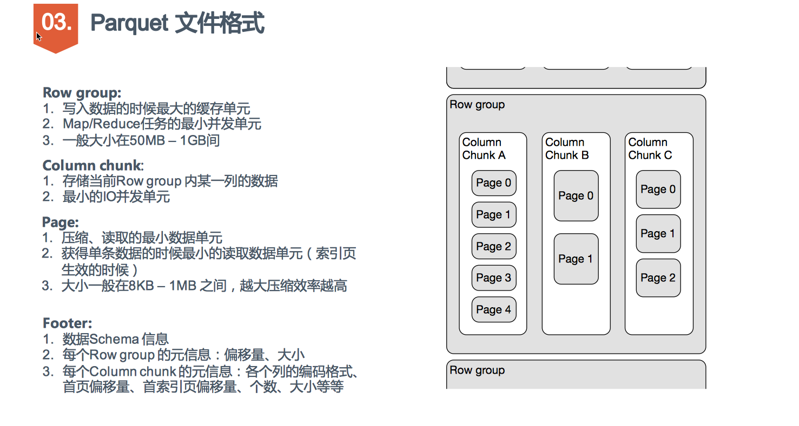

# Glossary

- Row group: A logical horizontal partitioning of the data into rows. There is no physical structure that is guaranteed for a row group. A row group consists of a column chunk for each column in the dataset.

- Column chunk: A chunk of the data for a particular column. These live in a particular row group and is guaranteed to be contiguous in the file.

- Page: Column chunks are divided up into pages. A page is conceptually an indivisible unit (in terms of compression and encoding). There can be multiple page types which is interleaved in a column chunk.

一个文件由一个或者多个 row groups 组成, 一个 row group 包含一个 column chunk per column. column chunk 包含一个或者多个 pages.

## Unit of parallelization

- MapReduce - File/Row Group
- IO - Column chunk
- Encoding/Compression - Page




# Deep
正是因为有 row group, 才使得 parquet 文件 splitable, 且每个 split 都有完整的 record(Spark 中也是根据 row group 来切 split 的). 

Row groups are used to keep all the columns of each record in the same HDFS block so records can be reassembled from a single block.

你只可以 sort 一个 column, 所以 sort 你最常 filter 的列.

RowGroups are typically chosen to be pretty large to avoid the cost of random i/o

在 parquet 里，经常混用 block 和 row group 的概念，可以认为两者相等。

BlockMetaData

```java
  private List<ColumnChunkMetaData> columns = new ArrayList<ColumnChunkMetaData>();
  private long rowCount;
  private long totalByteSize;
  private String path;
```

```java
  /**
   * PageReader for a single column chunk. A column chunk contains
   * several pages, which are yielded one by one in order.
   *
   * This implementation is provided with a list of pages, each of which
   * is decompressed and passed through.
   */
  static final class ColumnChunkPageReader implements PageReader {}
```

```java
/**
 * Reader for a sequence a page from a given column chunk
 */
public interface PageReader {

 /**
  * @return the dictionary page in that chunk or null if none
  */
  DictionaryPage readDictionaryPage();

  /**
   * @return the total number of values in the column chunk
   */
  long getTotalValueCount();

  /**
   * @return the next page in that chunk or null if after the last page
   */
  DataPage readPage();
}
```

```java
  /**
   * The data for a column chunk
   */
  private class Chunk {}
```

```java
  /*
   * Builder to concatenate the buffers of the discontinuous parts for the same column. These parts are generated as a
   * result of the column-index based filtering when some pages might be skipped at reading.
   */
  private class ChunkListBuilder {
    private class ChunkData {
      final List<ByteBuffer> buffers = new ArrayList<>();
      OffsetIndex offsetIndex;
    }

    private final Map<ChunkDescriptor, ChunkData> map = new HashMap<>();
    private ChunkDescriptor lastDescriptor;
    private SeekableInputStream f;
}
```

```java
  /**
   * PageReader for a single column chunk. A column chunk contains
   * several pages, which are yielded one by one in order.
   *
   * This implementation is provided with a list of pages, each of which
   * is decompressed and passed through.
   */
  static final class ColumnChunkPageReader implements PageReader {

    private final BytesInputDecompressor decompressor;
    private final long valueCount;
    private final List<DataPage> compressedPages;
    private final DictionaryPage compressedDictionaryPage;
    // null means no page synchronization is required; firstRowIndex will not be returned by the pages
    private final OffsetIndex offsetIndex;
    private final long rowCount;
    private int pageIndex = 0;

    ColumnChunkPageReader(BytesInputDecompressor decompressor, List<DataPage> compressedPages,
        DictionaryPage compressedDictionaryPage, OffsetIndex offsetIndex, long rowCount) {
      this.decompressor = decompressor;
      this.compressedPages = new LinkedList<DataPage>(compressedPages);
      this.compressedDictionaryPage = compressedDictionaryPage;
      long count = 0;
      for (DataPage p : compressedPages) {
        count += p.getValueCount();
      }
      this.valueCount = count;
      this.offsetIndex = offsetIndex;
      this.rowCount = rowCount;
    }
}
```