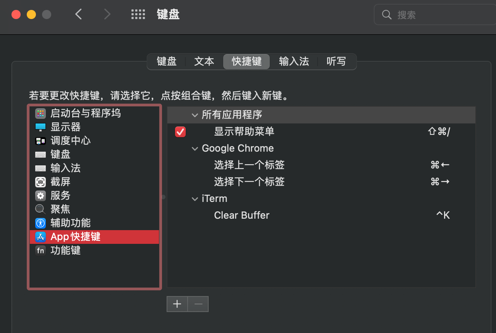
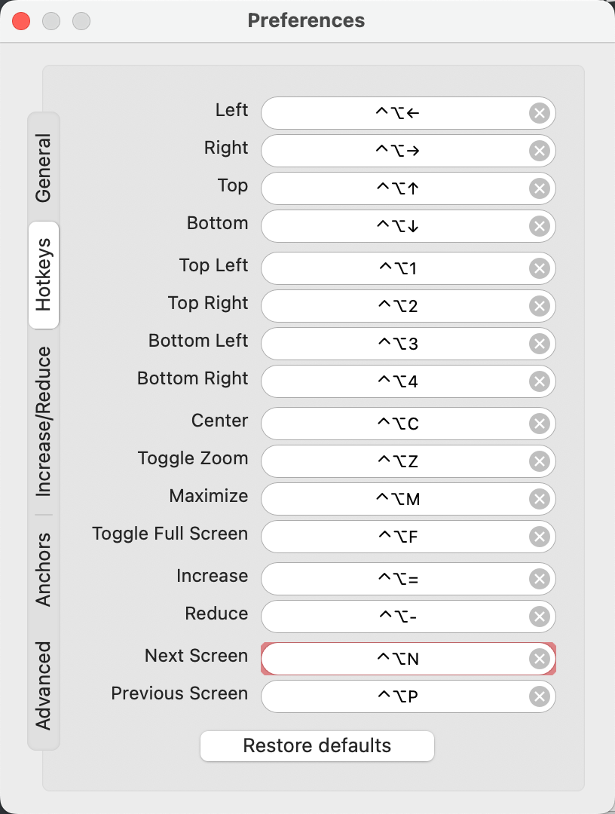
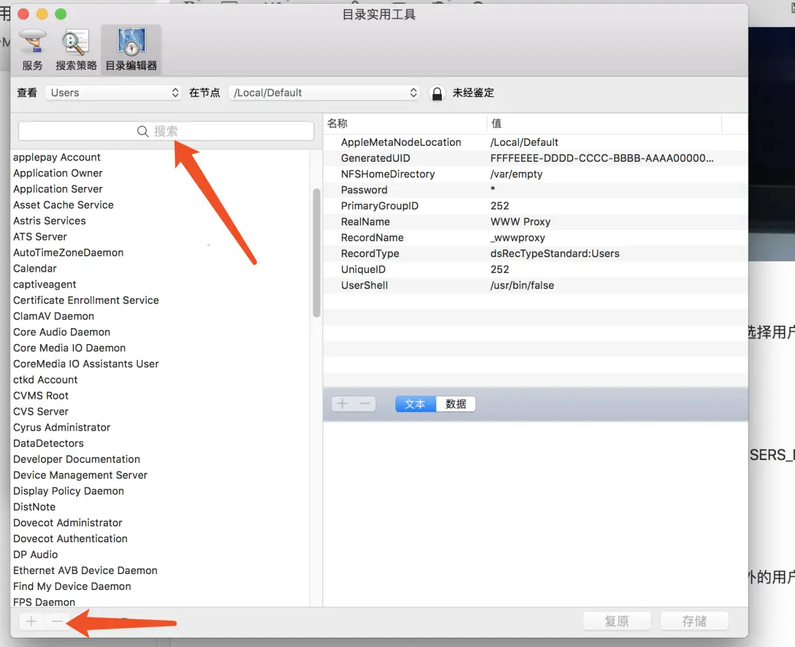

### mac 基础设置
0. 新建一个账户
1. 改键盘键位
2. 登录 Apple id
3. 更改键盘功能键/修饰键
4. 控制中心打开蓝牙
### 最重要的几个软件配置:
- Oh-my-zsh/.zshrc
- Sublime Text3
    - Alignment
    - AlignTab
    - Compare Side-By-Side
    - Expand Region
    - Insert Nums
    - Markdown Editing
    - Package Control
    - Package ResourceViewer
    - PackageSync
    - Pretty JSON
    - SQL Beautifier
    - Table Editor
    - TerminalView
    - CodeFormatter
    - SFTP
    - Terminal
    - OmniMarkupPreviewer
- VS-code (有自动配置同步)
- Hexo 博客
- IDEA 全家桶(有自动配置同步)
- Item2
- Vimrc
- Keyboard Maestro
- Alfread
- Typora
- 输入法的配置(搜狗/账号QQ邮箱)
- Mendeley Desktop 管理论文的
- Calibre
- 音乐备份(Foobar2000)

### 安装Command Line Tools for Xcode
xcode-select --install

### 安装包管理工具 Homebrew
```
/bin/bash -c "$(curl -fsSL https://raw.githubusercontent.com/Homebrew/install/HEAD/install.sh)"
```

### 查看已安装软件
`ls -l /Applications | awk '{print $3"\t", $0}' | sort > ~/Desktop/AppList.txt`

### 重要的一些软件:
- Tadama(app store)
- Contexts
- eul(机器信息cpu mem 什么的)
- 0 中的那些软件
- PDF Expert
- Sequel Pro(mysql client)
- HandShaker
- CheatSheet(用的不多)
- Fluid(网页 to app)
- Timing(看自己电脑上花了多少时间)/Qbserve(同类)
- Go2Shell
- IINA
- JD-GUI
- The Unarchiver
- kindle
- projector/IDEA
- QQ/wechat/QQ music
- Snipaste
- Spectacle

### 脚本
```bash
brew install htop
brew install node
# npm install -g hexo-cli
# https://hexo.io/zh-cn/docs/
brew install --cask shiftit
brew install --cask google-chrome
# 买的 9 的, 现在 brew 会装最新版也就是 10, 同理 Alfread
# brew install --cask keyboard-maestro
# brew install --cask alfred
brew install --cask iterm2
brew install --cask wechat
# vim ~/Library/Application\ Support/.com.contextsformac.Contexts.plist
brew install --cask contexts
brew install --cask qqmusic
# sougou拼音这个还要安装
brew install --cask sogouinput 
brew install --cask typora
brew install --cask spectacle
brew install --cask qq
brew install --cask sublime-text
brew install --cask visual-studio-code
brew install --cask calibre
brew install --cask foobar2000
brew install --cask mendeley
brew install --cask intellij-idea
brew install --cask clion
brew install --cask iina
brew install --cask snipaste
brew install --cask handshaker
brew install --cask eul
brew install --cask thunder
brew install --cask pdf-expert
brew install --cask sequel-pro
brew install --cask fluid
brew install --cask jd-gui
brew install kubectl
brew install wget
brew install binutils
```

配置快捷键






### 删除迁移助理的用户

强迫症看着不爽

1. 打开目录实用工具,删除的用户的用户名，接着点击左下角的“-”就可以删除了, 记得要鉴定下



2. 用户删了 但是个人目录还在, 而且 sudo 也删不掉, 有个简单方法是再创建一个普通同名用户, 然后把这个用户删了就 ok 了

### 配置定时任务

举例 kinit
1. 配置 kinit 自动输入密码 `kinit --keychain xxx@xxx`
2. 编写脚本, 并且赋予可执行权限 

```bash
# kinit_crontab.sh
/usr/bin/kinit --keychain xxx@xxx
echo "done kinit"
```

3. 编写launchctl脚本

- cd ~/Library/LaunchAgents
- vim com.user.kinit.plist

```xml
<?xml version="1.0" encoding="UTF-8"?>
<!DOCTYPE plist PUBLIC "-//Apple//DTD PLIST 1.0//EN" "http://www.apple.com/DTDs/PropertyList-1.0.dtd">
<plist version="1.0">
<dict>
    <key>Label</key>
    <!-- 一定以com 开头 -->
    <string>com.user.kinit</string>
    <key>Program</key>
    <string>/Users/aron/kinit_crontab.sh</string>
    <key>ProgramArguments</key>
    <array>
        <string>/Users/aron/kinit_crontab.sh</string>
    </array>
    <key>RunAtLoad</key>
    <true/>
    <key>StartInterval</key>
    <!-- 60s -->
    <integer>60</integer>
    <key>StandardOutPath</key>
    <string>/Users/aron/log/kinit_run.log</string>
    <key>StandardErrorPath</key>
    <string>/Users/aron/log/kinit_run.err</string>
</dict>
</plist>

```

4. launchctl定时执行脚本

```sh
cd ~/Library/LaunchAgents
launchctl load -w com.user.kinit.plist
卸载脚本：launchctl unload com.user.kinit.plist
```

### 配置 gdb init

`vim ~/.gdbinit`

```py
python
import sys
sys.path.insert(0, '~/gcc-10/share/gcc-10.2.0/python')
# sys.path.insert(0, '~/gcc-9/share/gcc-9.3.0/python')
from libstdcxx.v6.printers import register_libstdcxx_printers
register_libstdcxx_printers (None)

sys.path.insert(0, '~/clang/gdb')
from libcxx.printers import register_libcxx_printer_loader
register_libcxx_printer_loader()
end
```

