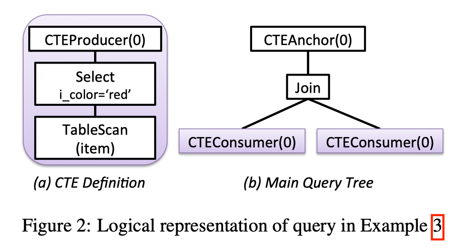
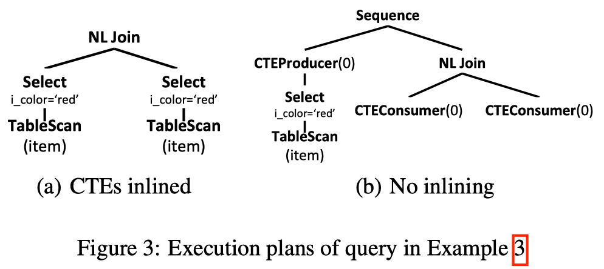
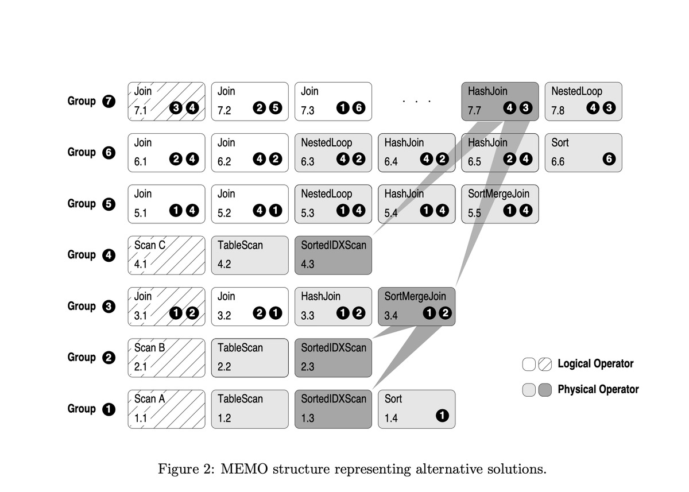
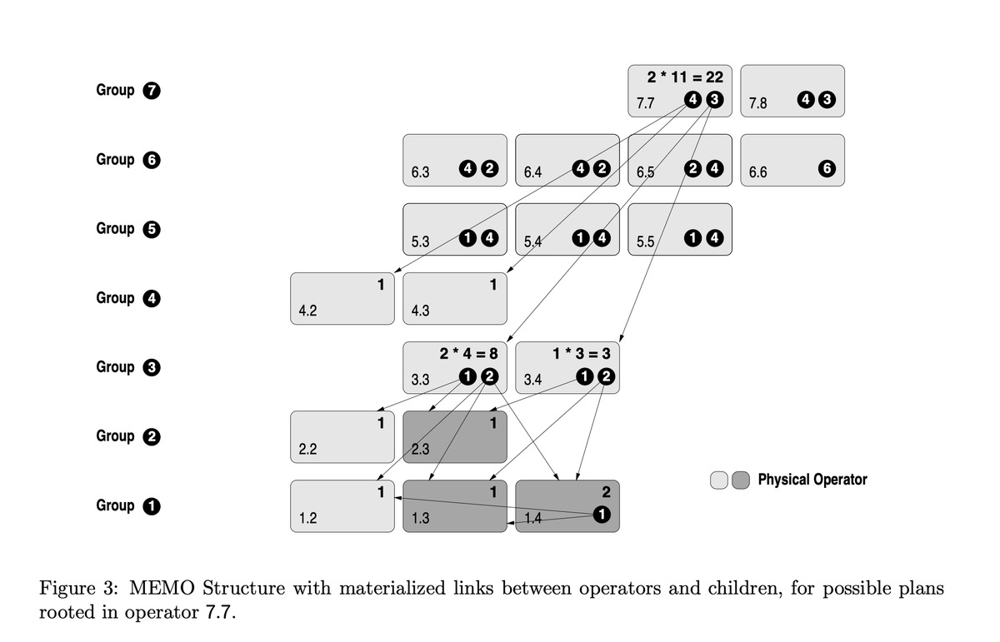
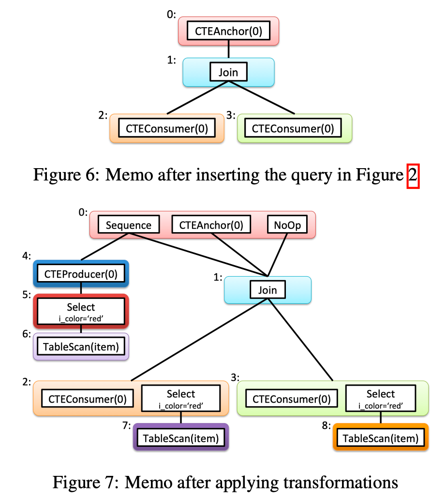
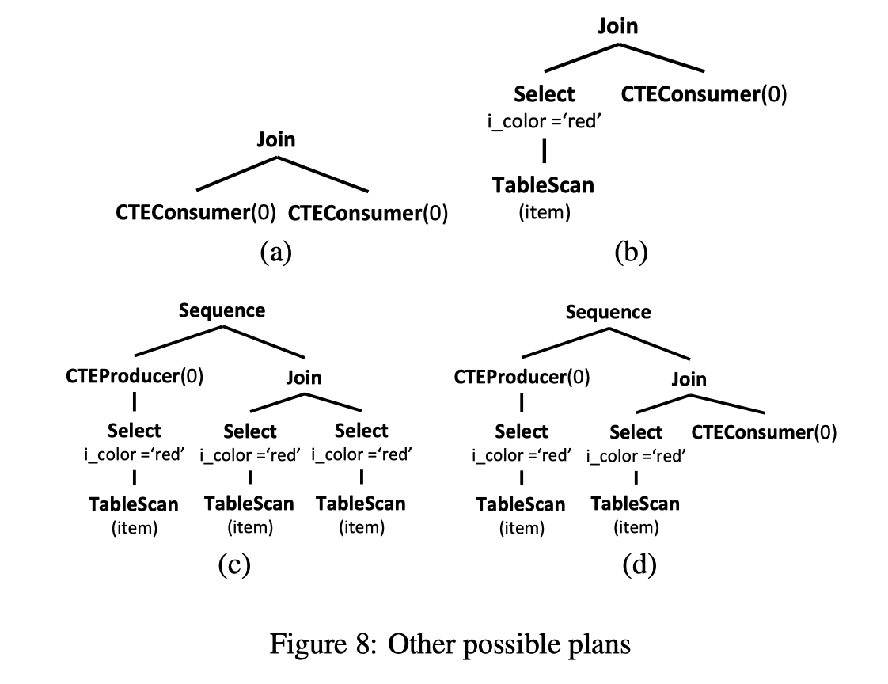
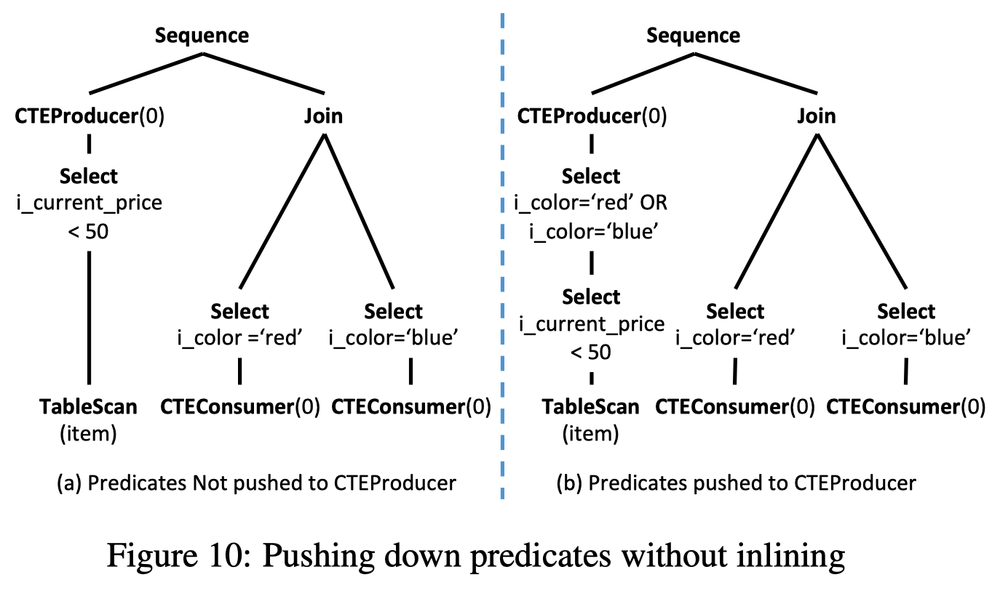
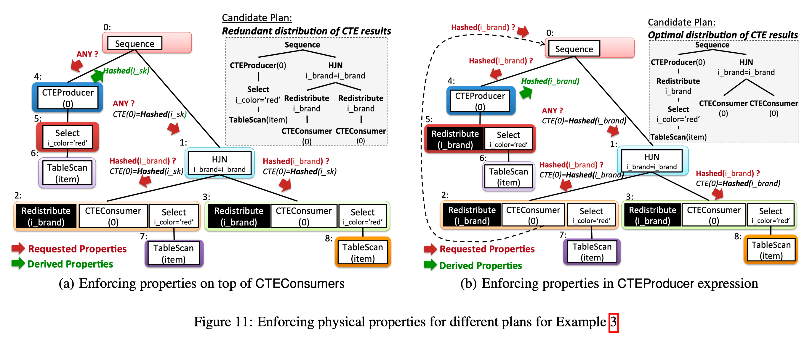
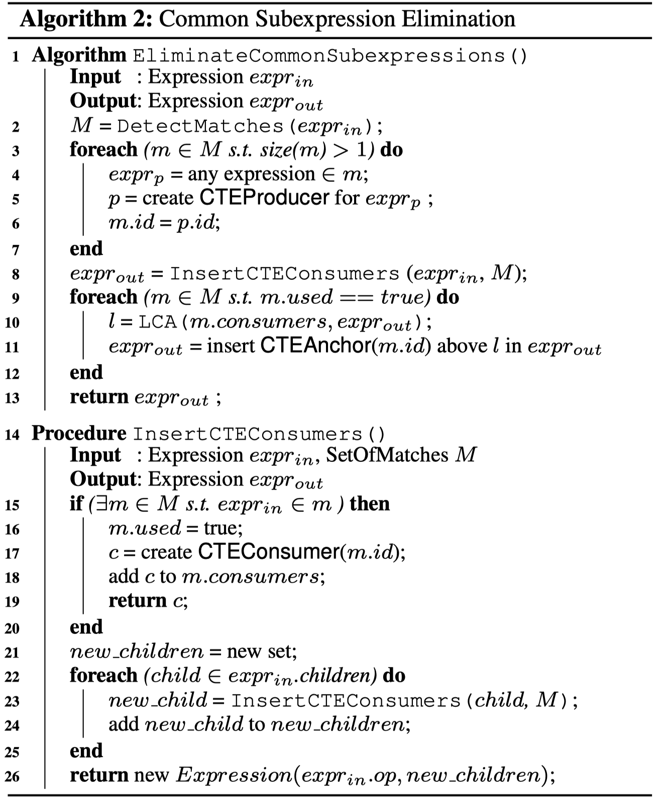

# 介绍

**CTE**: Common Table Expressions, 也就是我们常见的 With clause.

```sql
WITH v AS (SELECT i-brand, i_current_price, MAX (i_units) m
           FROM item WHERE i_color = 'red'
           GROUP BY ibrand, i_current_price)
SELECT * FROM v WHERE m < 100
```

**CTE 优点:**

1. 简化查询, 使其更可读
2. 性能提升(本文主要介绍非递归 CTE 带来的性能提升)

## 挑战

### 解决死锁

- 复杂的查询可能会有嵌套的 CTE, 优化器需要保证没有同时多个 process 在等对方结束

### 如何枚举/选取可能的计划

```sql
-- SQL2
-- index on i_color
WITH v AS (SELECT i_brand, i_color FROM item 
           WHERE i_CURRENT_price < 1000)
SELECT v1.*
FROM y vl, v v2, v v3
WHERE vl.i_brand = v2.i_brand
  AND v2.i_brand = v3.i_brand
  AND v3.i_color = 'red';
```

对于 **SQL2**, 有几种 CTE 展开的形式

a. 不展开: CTE 只执行一次, 但是没有用到 i_color 上的 index

b. 全部展开: 可以使用 i_color 上的 index, 但是展开的部分重复计算了三次

c. 部分展开


### 如何根据上下文优化

1. 如果查询对所有的 CTE 都有 filter, 可以直接把 filter 下推到 CTE 的定义上
2. 分布式计划中的物理属性的 enforce, 减少对同一份数据的re-partition/re-ordering

# 优化流程

## 名词定义

```sql
-- SQL3
WITH v AS (SELECT i_brand FROM item WHERE i_color = ’red’) 
SELECT * FROM v as v1, v as v2 WHERE v1.i_brand = v2.i_brand;
```



1. **CTEProducer**: CTE 定义的树的根节点, 有唯一的 ID.
2. **CTEConsumer**: query 里用到 CTE 的地方, ID 与其对应的 CTEProducer 一致.
3. **CTEAnchor**: 定义了 CTE 的作用域, 一个 CTE 仅可以在被其相对应的 CTEAnchor 下被引用.
4. **Sequence**: 二元操作符, 按顺序执行其 children (从左到右), 然后返回其 right child.

图三展示了 SQL3 的两种可能的 plan.

- a. 所有 CTEs 都被内联了, CTEAnchor 被去除, 所有的 CTEConsumer 都被替换成 CTE 展开的定义
- b. 无内联, CTEAnchor 被替换成 Sequence, CTEProducer 作为其 left child, CTEAnchor 的 child 作为其 right child
  - **Sequence** 保证了特定的执行顺序, 可以保证 CTEProducer 在 CTEConsumer 之前执行. 这个机制可以保证生成的计划没有死锁



### 嵌套 CTE 例子

```sql
-- SQL4
WITH v AS (SELECT i_current_price FROM item WHERE i_color = ’red’),
     w AS (SELECT v1.p FROM v AS v1, v AS v2 WHERE v1.p < v2.p)
SELECT * FROM v AS v3, w AS w1, w AS w2
WHERE v3.p < w1.p + w2.p;
```


注意, 图 b 有两个 CTEAnchor, 其顺序和在 with 定义里的一致

## PLAN ENUMERATION

### Memo 介绍

- MEMO 的定义：是一种数据结构，用于管理一个组，每个组代表一个查询计划的不同子目标。
- MEMO 结构的目标：是通过尽可能的公用相同的子树使得内存的使用最小。
- MEMO 的主要思想：通过使用共享的副本来避免子树的重复使用。

Memo 中两个最基本的概念就是 Expression Group（简称 Group） 以及 Group Expression（对应关系代数算子）

- 每个 Group 中保存的是逻辑等价的 Group Expression
- Group Expression 的子节点是由 Group 组成

#### Init Memo


一旦最初的计划复制到了MEMO结构中以后，就可以对逻辑操作符做一些转换以生成物理操作符。
一个转换规则可以生成：

1. 同一组中的一个逻辑操作符: 如 join( A, B) -> join( B, A)
2. 同一组中的一个物理操作符: 如 join -> Hash Join

#### Apply transformation/implement rule



一组逻辑操作符组成一个子计划。根仍保留在原来的组中，而其他操作符分配到其他的组中，必要的时候可以建立新组，如 join( A, join(B,C)) -> join( join(A,B), C), 这两个最外面的 Join 是等价的, 所以是同一个根节点, 但是前后两次里面的 join 不一样, 所以在不同的组

#### Find best plan



### CTE Transformation

使用 Memo 代表不同的候选者使得这个过程是 CBO 的, 我们可以在一条查询中内联某些 CTE, 其他的不内联.



1. 首先生成一个初始的 memo (F.6)
2. 第一条 rule 应用在 CTEAnchor 上, 生成一个 Sequence 节点(group 0), 同时把 CTEProducer 作为其 left child 展开, 生成了 group 4/5/6, 其 right child 是CTEAnchor 的 child
3. 第二条 rule 还是应用在 CTEAnchor, 生成一个 NoOp 算子, child 是 CTEAnchor 的 child
4. 第三条 rule 应用在 CTEConsumer 上, 生成一个展开后的 CTE 定义, 添加到 CTEConsumer 的同一个 group 中

F.8 展示了一些可能的 plan, 这些 plan 都有一些问题:

- 8(a)/8(b) 是非法的, 他们只有 CTEConsumer, 却没有 CTEProducer, 所以 CTEConsumer 永远也读不到他们想要的数据. 我们会避免产生这样的计划
- 8(c)/8(d) 的计划明显不是最优的, c 展开了所有的 CTE, 但是保留了 CTEProducer, 同理 d 也是.



### Predicate Pushdown

在 Orca, 我们引入了一种方法, 可以不展开 CTE 也可以做谓词下推.

```sql
-- SQL5
WITH v AS (SELECT i_brand, i_color FROM item WHERE i_CURRENT price < 50)
SELECT * FROM v v1, v v2
WHERE v1.i_brand = v2.i_brand
  AND v1.i_color = ’red’
  AND v2.i_color = ’blue’;
```



### Always Inlining Single-use CTEs

```sql
-- SQL6
WITH v AS (SELECT i_color FROM item WHERE i_current_price < 50)
SELECT * FROM v WHERE v.i_color = ’red’;
```

由于这类 CTE 只被使用了一次, 所以可以无脑 inline

### Elimination of unused CTEs

```sql
WITH v AS (SELECT i_color FROM item WHERE i_current_price < 50)
SELECT * FROM item WHERE item.i_color = 'red';
```

当 CTE 没有被使用到的时候, 直接消除掉. 当 CTE 有嵌套定义时, 可以先消除最外层定义的 CTE, 外层的 CTE 消除之后, 内层的 CTE 也无引用, 也可以消除.

## CONTEXTUALIZED OPTIMIZATION

### Enforcing Physical Properties



### Producer Context

CTEProducer 侧的计划生成比较独立, 可以不考虑 Consumer 侧. 如图 11(a), CTEProducer 侧并不需要任何分布, 所以没有添加任何 distribution. 但是 Consumer 测有个 hash join, 所以需要其底下的算子提供 HashDistribution, 但这不是最优的计划.

### Consumer Context

先从 Consumer 侧来考虑数据分布, 可以产生的更优的计划. 如图 11(b). 这种方式把 distribution 下推到了 CTE 中, 这样在 consumer 测就不用做 distribution.

## CTE-BASED OPTIMIZATIONS

### CTE-Generating Transformations

在以下场景 window function, full outer joins, distinct aggregates , Orca 会自动生成 CTE.

例如下面的 SQL9, distinct 了两个不同的列, 可以把 P-F-T 的部分提成一个 CTE, 减少读取的 input.

```sql
-- SQL9
SELECT COUNT(DISTINCT cs_item_sk), AVG(DISTINCT cs_qty)
FROM CATALOG sales WHERE cs_net profit > 1000
```


### Common Subexpression Elimination

Orca可以提取公共子表达式为 CTE.

```sql
-- SQL10
SELECT * FROM
  (SELECT i_brand, count(*) AS b FROM item GROUP BY i_brand HAVING count(*) > 10) t1,
  (SELECT i_brand, count(*) AS b FROM item GROUP BY i_brand HAVING count(*) > 20) t2
WHERE t1.i_brand <> t2.i_brand;
```


具体算法如下:

- 输入: 原始表达式
- 输出: common subexpression 已经被替换过的表达式
- DetectMatches() 用于找出公共的表达式, 论文中又引用了其他两篇论文
  - Exploiting Common Subexpressions for Cloud Query Processing.
  - Efficient Exploitation of Similar Subexpressions for Query Processing.
- InsertCTEConsumers() 把表达式中的公共子表达式替换为对应的 CTEConsumer
- 最后, 在每组公共子表达式的 LCA(最近公共祖先) 处插入一个CTEAnchor

