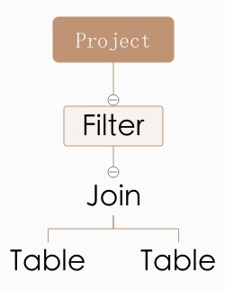

# Spark Catalyst 的实现分析

**转载自:**[Spark Catalyst 的实现分析](https://github.com/ColZer/DigAndBuried/blob/master/spark/spark-catalyst.md#spark-catalyst%E7%9A%84%E5%AE%9E%E7%8E%B0%E5%88%86%E6%9E%90)

Spark SQL 和 Catalyst 分别对应了 SQL 执行期以及解析期的优化工作，因此 Catalyst 的理解是 Spark SQL 的第一步。在一些 Catalyst 的介绍以及讲座中，下面一张图是必出现，它描述了从 SQL 语句到最后执行 Plan 的生成过程中，除了 Spark SQL，其他 SQL 引擎的工作原理也基本一致，比如 Hive 之类的。


本文核心也是介绍 Catalyst 内部的实现，但是不是按照这张图的步骤来介绍 Catalyst 的实现原理，而是按照 SQL 给人最直接几个概念，比如 Row，Expression，Plan 来逐步介绍它们的内部实现。

看过 Spark SQL 或者 Catalyst 人都知道，相比 Spark Core 的代码，这一块真的挺复杂了，各种算法逻辑，复杂的 Scala 语法元素，以及各种性能优化，代码自动生成，可能得需要几倍的时间，反复的琢磨，才能梳理清楚。

## 1. Row

Spark SQL 中处理的数据与传统 RDD 最大区别在处理的每行数据的类型表示，传统 RDD 不对每行数据进行类型要求，可以任何复杂数据结构，比如 Map, 或者自己自定义的类之类的，而 Spark SQL 中为`Row`。

`Row`的概念是针对之前版本中的 DataFrame 而言的，在 1.6 版本中提出的 Dataset 其实也是有`Row`的概念，只是会被隐式转换掉而已，在 Catalyst 中，处理的对象为`InternalRow`，注意`InternalRow`和`Row`是有本质区别的，`Row`是 API 层面的概念，专门针对 DataFrame，而`InternalRow`为内部概念。

`Row`类为 DataFrame 中核心概念，它表示一行结构化数据的输入，`Row`本身可以有 Scheme，即支持设置每个字段的类型，支持 GetInt 之类的操作；它也可以无 Scheme，即`Scheme=NULL`，支持泛化的 Get 操作，返回 Any 类型数据。`Row`本身就有点像`Array，Tuple`,它的子类`GenericRow`和`GenericRowWithSchema`都是基于`Array[Any]`来实现，它的每个字段的类型为`Any`，因此`Row`可以理解为是无类型约束的，虽然它内部有`Scheme`，但是`Array[Any]`到`Row`的转换，以及泛化的 Get 操作都是不受 Scheme 的限制，因此它是类型不安全的。

在 Spark 1.6 版本以后，提出了 Dataset 概念，它也是 Spark 从 RDD，SchemeRDD，DataFrame 演化过来最为标准化一个概念，相信在未来会是 Spark 中最为核心概念，`In the long run, we expect Datasets to become a powerful way to write more efficient Spark applications.`

Dataset 是 Spark SQL 中概念，在 API 层面上来说，它没有像 DataFrame 一样，强制要求输入数据为`Row`，或者依赖`Row.fromSeq`等功能函数将输入其他类型的数据强制转换为 Row，但是 Dataset 实际也是要求它处理的数据是`Row` 相似的类型，即为 Catalyst 内部的**`InternalRow`**和**`UnsafeRow`**的概念。当我们执行`seq(1,2,3).toDs 或者 Rdd.toDs`时候，实际上对每一行记录在内部做了很多转换。DataFrame 也被转换为 Dataset 进行包装，即将 DataFame 表示为`Dataset[Row]`。

Dataset 核心概念是为`Encoder`，它就是我们上面说隐式转换的幕后工具，如下所示 Encoder 内部的 toRow 函数，支持将输入 T 类型转换为`InternalRow`：

```
def toRow(t: T): InternalRow = try {
    inputRow(0) = t
    extractProjection(inputRow)
}
```

它支持将一个外部的数据类型，转换为 Dataset 内部的`InternalRow`，比如上面的`seq(1,2,3)`就是需要将每个输入的 Int 数字转换为一个`InternalRow`，`DataFrame`同理需要将`Row`转换为`InternalRow`。在转换的过程中，是**有类型的检查**，这也是与 DataFrame 最大的区别。

另外 Dataset 对外最为自豪一点就是序列化以及反序列化的性能，用官方话说:`Datasets also leverage Tungsten’s fast in-memory encoding，an order of magnitude faster than the default Java serializer`，那么它是这么实现呢？其实他就是上面谈到的`Encoder`的功能，上面虽然我们说它返回的是一个`InternalRow`，实际上，**它返回的是`InternalRow`一个子类，即`UnsafeRow`**

`UnsafeRow`内部是基于 Java 的 unsafe 包来实现（Tungsten 的功能），对 Row 中每个字段的操作都转换为字节的操作，换句话说它底层实际存储结构是 byte[]，而且支持 Kryo 序列化，相比使用 Java 序列化工具来序列化数组/Row 之类的复杂数据结构，它的性能肯定要好很多！

另外`InternalRow`还有一个子类，即`MutableRow`，而且`UnsafeRow`也是`MutableRow`的子类，它即为可修改的`InternalRow`，在很多地方都会出现这个，原理很简单，支持 set 等操作而已。

## 2. Expression

在 SQL 语句中，除了 SELECT FROM 等关键字以外，其他大部分元素都可以理解为 Expression，比如`SELECT sum(a), a`，其中`sum(a)`和`a`都为 Expression；

从 SQL 语句功能来说，Expression 的功能可以划分为 Projection，Predicate，Ordering，Aggregate；

其中 Projection 功能就是 input 数据进行加工，输出为 InternalRow；Predicate 而是对输入的 InternalRow 进行加工输出为 Bool，Ordering 和 Aggregate 则是针对 Sortby/Groupby 专用的两类表达式；你可能会说，那么 substr 之类的函数表达式不在上面归类？substr 在 sql 语句中肯定不会单独存在，他们都是作为子表达式出现在上面的几类当中，比如用于判断或者输出数据的加工。

- Expression 是一个 Tree 结构，即可以通过多级的 Child Expression 来组合成复杂的 Expression，比如前面`sum(a)`就是由`sum` 和`a` 两个简单的 Expression 组合而成，比如更复杂的 Expression 有`max(sum(a), sum(b))`;
- Expression 基本的功能是求值，比如`abs(a)`，`IfNull(A,B)`之类的操作，他们都是对输入 Row 进行加工，并输出处理结果，即 Expression 需要实现`def eval(input: InternalRow = null): Any`函数来实现它的功能。
- 既然 Expression 的功能是求值，那么它就有输入和输出类型的限制。每个 Expression 都有`def dataType: DataType`类型变量来表示它的输出类型，以及`def checkInputDataTypes(): TypeCheckResult`函数来校验当前 Expression 的输入（为 Tree 结构，那么它的输入即为 Child Expression 输出）是否符合类型要求。
- Expression 功能是针对 Row 进行加工，但是可以把加工方法分为以下几种
    - 原生的`def eval(input: InternalRow = null): Any`函数；
    - **对于 Non Child Expression，Expression 的计算是基于 Child Expression 计算结果进行二次加工的，因此对于 Non Child Expression，对 Eval 进行默认实现，子类只需要实现函数`def nullSafeEval(input: Any): Any`即可以，如下所示为只有一个 Child 的 Expression 的实现：**

    ```
    override def eval(input: InternalRow): Any = {
        val value = child.eval(input)
        if (value == null) {
            null
        } else {
            nullSafeEval(value)
        }
    }
    //比如 ExpressionAbs，就是利用子 Expression 的结果结果之上，进行一个 math.abs 加工。
    ```

    - `Projection`类型，它本身不是 Expression，但是它可以根据 N 个 Expression，对输入 row 的 N 个字段分别进行加工，输出一个新的 Row，即 Expression 的容器。

    ```
    abstract class Projection extends (InternalRow => InternalRow)
    def apply(input: InternalRow): InternalRow = {
        val outputArray = new Array(exprArray.length)
        var i = 0
        while (i < exprArray.length) {
          outputArray(i) = exprArray(i).eval(input)
          i += 1
        }
        new GenericInternalRow(outputArray)
      }
    //比如 row 序列化操作，可以把一个 row 序列化为 unsaferow，相当于一个 Projection
    ```

    - Expression 也可能是不支持 eval 的，即`Unevaluable`类型的 Expression，一般有三种情况：1) 是真的无法求值，比如处于 Unresolved 状态的 Expression；2) 是不支持通过 eval 进行求值，而需要通过 gen code 的方式来实现 Expression 功能; 3) Expression 为`RuntimeReplaceable`类型，它仅仅是在 parser 阶段一种临时 Expression，在优化阶段，会被替换为别的 Expression，因此它本身不需要有执行逻辑，但是得有替换相关的逻辑。

### Expression 大体归类

| Name                   | 归类                    | 功能描述                                                     |
| ---------------------- | ----------------------- | ------------------------------------------------------------ |
| Expression             |                         | Expression为Tree结构，中间节点都为加工类型表单，而叶子节点即为数据产生节点 |
| Attribute              |                         | Catalyst里面最为重要的概念，可以理解为表的属性，在sql处理各个阶段会有不同的形态，比如UnresolvedAttribute->AttributeReference->BoundReference，后面会具体分析 |
| Literal                |                         | 常量，支持各种类型的常量输入                                 |
| datetimeExpressions    |                         | 返回当前时间类型的常量，`CurrentDate`,`CurrentTimestamp`     |
| randomExpressions      |                         | 支持生成一些随机数                                           |
| 其他一些输入           |                         | 比如获取sql计算过程中的任务对应的InputFileName，SparkPartitionID |
| 基本计算功能：         |                         |                                                              |
| arithmetic             | nullSafeEval            | 数学Expression，支持`-`,`+`,`abs`, `+`,`-`,`*`,`/`,`%`,`max`,`min`,`pmod`数学运算符 |
| bitwiseExpressions     | nullSafeEval            | 位运算数，支持IntegralType类型的`and`,`or`,`not`,`xor`位运算 |
| mathExpressions        | nullSafeEval            | 数学函数，支持`cos`,`Sqrt`之类30多种,相当于Math包            |
| stringExpressions      | nullSafeEval            | 字符串函数，支持`Substring`,`Length`之类30多种，相当于String包 |
| decimalExpressions     | nullSafeEval            | Decimal类型的支持，支持`Unscaled`,`MakeDecimal`操作          |
| datetimeExpressions    | nullSafeEval            | 时间类型的运算                                               |
| collectionOperations   | nullSafeEval            | 容器的操作，支持容器`Contains`,`Sort`,`Size`三种操作         |
| cast                   | nullSafeEval            | 支持数据类型的转换                                           |
| misc                   | nullSafeEval            | 功能函数包，支持MD5，crc32之类的函数功能                     |
| 基本逻辑计算功能：     |                         |                                                              |
| predicates             | eval/nullSafeEval类型   | 支持子Expression之间的逻辑运算，比如`AND`,`In`,`Or`，输出Bool类型 |
| regexpExpressions      | nullSafeEval            | 支持LIKE相关操作                                             |
| conditionalExpressions | eval                    | 支持case，if，great，least四种逻辑判断运算                   |
| nullExpressions        | eval/RuntimeReplaceable | 与NULL/NA相关的判断或者IF判断功能，大部分都为RuntimeReplaceable，会被进行优化处理 |
| 其他类型：             |                         |                                                              |
| complexTypeCreator     | eval                    | SparkSql是支持复杂数据结构，比如Array，Map，Struct，这类Expression支持在sql语句上生成它们，比如select array |
| Generator              | eval                    | 支持flatmap类似的操作，即将Row转变为多个Row，支持Explode和自定义UserDefinedGenerator两种，其中Explode支持将数组和map拆开为多个Row。 |

### 2.1 Attribute 详解
Attribute 直译为属性，在 SQL 中，可以简单理解为输入的 Table 中的字段，Attribute 通过 Name 字段来进行命名。SQL 语句通过 Parse 生成 AST 以后，SQL 语句中的每个字段都会解析为 UnresolvedAttribute，它是属于 Attribute 的一个子类，比如`SELECT a`中的`a`就表示为`UnresolvedAttribute("a")`，还有一个特殊的 UnresolvedAttribute，既为 SQL 语句中的`＊`，它表示为`Star`，属于 UnresolvedAttribute 类型的子类。

Analyser 需要对 AST 进行进一步的加工，其中有一个很重要的操作就是把整个 AST 中所有 Unresolved 的 Attribute 都转变为 resolved 状态，比如根据输入 Table 将 `Star` 进行 expand 操作，对应的`Rule`名称为`ResolveReferences`，具体实现细节这里就不展开。

对于 resolve 操作除了将 Star 进行展开以外，它的主要功能就是关联 SQL 语句所有位置用到的 Attribute，即在 Attribute 的 name 基础上，指定一个 ID 进行唯一标示，如果一个 Attribute 在两处被多处被引用，ID 即为同一个 (怎么实现的？Attribute Resolve 操作时从底到顶来遍历整改 AST，每一步都是根据底部已经 resloved 的 Attribute 来给顶部的 Attribute 赋值，从而保证如果两个 Attribute 是指向同一个，它们的 ID 肯定是一样的；对于处于叶子节点 Attribute 是优先进行 resolve 的，比如`Rule:ResolveRelations`对处于底部的 Relation 进行 ResolveRelatition)。可以这么理解，做这些事情都是为了优化，物理存储的 Table 可能有很多 Attribute，而通过 resolve 操作，就指定整个计算过程中需要使用到 Attribute，即可以只从物理存储中读取相应字段，上层各种 Expression 对这些字段都转变为引用，因此 resolve 以后的 Attribute 不是叫做`resolvedAttribute`,而是叫做`AttributeReference`。

对于一个中间节点的 Expression，如果它对一个 Attribute 有引用，比如求一个字段值的长度`length(a)`，这里`a`经过了 UnresolvedAttribute 到 AttributeReference 的转化，但是针对一个输入的 Row，进行`length`Expression 计算时，还是无法从`AttributeReference`中读取相应在 Row 中的值，为什么？虽然`AttributeReference`也是 Expression，但是它是 Unevaluable，为了获取属性在输入 Row 中对应的值，需要对`AttributeReference`再进行一次`BindReferences`的转化，生成`BoundReference`，这个操作本质就是将 Expression 和一个输入 Scheme 进行关联，Scheme 有一组`AttributeReference`，它们之间是有顺序的，通过获取 AttributeReference 在`AttributeReference`组中的 Index，并生成 BoundReference，在对 BoundReference 进行 eval 时候，即可以使用该 index 获取它在相应 Row 中的值。

下面是 SQL 语句中 Attribute 经过的多次转化的过程：

SQL---parser---->UnresolvedAttribute----Analyser--->AttributeReference(resolved) ----Bind---->BoundReference

### 2.2 Expression Codegen
Spark Sql 是支持 Expression 层面代码生成，首先第一个疑问是我们知道 Expression 有 eval 方法来暴露 Expression 的功能，为什么还要搞一个 Codegen 呢？原因大体上有两个，一是提高性能，二是支持一些不能通过 eval 来表达的功能。这里主要解释了第一个，即提高性能，ps：我还没有去详细的测试这一块对性能影响大小，只是从感官上做一个结论：

基于 eval，Expression 执行过程中应该是这样的 e1.eval(e2.eval(e3.eval(e4.eval(...))))，随着 Expression 的复杂度上升，这个执行深度应该会很大，而且每一个操作之间是基于参数和返回进行传递，在操作系统系统层面是存在开销的；其次如果一个 Expression 计算结果会被多次利用，它的结果是没有办法被二次利用。

那么代码生成是这么解决这个问题的呢？

对于一个完整的 SQL 的执行，其中所有 Expression 只是对应一个最终执行代码的一个片段，注意是代码片段，而不是函数，更加不是一个类，每个代码片段由 ExprCode 来表示

`case class ExprCode(var code: String, var isNull: String, var value: String)`

code 为代码片段的计算代码，和 eval 函数功能一样，这个片段核心功能是对一个 row 进行处理，并把处理结果的值写到一个变量中，这个变量名称即为 value 表示，isNull 为 false 或者 true 字符串来表示这个代码片段生成的 value 对应的值是否为 Null。

    如果由 3 个 Expression，分别为
    exp1:ExprCode(code1，isnull1，value1)
    exp2:ExprCode(code2，isNull2，value2)
    exp2:ExprCode(code3，isNull3，value3)
    在 SQL 执行过程中，针对一个 Row 会生成下面的组合代码
    funtion(row) {
        //定义三个变量
        exp1.dataType value1 = defauleValue(exp1.dataType)
        exp2.dataType value2 = defauleValue(exp1.dataType)
        exp3.dataType value3 = defauleValue(exp1.dataType)
        //
        exp1.code1
        exp2.code2//可以使用 value1 变量的值
        exp3.code3//可以使用 value1 和 value2 的值
        ....
    }

Expression 层面的 Codegen 的实现其实很简单，这里就是不详细去描述，后面会重新针对 codegen，包括 Whole Stage Codegen 一起做一次大大专题进行分析。

## 3. LogicalPlan
如上所言，在 SQL 语句中，除了 SELECT FROM 等关键字以外，其他大部分元素都可以理解为 Expression，那么用什么来表示剩下的 SELECT FROM 这些关键字呢？毕竟 Expression 只是一些 Eval 功能函数或者代码片段，需要一个东西来串联这些片段，这个东西就是`Plan`，注意，我这里说的是`Plan`，是一个统称，而不是仅指向`LogicalPlan`。如开言图所示，在 SQL 解析以及优化，到最后过程中，都是以`Plan`而存在，只是每一步`Plan`功能不同而已。

`Plan`表现形式也是 Tree，节点之间的关系可以理解为一种操作次序，比如 Plan 叶子节点表示从磁盘读取 DB 文件，而 Root 节点表示最终数据的输出；下面是`Plan`最常见的实例截图。



用 SQL 语句来表示这个 Plan 即为:`SELECT project FROM table, table WHERE filter`。

Expression 功能是对输入 Row 进行加工，输出可能是 Any 数据类型。而 Plan 输出类型为`def output: Seq[Attribute]`表示的一组 Attribute，比如上面的`Project`和`Table`肯定是输出一个由`Seq[Attribute]`类型表示的 Row，`Filter`感觉是输出 Ture/False，但是这里说的 Plan，而不是 Filter 类型的 Expreesion，Filter 类型的 Plan 会在内部根据 Expression 计算结果来判断是否返回 Row，但是 Row 返回的类型肯定也是由`Seq[Attribute]`表示的。

另外 Expression 与 Plan 关系是被包含，比如`Filter`肯定是基于一个`Expression`计算结果进行判断，`Project`内部元素要么是直接为`Star`，或者为`Attribute`，或者为复杂的`Expression`，比如`SUM`。

下面我开始分析`LogicalPlan`，它是 SQL 语句经过 Parse 以后第一步展现形式。基于 ANTLR 实现的 SQL AST 分析过程即为 AST 树遍历过程，Catalyst 也是对 AST 树遍历过程中，完成 LogicalPlan 和所有依赖的 Expression 的构建，相关逻辑在`org.apache.spark.sql.catalyst.parser.AstBuilder`以及相关子类中，如果对 ANTLR 有一点基础，这一块代码还是比较容易看懂，就不细化分析，我们着重放在 LogicalPlan 上面。

在上面示意图中，我们看到`LogicalPlan`是由一些节点组成，在 Spark SQL 中，节点大体分为两种类型：Operator 和 Command。其中我们上面看到的`Filter`都可以理解为 Operator，而我们在 SQL Cli 中执行`set a=b`以及`addjar a`,它们都是 Command 类型的 Plan，当然相比由很多 Operator 组成的多级复杂 Plan，Command 组成的 Plan 可能是单节点而存在，要简单一些，下面我们对 Operator 做一些归类。

| Name      |   功能描述 |
|-------- | --------|
|`Project`(projectList: Seq[NamedExpression], child: LogicalPlan)|SELECT 语句输出操作，其中 projectList 为输出对象，每一个都为一个 Expression，它们可能是 Star，或者很复杂的 Expression|
|`Filter`(condition: Expression, child: LogicalPlan)|根据 condition 来对 Child 输入的 Rows 进行过滤|
|`Join`(left: LogicalPlan,right: LogicalPlan,joinType: JoinType,condition: Option[Expression])|left 和 right 的输出结果进行 join 操作|
|`Intersect`(left: LogicalPlan, right: LogicalPlan)|left 和 right 两个 Plan 输出的 rows 进行取交集运算。|
|`Except`(left: LogicalPlan, right: LogicalPlan)|在 left 计算结果中剔除掉 right 中的计算结果|
|`Union`(children: Seq[LogicalPlan])|将一组 Childs 的计算结果进行 Union 联合|
|`Sort`(order: Seq[SortOrder],global: Boolean, child: LogicalPlan)|对 child 的输出进行 sort 排序|
|`Repartition`(numPartitions: Int, shuffle: Boolean, child: LogicalPlan)|对 child 输出的数据进行重新分区操作|
|`InsertIntoTable`(table: LogicalPlan,child: LogicalPlan,...)|将 child 输出的 rows 输出到 table 中|
|`Distinct`(child: LogicalPlan)|对 child 输出的 rows 取重操作|
|`GlobalLimit`(limitExpr: Expression, child: LogicalPlan)|对 Child 输出的数据进行 Limit 限制|
|`Sample`(child: LogicalPlan,....)|根据一些参数，从 child 输出的 Rows 进行一定比例的取样|
|`Aggregate`(groupingExpressions: Seq[Expression],aggregateExpressions: Seq[NamedExpression],child: LogicalPlan)|对 child 输出 row 进行 aggregate 操作，比如 groupby 之类的操作|

这些 Operator 共同组成 SELECT SQL 语句中各种核心语言要素，而且 Catatyst 后面的所有优化逻辑都是针对 SELECT 语句进行优化。对于譬如 CREATE TABLE 以及 SET 之类的 SQL 语言元素，它们都是 Command 存在，相比 SELECT，Command 组成的 Plan 要简单很多，不过它的种类倒是真的不少！

| Name      |   功能描述 |
| -------- | --------|
|`DataBase`操作类|支持 ShowDatabase 以及 UseDatabase 以及 Create 等操作|
|`Table`操作类|多达 13 种，比如 Create，Show，Alter 等|
|`View`操作类|CreateViewCommand 支持 View 的创建|
|`Partition`操作类|支持 Partition 新增删除等操作|
|`Resources`操作类|比如 AddJar 之类的资源操作|
|`Functions`操作类|支持新增函数，删除函数等操作|
|`Cache`操作类|支持对 Table 进行 cache 和 uncache 操作|
|`Set`操作|通过 SetCommand 执行对参数进行临时修改|

由 Operator 组成的 Plan，仅仅只是一组描述形式的而存在，毕竟只是`LogicalPlan`，它们需要被转换为最终的`PhysicalPlan`才能真正具有可执行的能力，而这些 Command 类型的 Plan 都是以`def run(sparkSession: SparkSession): Seq[Row]`函数暴露给 Spark SQL，比如通过调用 Table 的 run 函数完成 Table 的创建等操作。因此我们可以肯定的是：Plan 优化都是针对以 Operator 组成的 Plan。

## 4. Expression 和 Plan 的 Tree 支持的操作

在 Catalyst 中，Expression 和 Plan 都为 Tree 类型的数据结构，无论是从 SQL 语句中解析出 Plan 或者 Expression，或针对 Plan 或 Expression 进行 Analy 以及 Optimize 操作，都需要针对 Tree 数据结构进行遍历，其中经典 Tree 遍历算法有先序和后序遍历。

另外由于 TreeNode 节点本身类型为`Product`（何为`Product`？在 Scala 中`Product`是最基本数据类型之一，如果一个`Case Class` 继承`Product`，那么即可以通过`productElement`函数或者`productIterator`迭代器对`Case Class`的参数信息进行索引和遍历），并且所有 Expression 和 Plan 都是属于`Product`类型，因此可以通过 TreeNode 内部定义的`mapProductIterator`函数对节点参数进行遍历。在遍历过程中，可以针对参数类型进行 Case 过滤，从而有选择的处理本次希望处理的数据，比如对一个 Expression 中所有类型为 Expression 的子表达式进行操作，而可以忽略其他类型的参数。

对 Plan 或 Expression 进行遍历的目的：首先是为了收集一些信息，比如针对 Tree 进行 map/foreach 操作；其次是为了对 Tree 节点内部的信息进行修改，比如对 PlanTree 中每个 Plan 节点内部引用的 Attribute 进行 Revole 操作；最后就是为对 Tree 的数据结构进行修改，比如删除 Tree 的子节点，以及与子节点进行合并，比如 Catasylt Optitimze 就有大量 Tree 结构的修改。

Catalyst 在实现 Tree 的操作上，代码很是优雅的主要原因：它是基于 Scala 来实现。Scala 的偏函数 PartialFunction（偏函数是对函数定义域的一个子集进行定义的函数。 scala 中用 scala.PartialFunction[-T, +S] 类来表示）可以清晰的描述操作目的，比如`PartialFunction[LogicalPlan, LogicalPlan]`是针对 Plan 类型的节点进行操作，而`PartialFunction[Expression, Expression]`是针对 Expression 进行操作；其次 Scala 强大的 Case 正则匹配，让在对 Tree 进行遍历过程，可以清晰确定这一次需要操作的对象，如果用别的语言来实现下面 TypeFilter 合并，其代码将会是何等的苦涩。

```
case t1 @ TypedFilter(_, _, t2 @ TypedFilter(_, _, child))
    if t1.deserializer.dataType == t2.deserializer.dataType =>
    TypedFilter(combineFilterFunction(t2.func, t1.func), t1.deserializer, child)
//优雅 Case 结构匹配语句，以及简洁的 CaseIF 判断，让快速定位相应的逻辑节点，并对节点数据进行修改变的如此简单。
```

同时无论是对 Expression 进行操作还是对 Plan 进行操作，Catalyst 将他们都抽象为`Rule`，它的 apply 函数通过传入一个 TreeType 类型的元素，并输出一个 TreeType 类型的元素。

```
abstract class Rule[TreeType <: TreeNode[_]] extends Logging {
  val ruleName: String
  def apply(plan: TreeType): TreeType
}
```

在对一个元素进行`rule.apply`操作以后，可以针对前后的元素是否相等`curPlan.fastEquals(lastPlan)`，来确定该`rule`是否对该元素有效，其中无效可能是因为该 rule 没有 case 匹配到相应信息，首先可能是真的没有，其次`rule`是可以反复的应用到一个节点，直到节点状态趋向稳定，即`rule`已经应用多次，已经找不到匹配的信息了。

另外可以将一组`Rule`组合为一个`Batch(name: String,rules: Rule[TreeType]*)`并把它封装在`RuleExecutor`中，从而通过`RuleExecutor`将该组`Rule`的可执行接口提供给外部使用，比如大名顶顶的 Optimize 策略，就是一堆堆的 Batch 组成。

```
abstract class Optimizerextends RuleExecutor[LogicalPlan] {
    def batches: Seq[Batch] = {
        Batch("Finish Analysis", Once,
        EliminateSubqueryAliases,
        ReplaceExpressions,
        ComputeCurrentTime,
        GetCurrentDatabase(sessionCatalog),
        RewriteDistinctAggregates) ::
    ....
```

如上所言，`Rule`是通过反复的应用在一个节点，直到节点状态趋向稳定。但是如优化类型的`Rule`，很多时候，优化是没有止境了，优化的越深，优化开销就越大。因此我也需要一定的手段来控制`Batch`应用到何种程度，比如`Once extends Strategy`表示该`Batch`只允许应用一次；而`FixedPoint extends Strategy`表示该`Batch`最多只允许应用 N 次，当然如果`batch`在运行过程中，节点已经`稳定`，会立即退出尝试的。

Spark SQL 对 Plan Tree 或者内部 Expression Tree 的遍历分为几个阶段：对 AST 进行 Parse 操作，生成 Unresolve Plan；对 Unresolve Plan 进行 Analy(包括 Resolve) 操作，生成 Logical Plan；对 Logical Plan 进行 Optimize 操作，生成 Optimized Logical Plan；以及最后进行 Planning 操作，生成 Physical Plan。这里面的每一阶段都可以简述为应用一组 BatchRule 来对 plan 进行加工，但是里面每一个 Rule 都是很值得去细节学习和分析的，实话，我也没有一个一个去看！！！

> 本文主要是针对 catalyst 内部实现做了一些简洁的分析，注重分析与 catalyst 相关的三个概念`Row，Expression，Plan`，因为对三个概念的理解与否，将决定是否可以看懂 spark sql 后面相关细节。
> 同时，Spark SQL 真的很复杂，如果想真的完全理解 Spark SQL 内部的具体细节，这条路还是很长！fighting！