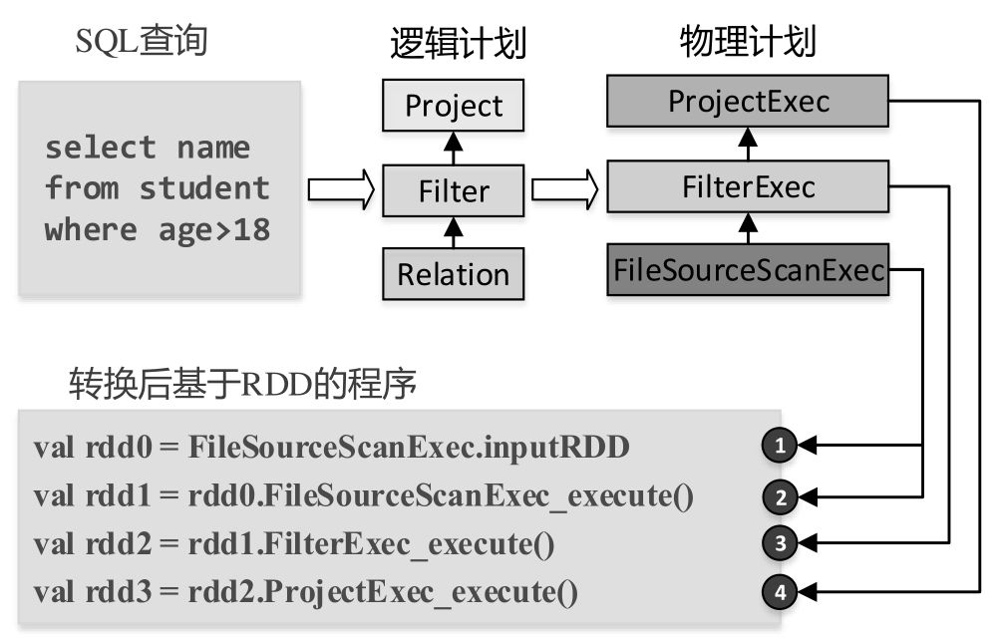
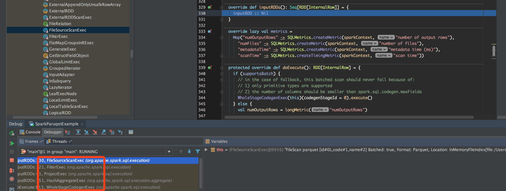

## 读取流程
### 入口点
我们以读取 parquet 文件为例, 使用 `ss.read.parquet(path)` 读取文件的时候, 入口点是`sparkSession.baseRelationToDataFrame`, 该方法接受一个 relation 返回一个 DataFrame. 

问题的关键在于如何得到这个 relation(具体来说是 `HadoopFsRelation`), 其代码在 `DataSource#resolveRelation`, 里面代码比较多,因为要 infer schema 什么的, 所有代码最后只是要构造一个 `HadoopFsRelation`, 我们先来看 `HadoopFsRelation` 的定义:

```scala
case class HadoopFsRelation(
    location: FileIndex,
    partitionSchema: StructType,
    dataSchema: StructType,
    bucketSpec: Option[BucketSpec],
    fileFormat: FileFormat,
    options: Map[String, String])(val sparkSession: SparkSession)
  extends BaseRelation with FileRelation {}
```

下面我们来说说每个属性:
1. location, 它的类型是 `FileIndex`, 其实这个 `FileIndex` 单独拿出来说内容也不少(我们可以使用这个来实现自己的 parquet index ), 这边只简单的提下(填个坑 之后详细讲下这个和各种 pruning), `FileIndex` 接口提供了一个 `listFiles` 的方法, 就是通过这个方法 Spark 知道要去哪里扫文件, 观察这个方法我们可以看到它传入了两个 filter, 可以用来做后续的 pruning, 如果有 partitionBy 的列, 那么就会多一级的目录, 所以这边返回的是一个 PartitionDirectory ( PartitionDirectory 是一个分区列的值带着一串文件列表).

    ```scala
    def listFiles(partitionFilters: Seq[Expression], dataFilters: Seq[Expression]): Seq[PartitionDirectory]
    ```

2. partitionSchema: partitionBy 的列
3. dataSchema: 数据文件本身的 schema, Spark 是从文件中 infer 出来的(如果用户没传的话)
4. bucketSpec: 如果有 bucketBy 的话, bucketBy的信息, 详细可以见我之前的博客 [Spark bucketing 机制](https://aaaaaaron.github.io/2019/10/09/Spark-Bucketing-Deep-Dive/)
5. fileFormat: 如果是 parquet 的话, 就是 ParquetFileFormat.
6. 其他可选项

我们要读取一个文件, 得到一个 DF, 其实最主要的就是要知道文件的 schema 和 location, 如果有这两个属性, 我们完全可以自己 new 一个 `HadoopFsRelation`, 传给 `baseRelationToDataFrame` (我们也可以写自己的 relation, 里面可以带我们自己需要的信息).

### Strategy 部分
Spark 靠各个 Strategy把 Logic plan 转换成 SparkPlan(以 Exec 结尾), . 读取文件会用到的 Strategy 是 `FileSourceStrategy`.

何时这个 Strategy 会被触发到? 主体代码在它的 apply 方法中, 在 apply 中可以看到, 当 match 到一个 `HadoopFsRelation` 时, 会触发到这个 Strategy. 

```scala
case PhysicalOperation(projects, filters,
      l @ LogicalRelation(fsRelation: HadoopFsRelation, _, table, _)) =>
```

`FileSourceStrategy` 主要是用来生成 `FileSourceScanExec`(如果有 project 和 filter, 会生成 `FilterExec`/`ProjectExec`, 并把 `FileSourceScanExec` 作为他们的 `child`), 我们结合最后生成的 exec 的属性一起看看它到底做了什么.

```scala
val scan = FileSourceScanExec(
    fsRelation,
    outputAttributes,
    outputSchema,
    partitionKeyFilters.toSeq,
    bucketSet,
    dataFilters,
    table.map(_.identifier))

val afterScanFilter = afterScanFilters.toSeq.reduceOption(expressions.And)
val withFilter = afterScanFilter.map(execution.FilterExec(_, scan)).getOrElse(scan)
val withProjections = if (projects == withFilter.output) {
  withFilter
} else {
  execution.ProjectExec(projects, withFilter)
}
```

0. fsRelation: 上面的 `HadoopFsRelation`
1. outputAttributes/outputSchema: 从logic plan上拿到 project 和 filter, 得到具体会用到的的是哪些列(列存, 不用扫描所有列)
2. partitionKeyFilters: 如果有 partition by 的列, 提取与其相关的 filter, 保存为 `partitionKeyFilters`.
3. bucketSet: 如果有 bucket by, 得到具体要扫哪些 buckets, 具体看我另外一篇关于 Spark bucket 的博客
4. dataFilters: 在没有 partition by 的列上的 filters
5. tableIdentifier: table 在 metastore 的 identify.

### Exec 部分

负责数据文件扫描的 spark plan 是 `FileSourceScanExec`, 借一张图来简要说明怎么会走到这个 Exec.



从图中可以看到, 从 SQL 生成了一颗逻辑执行计划树. 每个逻辑执行计划的节点都会转换成对应的一个物理执行计划(也是一颗树状结构). 



由于 Spark 会使用 Codegen,  `WholeStageCodegenExec` 是所有 Exec 的入口点. `child.asInstanceOf[CodegenSupport].inputRDDs()` 处于所有的 exec 的最头部, 会沿着 exec 树一层层调用下去最后会走到:`FileSourceScanExec#inputRDD`, 如图:

先到 `WholeStageCodegenExec` 的 `doExecute`, 这里要下面会提到的有两个地方, 一个是 `inputRDDs`, 另一个是 `buffer.hasNext` :
```scala
  override def doExecute(): RDD[InternalRow] = {
    ...
    val (ctx, cleanedSource) = doCodeGen()
    ...
    val rdds = child.asInstanceOf[CodegenSupport].inputRDDs()
    assert(rdds.size <= 2, "Up to two input RDDs can be supported")
    if (rdds.length == 1) {
      rdds.head.mapPartitionsWithIndex { (index, iter) =>
        val (clazz, _) = CodeGenerator.compile(cleanedSource)
        val buffer = clazz.generate(references).asInstanceOf[BufferedRowIterator]
        buffer.init(index, Array(iter))
        new Iterator[InternalRow] {
          override def hasNext: Boolean = {
            val v = buffer.hasNext
            if (!v) durationMs += buffer.durationMs()
            v
          }
          override def next: InternalRow = buffer.next()
        }
      }
    } 
  }
```

### FileSourceScanExec
inputRDD 首先会调用具体 `FileFormat` 实现类的 `buildReaderWithPartitionValues` ,因为我们用的是 parquet 作为例子, 所以这里会是 `ParquetFileFormat`, build 出来一个 `readFunction : ((PartitionedFile) => Iterator[InternalRow])`, 顾名思义后面会用这个 func 来读取文件.

下一步的 `createBucketedReadRDD` 我们之前的博客分析过( [Spark-Parquet-file-split](https://aaaaaaron.github.io/2018/10/22/Spark-Parquet-file-split) ), 主要是用来切分 partitions, 并且返回一个 FileScanRDD.

```scala
  private lazy val inputRDD: RDD[InternalRow] = {
    val readFile: (PartitionedFile) => Iterator[InternalRow] =
      relation.fileFormat.buildReaderWithPartitionValues(
        sparkSession = relation.sparkSession,
        dataSchema = relation.dataSchema,
        partitionSchema = relation.partitionSchema,
        requiredSchema = requiredSchema,
        filters = pushedDownFilters,
        options = relation.options,
        hadoopConf = relation.sparkSession.sessionState.newHadoopConfWithOptions(relation.options))

    relation.bucketSpec match {
      case Some(bucketing) if relation.sparkSession.sessionState.conf.bucketingEnabled =>
        createBucketedReadRDD(bucketing, readFile, selectedPartitions, relation)
      case _ =>
        createNonBucketedReadRDD(readFile, selectedPartitions, relation)
    }
  }
```

#### Pushdown filter

首先在 `FileSourceStrategy.apply`, 拿到 logic plan 上的 Filter, 处理逻辑在 `PhysicalOperation#collectProjectsAndFilters`, 这里看个方法`splitConjunctivePredicates`, 这个方法会把 Filter 按照 And 切开, 但是也不是遍历着切, 如果你外面套着个 And, 才会切, 所以会得到一个 Seq:

```scala
  protected def splitConjunctivePredicates(condition: Expression): Seq[Expression] = {
    condition match {
      case And(cond1, cond2) =>
        splitConjunctivePredicates(cond1) ++ splitConjunctivePredicates(cond2)
      case other => other :: Nil
    }
  }
```

在 `FileSourceStrategy` 中, 会用这个 filter 构造 dataFilters:`val dataFilters = normalizedFilters.filter(_.references.intersect(partitionSet).isEmpty)`, 这里会过滤掉 partition by 的列的 filter, 这个后面会单独传给 exec.

在 `ScanExec` 中, 会构造 pushedDownFilters: `dataFilters.flatMap(DataSourceStrategy.translateFilter)`, 它把 Expression 转成 sources.Filter.

注意这个 translateFilter 不支持任何的函数, 例如 cast, substr 等, filter 表达式中带着函数的, 会被直接跳过, 在最后的 `pushedDownFilters` 中, 也不会有这个 Expression 的 Filter.

#### FileIndex


## TBD
### FileScanRDD
比较重要的是 `currentIterator:Iterator[Object]` 这个东西, `compute` 方法吐出去的就是这个 iter. 可以看到这个 iter 通过之前 FileFormat 里生成的 readFunction 来生成的.

```scala
private def readCurrentFile(): Iterator[InternalRow] = {
  try {
    readFunction(currentFile)
  } catch {
    case e: FileNotFoundException =>
      throw new FileNotFoundException(
        e.getMessage + "\n" +
          "It is possible the underlying files have been updated. " +
          "You can explicitly invalidate the cache in Spark by " +
          "running 'REFRESH TABLE tableName' command in SQL or " +
          "by recreating the Dataset/DataFrame involved.")
  }
}
```

注意这个 rdd.iterator 
codegen

scan_mutableStateArray_0[0].hasNext() 调用到了 rdd 的 iter

```scala
    private void scan_nextBatch_0() throws java.io.IOException {
        long getBatchStart = System.nanoTime();
        if (scan_mutableStateArray_0[0].hasNext()) {
            scan_mutableStateArray_1[0] = (org.apache.spark.sql.vectorized.ColumnarBatch)scan_mutableStateArray_0[0].next();
            ((org.apache.spark.sql.execution.metric.SQLMetric) references[0] /* numOutputRows */).add(scan_mutableStateArray_1[0].numRows());
            scan_batchIdx_0 = 0;
            scan_mutableStateArray_2[0] = (org.apache.spark.sql.execution.vectorized.OnHeapColumnVector) scan_mutableStateArray_1[0].column(0);

        }
        scan_scanTime_0 += System.nanoTime() - getBatchStart;
    }
```

#### RecordReaderIterator
上面的 currentIterator 其实是一个 RecordReaderIterator, 里面包装了 RecordReader. 对于 Parquet 的实现是 `VectorizedParquetRecordReader`.

##### initialize
      blocks = filterRowGroups(filter, footer.getBlocks(), fileSchema);
      this.reader = new ParquetFileReader(
        configuration, footer.getFileMetaData(), file, blocks, requestedSchema.getColumns())
##### nextKeyValue

##### getCurrentValue

##### checkEndOfRowGroup

