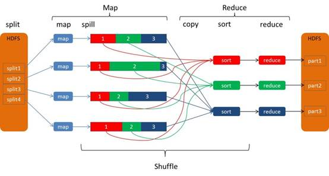
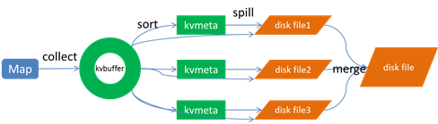
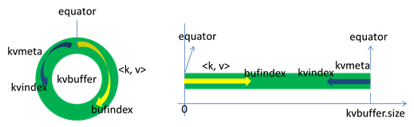
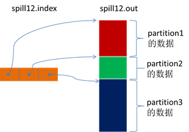
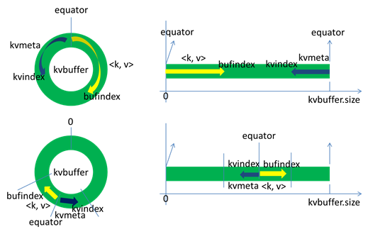
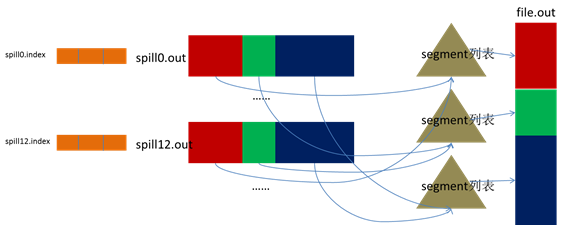
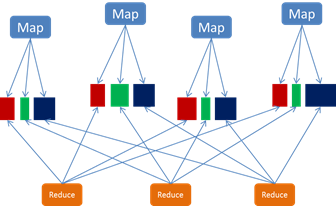
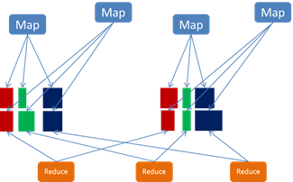

# **Shuffle 过程介绍**

## **MapReduce 的 Shuffle 过程介绍**

Shuffle 的本义是洗牌、混洗，把一组有一定规则的数据尽量转换成一组无规则的数据，越随机越好。MapReduce 中的 shuffle 更像是洗牌的逆过程，把一组无规则的数据尽量转换成一组具有一定规则的数据。

为什么 MapReduce 计算模型需要 shuffle 过程？我们都知道 MapReduce 计算模型一般包括两个重要的阶段：map 是映射，负责数据的过滤分发；reduce 是规约，负责数据的计算归并。Reduce 的数据来源于 map，map 的输出即是 reduce 的输入，reduce 需要通过 shuffle 来获取数据。

从 map 输出到 reduce 输入的整个过程可以广义地称为 shuffle。Shuffle 横跨 map 端和 reduce 端，在 map 端包括 spill 过程，在 reduce 端包括 copy 和 sort 过程，如图所示：

### Map Shuffle (Spill 过程)

Spill 过程包括输出、排序、溢写、合并等步骤，如图所示：

#### **Collect**

每个 Map 任务不断地以 <key, value> 对的形式把数据输出到在内存中构造的一个环形数据结构中。使用环形数据结构是为了更有效地使用内存空间，在内存中放置尽可能多的数据。

这个数据结构其实就是个字节数组，叫 kvbuffer，名如其义，但是这里面不光放置了 <key, value> 数据，还放置了一些索引数据，给放置索引数据的区域起了一个 kvmeta 的别名，在 kvbuffer 的一块区域上穿了一个 IntBuffer（字节序采用的是平台自身的字节序）的马甲。<key, value> 数据区域和索引数据区域在 kvbuffer 中是相邻不重叠的两个区域，用一个分界点来划分两者，分界点不是亘古不变的，而是每次 spill 之后都会更新一次。初始的分界点是 0，<key, value> 数据的存储方向是向上增长，索引数据的存储方向是向下增长，如图所示：

Kvbuffer 的存放指针 bufindex 是一直闷着头地向上增长，比如 bufindex 初始值为 0，一个 Int 型的 key 写完之后，bufindex 增长为 4，一个 Int 型的 value 写完之后，bufindex 增长为 8。

索引是对 <key, value> 在 kvbuffer 中的索引，是个四元组，包括：value 的起始位置、key 的起始位置、partition 值、value 的长度，占用四个 Int 长度，kvmeta 的存放指针 kvindex 每次都是向下跳四个 “格子”，然后再向上一个格子一个格子地填充四元组的数据。比如 kvindex 初始位置是 - 4，当第一个 <key, value> 写完之后，(kvindex+0) 的位置存放 value 的起始位置、(kvindex+1)的位置存放 key 的起始位置、(kvindex+2)的位置存放 partition 的值、(kvindex+3)的位置存放 value 的长度，然后 kvindex 跳到 - 8 位置，等第二个 <key, value> 和索引写完之后，kvindex 跳到 - 32 位置。

Kvbuffer 的大小虽然可以通过参数设置，但是总共就那么大，<key, value> 和索引不断地增加，加着加着，kvbuffer 总有不够用的那天，那怎么办？把数据从内存刷到磁盘上再接着往内存写数据，把 kvbuffer 中的数据刷到磁盘上的过程就叫 spill，多么明了的叫法，内存中的数据满了就自动地 spill 到具有更大空间的磁盘。

关于 spill 触发的条件，也就是 kvbuffer 用到什么程度开始 spill，还是要讲究一下的。如果把 kvbuffer 用得死死得，一点缝都不剩的时候再开始 spill，那 map 任务就需要等 spill 完成腾出空间之后才能继续写数据；如果 kvbuffer 只是满到一定程度，比如 80% 的时候就开始 spill，那在 spill 的同时，map 任务还能继续写数据，如果 spill 够快，map 可能都不需要为空闲空间而发愁。两利相衡取其大，一般选择后者。

Spill 这个重要的过程是由 spill 线程承担，spill 线程从 map 任务接到 “命令” 之后就开始正式干活，干的活叫 sortAndSpill，原来不仅仅是 spill，在 spill 之前还有个颇具争议性的 sort。

#### **Sort**

先把 kvbuffer 中的数据按照 partition 值和 key 两个关键字升序排序，移动的只是索引数据，排序结果是 kvmeta 中数据按照 partition 为单位聚集在一起，同一 partition 内的按照 key 有序。

#### **Spill**

Spill 线程为这次 spill 过程创建一个磁盘文件：从所有的本地目录中轮训查找能存储这么大空间的目录，找到之后在其中创建一个类似于 “spill12.out” 的文件。Spill 线程根据排过序的 kvmeta 挨个 partition 的把 <key, value> 数据吐到这个文件中，一个 partition 对应的数据吐完之后顺序地吐下个 partition，直到把所有的 partition 遍历完。一个 partition 在文件中对应的数据也叫段(segment)。

所有的 partition 对应的数据都放在这个文件里，虽然是顺序存放的，但是怎么直接知道某个 partition 在这个文件中存放的起始位置呢？强大的索引又出场了。有一个三元组记录某个 partition 对应的数据在这个文件中的索引：起始位置、原始数据长度、压缩之后的数据长度，一个 partition 对应一个三元组。然后把这些索引信息存放在内存中，如果内存中放不下了，后续的索引信息就需要写到磁盘文件中了：从所有的本地目录中轮训查找能存储这么大空间的目录，找到之后在其中创建一个类似于 “spill12.out.index” 的文件，文件中不光存储了索引数据，还存储了 crc32 的校验数据。(spill12.out.index 不一定在磁盘上创建，如果内存（默认 1M 空间）中能放得下就放在内存中，即使在磁盘上创建了，和 spill12.out 文件也不一定在同一个目录下。)

每一次 spill 过程就会最少生成一个 out 文件，有时还会生成 index 文件，spill 的次数也烙印在文件名中。索引文件和数据文件的对应关系如下图所示：

话分两端，在 spill 线程如火如荼的进行 sortAndSpill 工作的同时，map 任务不会因此而停歇，而是一无既往地进行着数据输出。Map 还是把数据写到 kvbuffer 中，那问题就来了：<key, value> 只顾着闷头按照 bufindex 指针向上增长，kvmeta 只顾着按照 kvindex 向下增长，是保持指针起始位置不变继续跑呢，还是另谋它路？如果保持指针起始位置不变，很快 bufindex 和 kvindex 就碰头了，碰头之后再重新开始或者移动内存都比较麻烦，不可取。Map 取 kvbuffer 中剩余空间的中间位置，用这个位置设置为新的分界点，bufindex 指针移动到这个分界点，kvindex 移动到这个分界点的 - 16 位置，然后两者就可以和谐地按照自己既定的轨迹放置数据了，当 spill 完成，空间腾出之后，不需要做任何改动继续前进。分界点的转换如下图所示：

Map 任务总要把输出的数据写到磁盘上，即使输出数据量很小在内存中全部能装得下，在最后也会把数据刷到磁盘上。

#### **Merge**

Map 任务如果输出数据量很大，可能会进行好几次 spill，out 文件和 index 文件会产生很多，分布在不同的磁盘上。最后把这些文件进行合并的 merge 过程闪亮登场。

Merge 过程怎么知道产生的 spill 文件都在哪了呢？从所有的本地目录上扫描得到产生的 spill 文件，然后把路径存储在一个数组里。Merge 过程又怎么知道 spill 的索引信息呢？没错，也是从所有的本地目录上扫描得到 index 文件，然后把索引信息存储在一个列表里。到这里，又遇到了一个值得纳闷的地方。在之前 spill 过程中的时候为什么不直接把这些信息存储在内存中呢，何必又多了这步扫描的操作？特别是 spill 的索引数据，之前当内存超限之后就把数据写到磁盘，现在又要从磁盘把这些数据读出来，还是需要装到更多的内存中。之所以多此一举，是因为这时 kvbuffer 这个内存大户已经不再使用可以回收，有内存空间来装这些数据了。（对于内存空间较大的土豪来说，用内存来省却这两个 io 步骤还是值得考虑的。）

然后为 merge 过程创建一个叫 file.out 的文件和一个叫 file.out.index 的文件用来存储最终的输出和索引。

一个 partition 一个 partition 的进行合并输出。对于某个 partition 来说，从索引列表中查询这个 partition 对应的所有索引信息，每个对应一个段插入到段列表中。也就是这个 partition 对应一个段列表，记录所有的 spill 文件中对应的这个 partition 那段数据的文件名、起始位置、长度等等。

然后对这个 partition 对应的所有的 segment 进行合并，目标是合并成一个 segment。当这个 partition 对应很多个 segment 时，会分批地进行合并：先从 segment 列表中把第一批取出来，以 key 为关键字放置成最小堆，然后从最小堆中每次取出最小的 <key, value> 输出到一个临时文件中，这样就把这一批段合并成一个临时的段，把它加回到 segment 列表中；再从 segment 列表中把第二批取出来合并输出到一个临时 segment，把其加入到列表中；这样往复执行，直到剩下的段是一批，输出到最终的文件中。

最终的索引数据仍然输出到 index 文件中。

Map 端的 shuffle 过程到此结束。

### Reduce shuffle 
#### **Copy**

Reduce 任务通过 http 向各个 map 任务拖取它所需要的数据。每个节点都会启动一个常驻的 http server，其中一项服务就是响应 reduce 拖取 map 数据。当有 mapOutput 的 http 请求过来的时候，http server 就读取相应的 map 输出文件中对应这个 reduce 部分的数据通过网络流输出给 reduce。

Reduce 任务拖取某个 map 对应的数据，如果在内存中能放得下这次数据的话就直接把数据写到内存中。Reduce 要向每个 map 去拖取数据，在内存中每个 map 对应一块数据，当内存中存储的 map 数据占用空间达到一定程度的时候，开始启动内存中 merge，把内存中的数据 merge 输出到磁盘上一个文件中。

如果在内存中不能放得下这个 map 的数据的话，直接把 map 数据写到磁盘上，在本地目录创建一个文件，从 http 流中读取数据然后写到磁盘，使用的缓存区大小是 64K。拖一个 map 数据过来就会创建一个文件，当文件数量达到一定阈值时，开始启动磁盘文件 merge，把这些文件合并输出到一个文件。

有些 map 的数据较小是可以放在内存中的，有些 map 的数据较大需要放在磁盘上，这样最后 reduce 任务拖过来的数据有些放在内存中了有些放在磁盘上，最后会对这些来一个全局合并。

#### **Merge Sort**

这里使用的 merge 和 map 端使用的 merge 过程一样。Map 的输出数据已经是有序的，merge 进行一次合并排序，所谓 reduce 端的 sort 过程就是这个合并的过程。一般 reduce 是一边 copy 一边 sort，即 copy 和 sort 两个阶段是重叠而不是完全分开的。

Reduce 端的 shuffle 过程至此结束。

## **Spark 的 Shuffle 过程介绍**

### **Shuffle Writer**

Spark 丰富了任务类型，有些任务之间数据流转不需要通过 shuffle，但是有些任务之间还是需要通过 shuffle 来传递数据，比如 wide dependency 的 group by key。

Spark 中需要 shuffle 输出的 map 任务会为每个 reduce 创建对应的 bucket，map 产生的结果会根据设置的 partitioner 得到对应的 bucketId，然后填充到相应的 bucket 中去。每个 map 的输出结果可能包含所有的 reduce 所需要的数据，所以每个 map 会创建 R 个 bucket（R 是 reduce 的个数），M 个 map 总共会创建 M*R 个 bucket。

Map 创建的 bucket 其实对应磁盘上的一个文件，map 的结果写到每个 bucket 中其实就是写到那个磁盘文件中，这个文件也被称为 blockFile，是 DiskBlockManager 管理器通过文件名的 hash 值对应到本地目录的子目录中创建的。每个 map 要在节点上创建 R 个磁盘文件用于结果输出，map 的结果是直接输出到磁盘文件上的，100KB 的内存缓冲是用来创建 FastBufferedOutputStream 输出流。这种方式一个问题就是 shuffle 文件过多。

针对上述 shuffle 过程产生的文件过多问题，Spark 有另外一种改进的 shuffle 过程：consolidation shuffle，以期显著减少 shuffle 文件的数量。在 consolidation shuffle 中每个 bucket 并非对应一个文件，而是对应文件中的一个 segment 部分。Job 的 map 在某个节点上第一次执行，为每个 reduce 创建 bucket 对应的输出文件，把这些文件组织成 ShuffleFileGroup，当这次 map 执行完之后，这个 ShuffleFileGroup 可以释放为下次循环利用；当又有 map 在这个节点上执行时，不需要创建新的 bucket 文件，而是在上次的 ShuffleFileGroup 中取得已经创建的文件继续追加写一个 segment；当前次 map 还没执行完，ShuffleFileGroup 还没有释放，这时如果有新的 map 在这个节点上执行，无法循环利用这个 ShuffleFileGroup，而是只能创建新的 bucket 文件组成新的 ShuffleFileGroup 来写输出。

比如一个 job 有 3 个 map 和 2 个 reduce：(1) 如果此时集群有 3 个节点有空槽，每个节点空闲了一个 core，则 3 个 map 会调度到这 3 个节点上执行，每个 map 都会创建 2 个 shuffle 文件，总共创建 6 个 shuffle 文件；(2) 如果此时集群有 2 个节点有空槽，每个节点空闲了一个 core，则 2 个 map 先调度到这 2 个节点上执行，每个 map 都会创建 2 个 shuffle 文件，然后其中一个节点执行完 map 之后又调度执行另一个 map，则这个 map 不会创建新的 shuffle 文件，而是把结果输出追加到之前 map 创建的 shuffle 文件中；总共创建 4 个 shuffle 文件；(3) 如果此时集群有 2 个节点有空槽，一个节点有 2 个空 core 一个节点有 1 个空 core，则一个节点调度 2 个 map 一个节点调度 1 个 map，调度 2 个 map 的节点上，一个 map 创建了 shuffle 文件，后面的 map 还是会创建新的 shuffle 文件，因为上一个 map 还正在写，它创建的 ShuffleFileGroup 还没有释放；总共创建 6 个 shuffle 文件。

### **Shuffle Fetcher**

Reduce 去拖 map 的输出数据，Spark 提供了两套不同的拉取数据框架：通过 socket 连接去取数据；使用 netty 框架去取数据。

每个节点的 Executor 会创建一个 BlockManager，其中会创建一个 BlockManagerWorker 用于响应请求。当 reduce 的 GET_BLOCK 的请求过来时，读取本地文件将这个 blockId 的数据返回给 reduce。如果使用的是 Netty 框架，BlockManager 会创建 ShuffleSender 用于发送 shuffle 数据。

并不是所有的数据都是通过网络读取，对于在本节点的 map 数据，reduce 直接去磁盘上读取而不再通过网络框架。

Reduce 拖过来数据之后以什么方式存储呢？Spark map 输出的数据没有经过排序，spark shuffle 过来的数据也不会进行排序，spark 认为 shuffle 过程中的排序不是必须的，并不是所有类型的 reduce 需要的数据都需要排序，强制地进行排序只会增加 shuffle 的负担。Reduce 拖过来的数据会放在一个 HashMap 中，HashMap 中存储的也是 <key, value> 对，key 是 map 输出的 key，map 输出对应这个 key 的所有 value 组成 HashMap 的 value。Spark 将 shuffle 取过来的每一个 <key, value> 对插入或者更新到 HashMap 中，来一个处理一个。HashMap 全部放在内存中。

Shuffle 取过来的数据全部存放在内存中，对于数据量比较小或者已经在 map 端做过合并处理的 shuffle 数据，占用内存空间不会太大，但是对于比如 group by key 这样的操作，reduce 需要得到 key 对应的所有 value，并将这些 value 组一个数组放在内存中，这样当数据量较大时，就需要较多内存。

当内存不够时，要不就失败，要不就用老办法把内存中的数据移到磁盘上放着。Spark 意识到在处理数据规模远远大于内存空间时所带来的不足，引入了一个具有外部排序的方案。Shuffle 过来的数据先放在内存中，当内存中存储的 <key, value> 对超过 1000 并且内存使用超过 70% 时，判断节点上可用内存如果还足够，则把内存缓冲区大小翻倍，如果可用内存不再够了，则把内存中的 <key, value> 对排序然后写到磁盘文件中。最后把内存缓冲区中的数据排序之后和那些磁盘文件组成一个最小堆，每次从最小堆中读取最小的数据，这个和 MapReduce 中的 merge 过程类似。

## **MapReduce 和 Spark 的 Shuffle 过程对比**

|| MapReduce | Spark |
| ------ | ------ | ------ |
| collect | 在内存中构造了一块数据结构用于 map 输出的缓冲 | 没有在内存中构造一块数据结构用于 map 输出的缓冲，而是直接把输出写到磁盘文件 |
| sort | map 输出的数据有排序 | map 输出的数据没有排序 |
| merge | 对磁盘上的多个 spill 文件最后进行合并成一个输出文件 | 在 map 端没有 merge 过程，在输出时直接是对应一个 reduce 的数据写到一个文件中，这些文件同时存在并发写，最后不需要合并成一个 |
| copy 框架 | jetty | netty 或者直接 socket 流 |
| 对于本节点上的文件 | 仍然是通过网络框架拖取数据 | 不通过网络框架，对于在本节点上的 map 输出文件，采用本地读取的方式 |
| copy 过来的数据存放位置 | 先放在内存，内存放不下时写到磁盘 | 一种方式全部放在内存；另一种方式先放在内存 |
| merge sort | 最后会对磁盘文件和内存中的数据进行合并排序 | 对于采用另一种方式时也会有合并排序的过程 |

## **Shuffle 后续优化方向**

通过上面的介绍，我们了解到，shuffle 过程的主要存储介质是磁盘，尽量的减少 io 是 shuffle 的主要优化方向。我们脑海中都有那个经典的存储金字塔体系，shuffle 过程为什么把结果都放在磁盘上，那是因为现在内存再大也大不过磁盘，内存就那么大，还这么多张嘴吃，当然是分配给最需要的了。如果具有 “土豪” 内存节点，减少 shuffle io 的最有效方式无疑是尽量把数据放在内存中。下面列举一些现在看可以优化的方面，期待经过我们不断的努力，TDW 计算引擎运行地更好。

### **MapReduce Shuffle 后续优化方向**

*   压缩：对数据进行压缩，减少写读数据量；

*   减少不必要的排序：并不是所有类型的 reduce 需要的数据都是需要排序的，排序这个 nb 的过程如果不需要最好还是不要的好；

*   内存化：shuffle 的数据不放在磁盘而是尽量放在内存中，除非逼不得已往磁盘上放；当然了如果有性能和内存相当的第三方存储系统，那放在第三方存储系统上也是很好的；这个是个大招；

*   网络框架：netty 的性能据说要占优了；

*   本节点上的数据不走网络框架：对于本节点上的 map 输出，reduce 直接去读吧，不需要绕道网络框架。

### **Spark Shuffle 后续优化方向**

Spark 作为 MapReduce 的进阶架构，对于 shuffle 过程已经是优化了的，特别是对于那些具有争议的步骤已经做了优化，但是 Spark 的 shuffle 对于我们来说在一些方面还是需要优化的。

*   压缩：对数据进行压缩，减少写读数据量；

*   内存化：Spark 历史版本中是有这样设计的：map 写数据先把数据全部写到内存中，写完之后再把数据刷到磁盘上；考虑内存是紧缺资源，后来修改成把数据直接写到磁盘了；对于具有较大内存的集群来讲，还是尽量地往内存上写吧，内存放不下了再放磁盘。

摘自: [腾讯大数据博客](http://data.qq.com/article?id=543)