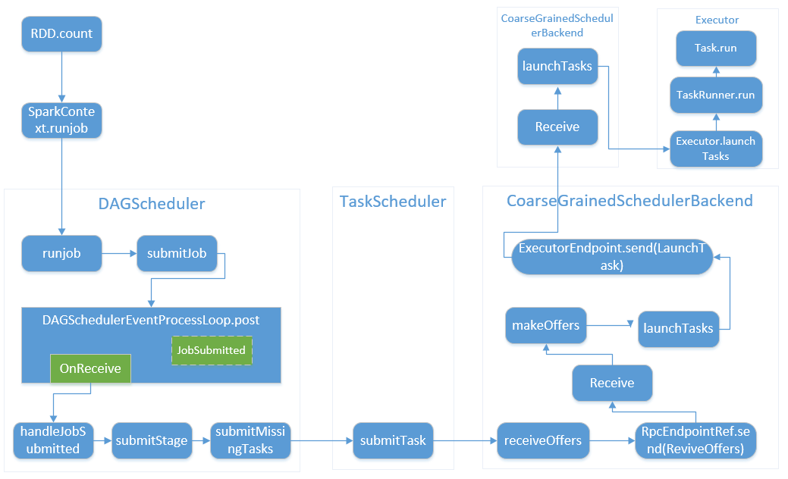
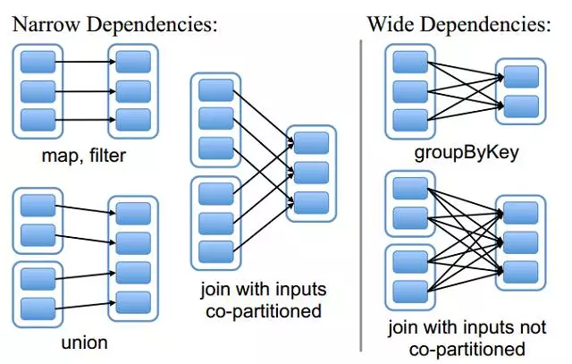

SparkContext在一开始就会初始化 _schedulerBackend、_taskScheduler、_dagScheduler这三个实例(`SparkContext.createTaskScheduler`)

用户提交的Job首先会被转换为一系列RDD，然后才交给DAGScheduler.runJob进行处理. 这些 RDD 会被划分成为多个 stage, stage 之间存在着依赖关系. Job中所有Stage的提交过程包括反向驱动与正向提交。

注: 第一幅图片来自于[博客](https://smartcxr.github.io/2019/05/01/Spark%E4%BD%9C%E4%B8%9A%E6%89%A7%E8%A1%8C%E5%8E%9F%E7%90%86/)