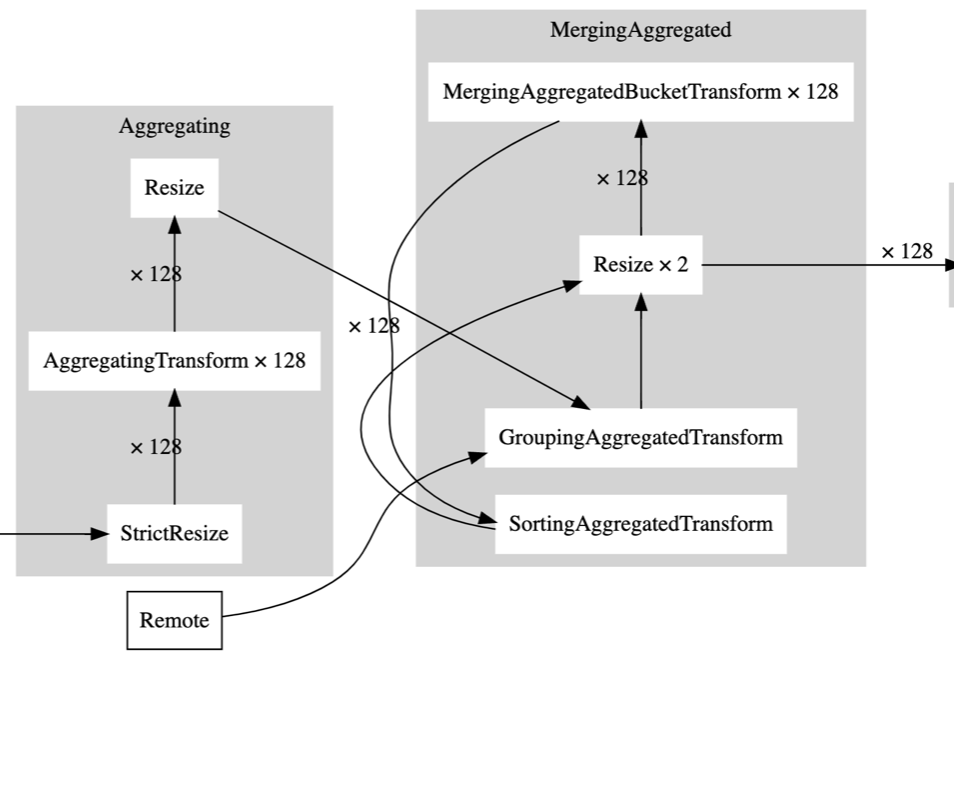
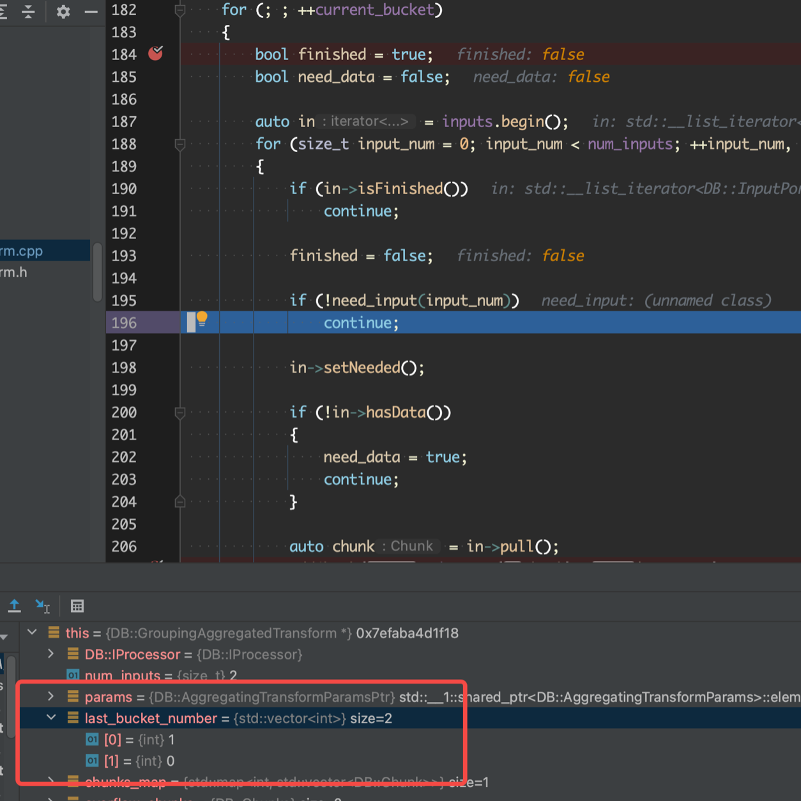
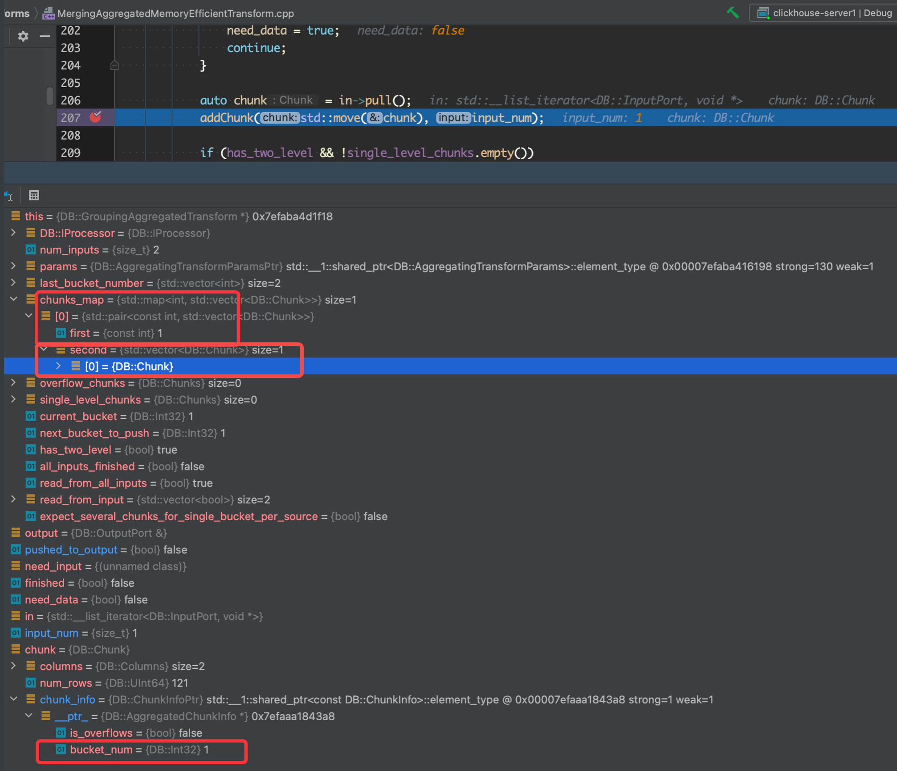

# Clickhouse Aggregation 源码分析

# 框架侧

主要就是看 AggregateTransfom 的 prepare/work方法, 先来复习下 pipeline 的状态

```cpp
        /// Processor needs some data at its inputs to proceed.
        /// You need to run another processor to generate required input and then call 'prepare' again.
        NeedData,

        /// Processor cannot proceed because output port is full or not isNeeded().
        /// You need to transfer data from output port to the input port of another processor and then call 'prepare' again.
        PortFull,

        /// All work is done (all data is processed or all output are closed), nothing more to do.
        Finished,

        /// No one needs data on output ports.
        /// Unneeded,

        /// You may call 'work' method and processor will do some work synchronously.
        Ready,

        /// You may call 'schedule' method and processor will return descriptor.
        /// You need to poll this descriptor and call work() afterwards.
        Async,

        /// Processor wants to add other processors to pipeline.
        /// New processors must be obtained by expandPipeline() call.
        ExpandPipeline,
```

看 ch 的 prepare, 最主要是关注 input 和 output, 简单来说就是啥时候从 input 拿, 啥时候往 output 放

## prepare

```cpp
IProcessor::Status AggregatingTransform::prepare()
{
    /// There are one or two input ports.
    /// The first one is used at aggregation step, the second one - while reading merged data from ConvertingAggregated

    auto & output = outputs.front();
    /// Last output is current. All other outputs should already be closed.
    auto & input = inputs.back();

    /// Check can output.
    if (output.isFinished())
    {
        input.close();
        return Status::Finished;
    }

    if (!output.canPush())
    {
        input.setNotNeeded();
        return Status::PortFull;
    }

    /// Finish data processing, prepare to generating.
    if (is_consume_finished && !is_generate_initialized)
    {
        /// Close input port in case max_rows_to_group_by was reached but not all data was read.
        inputs.front().close();

        return Status::Ready;
    }

    if (is_generate_initialized && !is_pipeline_created && !processors.empty())
        return Status::ExpandPipeline;

    /// Only possible while consuming.
    if (read_current_chunk)
        return Status::Ready;

    /// Get chunk from input.
    if (input.isFinished())
    {
        if (is_consume_finished)
        {
            output.finish();
            return Status::Finished;
        }
        else
        {
            /// Finish data processing and create another pipe.
            is_consume_finished = true;
            return Status::Ready;
        }
    }

    if (!input.hasData())
    {
        input.setNeeded();
        return Status::NeedData;
    }

    if (is_consume_finished)
        input.setNeeded();

    current_chunk = input.pull(/*set_not_needed = */ !is_consume_finished);
    read_current_chunk = true;

    if (is_consume_finished)
    {
        output.push(std::move(current_chunk));
        read_current_chunk = false;
        return Status::PortFull;
    }

    return Status::Ready;
}
```

`    if (is_consume_finished && !is_generate_initialized)`: 已经 consume 完, 但是还未 generate initialized,  返回 ready, 执行 work 的 `initGenerate` , 在 `initGenerate` 里会加上ConvertingAggregatedToChunksTransform: `processors.emplace_back(std::make_shared<ConvertingAggregatedToChunksTransform>(params, std::move(prepared_data_ptr), max_threads));`


```
if (is_generate_initialized && !is_pipeline_created && !processors.empty())
	return Status::ExpandPipeline;
```
已经 consume 完, 但是还没有`expandPipeline`, 返回 ExpandPipeline, 注意这里会创建新的 processor 并且作为 input 连接到 agg transfrom, 具体可以看 `Processors AggregatingTransform::expandPipeline()`, **注意, 这里会切换 input, 把原来 agg 的输入切换成 ConvertingAggregatedToChunksTransform**


```cpp
/// Get chunk from input.
if (input.isFinished())
{
    if (is_consume_finished)
    {
        output.finish();
        return Status::Finished;
    }
    else
    {
        /// Finish data processing and create another pipe.
        is_consume_finished = true;
        return Status::Ready;
    }
}
```

当 input finish 的时候, 这时候有两种可能

- consume 完成了, 这种时候代表 initGenerate, 所以这个 agg transform 也完成了
- consume 没完成但是input 又没数据, 代表agg 已经消费完下游的数据了, 设置 is_consume_finished 为 true, 然后开始 initGenerate


    if (is_consume_finished)
        input.setNeeded();

这里 input 已经切换成 ConvertingAggregatedToChunksTransform 了, 所以这里需要设置为 needed 让它把数据吐上来


    current_chunk = input.pull(/*set_not_needed = */ !is_consume_finished);
    read_current_chunk = true;
    if (is_consume_finished)
    {
        output.push(std::move(current_chunk));
        read_current_chunk = false;
        return Status::PortFull;
    }

这里是拿到 ConvertingAggregatedToChunksTransform 吐回来的 chunk, 放到 output


```
if (many_data->num_finished.fetch_add(1) + 1 < many_data->variants.size())
	return;
```

这里也是很重要的一个点, 这个方法在 `AggregatingTransform::initGenerate()` 中, 这个方法说明了当 agg 的所有并发没有全部完成前, 不能进行initGenerate, 这就等于给pipeline 加了一个堤坝, 会比较影响性能.

## expandPipeline

```cpp
Processors AggregatingTransform::expandPipeline()
{
    if (processors.empty())
        throw Exception(ErrorCodes::LOGICAL_ERROR, "Can not expandPipeline in AggregatingTransform. This is a bug.");
    auto & out = processors.back()->getOutputs().front();
    inputs.emplace_back(out.getHeader(), this);
    connect(out, inputs.back());
    is_pipeline_created = true;
    return std::move(processors);
}
```

把 processors 里的 processor 和 agg transform 的 input  connect

## work

```cpp
void AggregatingTransform::work()
{
    if (is_consume_finished)
        initGenerate();
    else
    {
        consume(std::move(current_chunk));
        read_current_chunk = false;
    }
}
```

下文详细说

# 执行侧

一个大体的数据流程也是重要问题: 

- 列内存从哪里分配
- 分配的内存结构，长度是如何的

1. AggregatingStep::transformPipeline, 构造 many data & AggregatingTransform, 其中 ManyAggregatedData 用来传输数据的, 下面有具体介绍

```cpp
auto many_data = std::make_shared<ManyAggregatedData>(streams);
for (size_t j = 0; j < streams; ++j)
{
    auto aggregation_for_set = std::make_shared<AggregatingTransform>(input_header, transform_params_for_set, many_data, j, merge_max_threads, temporary_data_merge_threads);
    ...
}

```

2. AggregatingTransform::consume 里调用  `Aggregator::executeOnBlock(Columns columns, UInt64 num_rows, AggregatedDataVariants & result,
       ColumnRawPtrs & key_columns, AggregateColumns & aggregate_column, bool & no_more_keys)`

其中这个 result 是 1 中的 many_data 加上 stream 号得到的 ` variants(*many_data->variants[current_variant])`

3. Aggregator::executeImplBatch 

首先把所有的值都插入到 hash table 中, hash table 的内存是 hash table 的内存(本身 hash table 的), 聚合的中间态是聚合的中间态的内存(alignedAlloc), `emplace_result.setMapped(aggregate_data);` 这个操作把两个东西结合到了一起

```cpp
    /// Is used for default implementation in HashMethodBase.
    FieldType getKeyHolder(size_t row, Arena &) const { return unalignedLoad<FieldType>(vec + row * sizeof(FieldType)); }

		std::unique_ptr<AggregateDataPtr[]> places(new AggregateDataPtr[rows]);

		/// For all rows.
    for (size_t i = 0; i < rows; ++i)
    {  
        AggregateDataPtr aggregate_data = nullptr;
        auto emplace_result = state.emplaceKey(method.data, i, *aggregates_pool);
        /// If a new key is inserted, initialize the states of the aggregate functions, and possibly something related to the key.
        if (emplace_result.isInserted())
        {
            /// exception-safety - if you can not allocate memory or create states, then destructors will not be called.
            emplace_result.setMapped(nullptr);
            aggregate_data = aggregates_pool->alignedAlloc(total_size_of_aggregate_states, align_aggregate_states);
						createAggregateStates(aggregate_data);
            emplace_result.setMapped(aggregate_data);
        }
        places[i] = aggregate_data;
    }  
```

createAggregateStates 的实现, 调用的是聚合函数的 create 方法, 这里看了一个实现是一个 placement new, 具体内存的分配是 Arena::alloc(size_t zie) 的调用(``AggregateDataPtr place = aggregates_pool->alloc(xxx)``)

得到了 `aggregate_data` , 然后就给emplace_relult 设置`emplace_result.setMapped(aggregate_data)`, 其中 emplace_result 是这么来的 `auto emplace_result = state.emplaceKey(method.data, i, *aggregates_pool);` 其中的 data 是 AggregatedDataVariants 中的成员变量, 举例来说: `using AggregatedDataWithUInt8Key = FixedImplicitZeroHashMapWithCalculatedSize<UInt8, AggregateDataPtr>;`, 一般是一个 hash table (也有可能是 two level 的), 再调用 hash table 的 emplace

```cpp
    for (size_t j = 0; j < params.aggregates_size; ++j)
    {
        try
        {
            /** An exception may occur if there is a shortage of memory.
              * In order that then everything is properly destroyed, we "roll back" some of the created states.
              * The code is not very convenient.
              */
            aggregate_functions[j]->create(aggregate_data + offsets_of_aggregate_states[j]);
        }
        catch (...)
        {
            for (size_t rollback_j = 0; rollback_j < j; ++rollback_j)
            {
                if constexpr (skip_compiled_aggregate_functions)
                    if (is_aggregate_function_compiled[j])
                        continue;

                aggregate_functions[rollback_j]->destroy(aggregate_data + offsets_of_aggregate_states[rollback_j]);
            }
            throw;
        }
    }
```

IAggregateFunctionDataHelper:: create

```cpp
using AggregateDataPtr = char *;
void create(AggregateDataPtr place) const override
{
    new (place) Data;
}
```

然后调用 agg func add的实现

```cpp
/// Add values to the aggregate functions.
for (size_t i = 0; i < aggregate_functions.size(); ++i)
{
    AggregateFunctionInstruction * inst = aggregate_instructions + i;

    if (inst->offsets)
        inst->batch_that->addBatchArray(rows, places.get(), inst->state_offset, inst->batch_arguments, inst->offsets, aggregates_pool);
    else
        inst->batch_that->addBatch(rows, places.get(), inst->state_offset, inst->batch_arguments, aggregates_pool);
}
```


`IAggregateFunction`定义的3个接口:

- `add`函数将**对应AggregateDataPtr指针之中数据取出，与列columns中的第row_num的数据进行对应的聚合计算**。
- `addBatch`函数：这是函数也是非常重要的，虽然它仅仅实现了一个for循环调用add函数。它通过这样的方式来减少虚函数的调用次数，并且增加了编译器内联的概率，同样，它实现了高效的向量化。
- `merge`函数：将两个聚合结果进行合并的函数，通常用在并发执行聚合函数的过程之中，需要将对应的聚合结果进行合并。

**举例 AggregateFunctionSum:**

`AggregateFunction`的函数就是通过`AggregateDataPtr`指针来获取`AggregateFunctionSumData`的地址, 来调用add实现聚合算子的

```cpp
static Data & data(AggregateDataPtr __restrict place) { return *reinterpret_cast<Data *>(place); }

void add(AggregateDataPtr __restrict place, const IColumn ** columns, size_t row_num, Arena *) const override
{
    const auto & column = assert_cast<const ColVecType &>(*columns[0]);
    if constexpr (is_big_int_v<T>)
        this->data(place).add(static_cast<TResult>(column.getData()[row_num]));
    else
        this->data(place).add(column.getData()[row_num]);
}
```

`AggregateFunctionSumData`实现了前文提到的`add, merge, write,read`四大方法，正好与接口`IAggregateFunction`一一对应上了

```cpp
template <typename T>
struct AggregateFunctionSumData
{
    T sum{};

    void add(T value)
    {
        sum += value;
    }

    void merge(const AggregateFunctionSumData & rhs)
    {
        sum += rhs.sum;
    }

    void write(WriteBuffer & buf) const
    {
        writeBinary(sum, buf);
    }

    void read(ReadBuffer & buf)
    {
        readBinary(sum, buf);
    }

    T get() const
    {
        return sum;
    }
};
```

## 源码分析

### AggregatingTransform

```cpp
/** Aggregates the stream of blocks using the specified key columns and aggregate functions.
  * Columns with aggregate functions adds to the end of the block.
  * If final = false, the aggregate functions are not finalized, that is, they are not replaced by their value, but contain an intermediate state of calculations.
  * This is necessary so that aggregation can continue (for example, by combining streams of partially aggregated data).
  *
  * For every separate stream of data separate AggregatingTransform is created.
  * Every AggregatingTransform reads data from the first port till is is not run out, or max_rows_to_group_by reached.
  * When the last AggregatingTransform finish reading, the result of aggregation is needed to be merged together.
  * This task is performed by ConvertingAggregatedToChunksTransform.
  * Last AggregatingTransform expands pipeline and adds second input port, which reads from ConvertingAggregated.
  *
  * Aggregation data is passed by ManyAggregatedData structure, which is shared between all aggregating transforms.
  * At aggregation step, every transform uses it's own AggregatedDataVariants structure.
  * At merging step, all structures pass to ConvertingAggregatedToChunksTransform.
  */

```

#### AggregatingTransform::work/prepare

见上面章节, 不在赘述, 我们主要看看 work 里的两个方法 `consume`/`initGenerate`

#### AggregatingTransform::consume

注意, 当 executeOnBlock 返回 false 的时候, is_consume_finished 才会为 true

```cpp
if (params->only_merge)
{
    auto block = getInputs().front().getHeader().cloneWithColumns(chunk.detachColumns());
    block = materializeBlock(block);
    if (!params->aggregator.mergeOnBlock(block, variants, no_more_keys))
        is_consume_finished = true;
}
else
{
    if (!params->aggregator.executeOnBlock(chunk.detachColumns(), num_rows, variants, key_columns, aggregate_columns, no_more_keys))
        is_consume_finished = true;
}
```

接下来进入 Aggregator 的逻辑, 主要逻辑都是在 Aggregator 这个类中

### Aggregator

#### Aggregator::executeOnBlock

这个类串起来了 agg 的主体流程:

1. 计算聚合结果
2. 是否要把结果转成 two level 的
3. 是否要把聚合的中间结果 flush 到磁盘上

```cpp
bool Aggregator::executeOnBlock(Columns columns, UInt64 num_rows, AggregatedDataVariants & result,
    ColumnRawPtrs & key_columns, AggregateColumns & aggregate_columns, bool & no_more_keys) const
{
    /// `result` will destroy the states of aggregate functions in the destructor
    result.aggregator = this;
    ...
    /// We select one of the aggregation methods and call it.
    /// For the case when there are no keys (all aggregate into one row).
    if (result.type == AggregatedDataVariants::Type::without_key)
    {
        executeWithoutKeyImpl(result.without_key, num_rows, aggregate_functions_instructions.data(), result.aggregates_pool);
    }
    else
    {
        /// This is where data is written that does not fit in `max_rows_to_group_by` with `group_by_overflow_mode = any`.
        AggregateDataPtr overflow_row_ptr = params.overflow_row ? result.without_key : nullptr;

        #define M(NAME, IS_TWO_LEVEL) \
            else if (result.type == AggregatedDataVariants::Type::NAME) \
                executeImpl(*result.NAME, result.aggregates_pool, num_rows, key_columns, aggregate_functions_instructions.data(), \
                    no_more_keys, overflow_row_ptr);

        if (false) {} // NOLINT
        APPLY_FOR_AGGREGATED_VARIANTS(M)
        #undef M
    }
    ...
    bool worth_convert_to_two_level
        = (params.group_by_two_level_threshold && result_size >= params.group_by_two_level_threshold)
        || (params.group_by_two_level_threshold_bytes && result_size_bytes >= static_cast<Int64>(params.group_by_two_level_threshold_bytes));

    /** Converting to a two-level data structure.
      * It allows you to make, in the subsequent, an effective merge - either economical from memory or parallel.
      */
    if (result.isConvertibleToTwoLevel() && worth_convert_to_two_level)
        result.convertToTwoLevel();
    ...
    /** Flush data to disk if too much RAM is consumed.
      * Data can only be flushed to disk if a two-level aggregation structure is used.
      */
    if (params.max_bytes_before_external_group_by
        && result.isTwoLevel()
        && current_memory_usage > static_cast<Int64>(params.max_bytes_before_external_group_by)
        && worth_convert_to_two_level)
    {
        size_t size = current_memory_usage + params.min_free_disk_space;

        std::string tmp_path = params.tmp_volume->getDisk()->getPath();

        // enoughSpaceInDirectory() is not enough to make it right, since
        // another process (or another thread of aggregator) can consume all
        // space.
        //
        // But true reservation (IVolume::reserve()) cannot be used here since
        // current_memory_usage does not takes compression into account and
        // will reserve way more that actually will be used.
        //
        // Hence let's do a simple check.
        if (!enoughSpaceInDirectory(tmp_path, size))
            throw Exception("Not enough space for external aggregation in " + tmp_path, ErrorCodes::NOT_ENOUGH_SPACE);

        writeToTemporaryFile(result, tmp_path);
    }

}
```

#### Aggregator::executeImpl/executeImplBatch

- 具体执行 agg 计算的函数
- 构造了一个 AggregateDataPtr 的数组 places，这里是这就是后续我们实际聚合结果存放的地方。这个数据的长度也就是这个Batch的长度，也就是说，聚合结果的指针也作为一组列式的数据，参与到后续的聚合运算之中
- 通过一个for循环，依次调用 state.emplaceKey，计算每列聚合key的hash值，进行分类，并且将对应结果依次和 places 对应
- 通过一个for循环，调用聚合函数的 addBatch 方法, 每个 AggregateFunctionInstruction 都有一个制定的 places_offset 和对应属于进行聚合计算的value列，这里通过一个for循环调用AddBatch，将 places 之中对应的数据指针和聚合value列进行聚合，最终形成所有的聚合计算的结果。

```cpp
/// Process one data block, aggregate the data into a hash table.
void executeImplBatch(
    Method & method,
    typename Method::State & state,
    Arena * aggregates_pool,
    size_t rows,
    AggregateFunctionInstruction * aggregate_instructions,
    AggregateDataPtr overflow_row) const
{
    /// Optimization for special case when there are no aggregate functions.
    if (params.aggregates_size == 0)
    {
        if constexpr (no_more_keys)
            return;

        /// For all rows.
        AggregateDataPtr place = aggregates_pool->alloc(0);
        for (size_t i = 0; i < rows; ++i)
            state.emplaceKey(method.data, i, *aggregates_pool).setMapped(place);
        return;
    } 
    ...
    std::unique_ptr<AggregateDataPtr[]> places(new AggregateDataPtr[rows]);

    /// For all rows.
    for (size_t i = 0; i < rows; ++i)
    {
        AggregateDataPtr aggregate_data = nullptr;

        if constexpr (!no_more_keys)
        {
            auto emplace_result = state.emplaceKey(method.data, i, *aggregates_pool);

            /// If a new key is inserted, initialize the states of the aggregate functions, and possibly something related to the key.
            if (emplace_result.isInserted())
            {
                /// exception-safety - if you can not allocate memory or create states, then destructors will not be called.
                emplace_result.setMapped(nullptr);

                aggregate_data = aggregates_pool->alignedAlloc(total_size_of_aggregate_states, align_aggregate_states);
                {
                    createAggregateStates(aggregate_data);
                }

                emplace_result.setMapped(aggregate_data);
            }
            else
                aggregate_data = emplace_result.getMapped();

            assert(aggregate_data != nullptr);
        }
        else
        {
            /// Add only if the key already exists.
            auto find_result = state.findKey(method.data, i, *aggregates_pool);
            if (find_result.isFound())
                aggregate_data = find_result.getMapped();
            else
                aggregate_data = overflow_row;
        }

        places[i] = aggregate_data;
    }

    /// Add values to the aggregate functions.
    for (size_t i = 0; i < aggregate_functions.size(); ++i)
    {
        AggregateFunctionInstruction * inst = aggregate_instructions + i;

        if (inst->offsets)
            inst->batch_that->addBatchArray(rows, places.get(), inst->state_offset, inst->batch_arguments, inst->offsets, aggregates_pool);
        else
            inst->batch_that->addBatch(rows, places.get(), inst->state_offset, inst->batch_arguments, aggregates_pool);
    }
}
```

这里用了比较多模板, 细节还要继续追下去.

`Method & method`:  AggregatedDataVariants 中定义的成员变量`key8/key16/key32/key32_two_level...`, 有非常多
`typename Method::State & state`:  上面成员变量中的类 State, 比如 `AggregationMethodOneNumber` 中的 `State`定义:

```cpp
    /// To use one `Method` in different threads, use different `State`.
    using State = ColumnsHashing::HashMethodOneNumber<typename Data::value_type,
        Mapped, FieldType, consecutive_keys_optimization>;
```


### AggregatedDataVariants

这里可以说整个 agg 的精髓了

这里 CH 给每种数据类型都定义了相应的数据结构, 用来计算的时候更加高效, 每种数据类型都有他自己的类型以及 two_level 的定义, two level 的实现之后会详细介绍

```cpp
/** Different data structures that can be used for aggregation
  * For efficiency, the aggregation data itself is put into the pool.
  * Data and pool ownership (states of aggregate functions)
  *  is acquired later - in `convertToBlocks` function, by the ColumnAggregateFunction object.
  *
  * Most data structures exist in two versions: normal and two-level (TwoLevel).
  * A two-level hash table works a little slower with a small number of different keys,
  *  but with a large number of different keys scales better, because it allows
  *  parallelize some operations (merging, post-processing) in a natural way.
  *
  * To ensure efficient work over a wide range of conditions,
  *  first single-level hash tables are used,
  *  and when the number of different keys is large enough,
  *  they are converted to two-level ones.
  *
  * PS. There are many different approaches to the effective implementation of parallel and distributed aggregation,
  *  best suited for different cases, and this approach is just one of them, chosen for a combination of reasons.
  */

std::unique_ptr<AggregationMethodOneNumber<UInt8, AggregatedDataWithUInt8Key, false>>           key8;
std::unique_ptr<AggregationMethodOneNumber<UInt32, AggregatedDataWithUInt64Key>>                key32;
std::unique_ptr<AggregationMethodOneNumber<UInt64, AggregatedDataWithUInt64Key>>                key64;
std::unique_ptr<AggregationMethodStringNoCache<AggregatedDataWithShortStringKey>>               key_string;
...
std::unique_ptr<AggregationMethodOneNumber<UInt32, AggregatedDataWithUInt64KeyTwoLevel>>        key32_two_level;
std::unique_ptr<AggregationMethodOneNumber<UInt64, AggregatedDataWithUInt64KeyTwoLevel>>        key64_two_level;

using AggregatedDataWithoutKey = AggregateDataPtr;

using AggregatedDataWithUInt8Key = FixedImplicitZeroHashMapWithCalculatedSize<UInt8, AggregateDataPtr>;
using AggregatedDataWithUInt16Key = FixedImplicitZeroHashMap<UInt16, AggregateDataPtr>;
...
```

#### AggregationMethodOneNumber

定义了 State, 这个是用来真正 emplaceKey 的, 会把数据 emplace 到 data 中 `data.emplace(key_holder, it, inserted);`

```cpp
/// For the case where there is one numeric key.
/// FieldType is UInt8/16/32/64 for any type with corresponding bit width.
template <typename FieldType, typename TData,
        bool consecutive_keys_optimization = true>
struct AggregationMethodOneNumber
{
    using Data = TData;
    using Key = typename Data::key_type;
    using Mapped = typename Data::mapped_type;

    Data data;

    AggregationMethodOneNumber() = default;

    template <typename Other>
    AggregationMethodOneNumber(const Other & other) : data(other.data) {}

    /// To use one `Method` in different threads, use different `State`.
    using State = ColumnsHashing::HashMethodOneNumber<typename Data::value_type,
        Mapped, FieldType, consecutive_keys_optimization>;

    /// Use optimization for low cardinality.
    static const bool low_cardinality_optimization = false;

    /// Shuffle key columns before `insertKeyIntoColumns` call if needed.
    std::optional<Sizes> shuffleKeyColumns(std::vector<IColumn *> &, const Sizes &) { return {}; }

    // Insert the key from the hash table into columns.
    static void insertKeyIntoColumns(const Key & key, std::vector<IColumn *> & key_columns, const Sizes & /*key_sizes*/)
    {
        const auto * key_holder = reinterpret_cast<const char *>(&key);
        auto * column = static_cast<ColumnVectorHelper *>(key_columns[0]);
        column->insertRawData<sizeof(FieldType)>(key_holder);
    }
};
```

#### HashMethodBase#EmplaceResult emplaceImpl

```cpp
template <typename Data, typename KeyHolder>
ALWAYS_INLINE EmplaceResult emplaceImpl(KeyHolder & key_holder, Data & data)
{
    if constexpr (Cache::consecutive_keys_optimization)
    {
        if (cache.found && cache.check(keyHolderGetKey(key_holder)))
        {
            if constexpr (has_mapped)
                return EmplaceResult(cache.value.second, cache.value.second, false);
            else
                return EmplaceResult(false);
        }
    }

    typename Data::LookupResult it;
    bool inserted = false;
    data.emplace(key_holder, it, inserted);

    [[maybe_unused]] Mapped * cached = nullptr;
    if constexpr (has_mapped)
        cached = &it->getMapped();

    if (inserted)
    {
        if constexpr (has_mapped)
        {
            new (&it->getMapped()) Mapped();
        }
    }

    if constexpr (consecutive_keys_optimization)
    {
        cache.found = true;
        cache.empty = false;

        if constexpr (has_mapped)
        {
            cache.value.first = it->getKey();
            cache.value.second = it->getMapped();
            cached = &cache.value.second;
        }
        else
        {
            cache.value = it->getKey();
        }
    }

    if constexpr (has_mapped)
        return EmplaceResult(it->getMapped(), *cached, inserted);
    else
        return EmplaceResult(inserted);
}
```


#### AggregatedDataWithUInt8Key

上面介绍了到 `data.emplace(key_holder, it, inserted);` 而这个 data 就是这个模板的第二个参数, 举例来说, 比如 `AggregatedDataWithUInt8Key`

`std::unique_ptr<AggregationMethodOneNumber<UInt8, AggregatedDataWithUInt8Key, false>>           key8;`

一层一层找下去

`using AggregatedDataWithUInt8Key = FixedImplicitZeroHashMapWithCalculatedSize<UInt8, AggregateDataPtr>;`

```cpp
template <typename Key, typename Mapped, typename Allocator = HashTableAllocator>
using FixedImplicitZeroHashMapWithCalculatedSize = FixedHashMap<
    Key,
    Mapped,
    FixedHashMapImplicitZeroCell<Key, Mapped>,
    FixedHashTableCalculatedSize<FixedHashMapImplicitZeroCell<Key, Mapped>>,
    Allocator>;
```

最后的实现是 `FixedHashTable`, 下面是它的介绍:

```
/** Used as a lookup table for small keys such as UInt8, UInt16. It's different
  *  than a HashTable in that keys are not stored in the Cell buf, but inferred
  *  inside each iterator. There are a bunch of to make it faster than using
  *  HashTable: a) It doesn't have a conflict chain; b) There is no key
  *  comparison; c) The number of cycles for checking cell empty is halved; d)
  *  Memory layout is tighter, especially the Clearable variants.
  *
  * NOTE: For Set variants this should always be better. For Map variants
  *  however, as we need to assemble the real cell inside each iterator, there
  *  might be some cases we fall short.
**/  
```

#### FixedHashTable/TwoLevelHashTable

记个 todo 把 看不动

#### AggregatedDataWithUInt64KeyTwoLevel

`using AggregatedDataWithUInt64KeyTwoLevel = TwoLevelHashMap<UInt64, AggregateDataPtr, HashCRC32<UInt64>>;`

`using TwoLevelHashMap = TwoLevelHashMapTable<Key, HashMapCell<Key, Mapped, Hash>, Hash, Grower, Allocator, ImplTable>;`


### ManyAggregatedData

成员变量

```cpp
using AggregatedDataVariantsPtr = std::shared_ptr<AggregatedDataVariants>;
using ManyAggregatedDataVariants = std::vector<AggregatedDataVariantsPtr>;

ManyAggregatedDataVariants variants;
std::vector<std::unique_ptr<std::mutex>> mutexes;
std::atomic<UInt32> num_finished = 0;
```

#### AggregatedDataVariants

```cpp
    /** Working with states of aggregate functions in the pool is arranged in the following (inconvenient) way:
      * - when aggregating, states are created in the pool using IAggregateFunction::create (inside - `placement new` of arbitrary structure);
      * - they must then be destroyed using IAggregateFunction::destroy (inside - calling the destructor of arbitrary structure);
      * - if aggregation is complete, then, in the Aggregator::convertToBlocks function, pointers to the states of aggregate functions
      *   are written to ColumnAggregateFunction; ColumnAggregateFunction "acquires ownership" of them, that is - calls `destroy` in its destructor.
      * - if during the aggregation, before call to Aggregator::convertToBlocks, an exception was thrown,
      *   then the states of aggregate functions must still be destroyed,
      *   otherwise, for complex states (eg, AggregateFunctionUniq), there will be memory leaks;
      * - in this case, to destroy states, the destructor calls Aggregator::destroyAggregateStates method,
      *   but only if the variable aggregator (see below) is not nullptr;
      * - that is, until you transfer ownership of the aggregate function states in the ColumnAggregateFunction, set the variable `aggregator`,
      *   so that when an exception occurs, the states are correctly destroyed.
      *
      * PS. This can be corrected by making a pool that knows about which states of aggregate functions and in which order are put in it, and knows how to destroy them.
      * But this can hardly be done simply because it is planned to put variable-length strings into the same pool.
      * In this case, the pool will not be able to know with what offsets objects are stored.
      */
```

成员变量

```cpp
    const Aggregator * aggregator = nullptr;

    size_t keys_size{};  /// Number of keys. NOTE do we need this field?
    Sizes key_sizes;     /// Dimensions of keys, if keys of fixed length

    /// Pools for states of aggregate functions. Ownership will be later transferred to ColumnAggregateFunction.
    Arenas aggregates_pools;
    Arena * aggregates_pool{};    /// The pool that is currently used for allocation.

    // Disable consecutive key optimization for Uint8/16, because they use a FixedHashMap
    // and the lookup there is almost free, so we don't need to cache the last lookup result
    std::unique_ptr<AggregationMethodOneNumber<UInt8, AggregatedDataWithUInt8Key, false>>           key8;
    std::unique_ptr<AggregationMethodOneNumber<UInt16, AggregatedDataWithUInt16Key, false>>         key16;

    std::unique_ptr<AggregationMethodOneNumber<UInt32, AggregatedDataWithUInt64Key>>                key32;
    std::unique_ptr<AggregationMethodOneNumber<UInt64, AggregatedDataWithUInt64Key>>                key64;
    std::unique_ptr<AggregationMethodStringNoCache<AggregatedDataWithShortStringKey>>               key_string;
    std::unique_ptr<AggregationMethodFixedStringNoCache<AggregatedDataWithShortStringKey>>          key_fixed_string;
    std::unique_ptr<AggregationMethodKeysFixed<AggregatedDataWithUInt16Key, false, false, false>>   keys16;
    std::unique_ptr<AggregationMethodKeysFixed<AggregatedDataWithUInt32Key>>                        keys32;
    ...
    Type type = Type::EMPTY;
    void convertToTwoLevel();

```


#### Arena

```cpp
/** Memory pool to append something. For example, short strings.
  * Usage scenario:
  * - put lot of strings inside pool, keep their addresses;
  * - addresses remain valid during lifetime of pool;
  * - at destruction of pool, all memory is freed;
  * - memory is allocated and freed by large MemoryChunks;
  * - freeing parts of data is not possible (but look at ArenaWithFreeLists if you need);
  */
```

```cpp
/**
  * ArenaKeyHolder is a key holder for hash tables that serializes a StringRef
  * key to an Arena.
  */
struct ArenaKeyHolder
{
    StringRef key;
    Arena & pool;

};
```

### AggregatingTransform::initGenerate

### ConvertingAggregatedToChunksTransform

```cpp
/// Generates chunks with aggregated data.
/// In single level case, aggregates data itself.
/// In two-level case, creates `ConvertingAggregatedToChunksSource` workers:
///
/// ConvertingAggregatedToChunksSource ->
/// ConvertingAggregatedToChunksSource -> ConvertingAggregatedToChunksTransform -> AggregatingTransform
/// ConvertingAggregatedToChunksSource ->
///
/// Result chunks guaranteed to be sorted by bucket number.
```

#### ConvertingAggregatedToChunksTransform::createSources

```cpp
void createSources()
{
    AggregatedDataVariantsPtr & first = data->at(0);
    shared_data = std::make_shared<ConvertingAggregatedToChunksSource::SharedData>();

    for (size_t thread = 0; thread < num_threads; ++thread)
    {
        /// Select Arena to avoid race conditions
        Arena * arena = first->aggregates_pools.at(thread).get();
        auto source = std::make_shared<ConvertingAggregatedToChunksSource>(params, data, shared_data, arena);

        processors.emplace_back(std::move(source));
    }
}
```

### MergingAggregatedTransform

####  MergingAggregatedTransform::consume

如果是 two level 的, 则可以并行

```cpp
/** If the remote servers used a two-level aggregation method,
  *  then blocks will contain information about the number of the bucket.
  * Then the calculations can be parallelized by buckets.
  * We decompose the blocks to the bucket numbers indicated in them.
  */

auto block = getInputPort().getHeader().cloneWithColumns(chunk.getColumns());
block.info.is_overflows = agg_info->is_overflows;
block.info.bucket_num = agg_info->bucket_num;

bucket_to_blocks[agg_info->bucket_num].emplace_back(std::move(block));
```

#### MergingAggregatedTransform::generate

```cpp
/// TODO: this operation can be made async. Add async for IAccumulatingTransform.
params->aggregator.mergeBlocks(std::move(bucket_to_blocks), data_variants, max_threads);
blocks = params->aggregator.convertToBlocks(data_variants, params->final, max_threads);
next_block = blocks.begin();
```


### Two level group by

参数 group_by_two_level_threshold/group_by_two_level_threshold_bytes

主要用于增加并行度

判断位置: Aggregator::executeOnBlock

```SQL
if (result.isConvertibleToTwoLevel() && worth_convert_to_two_level)
    result.convertToTwoLevel();
```

`    std::unique_ptr<AggregationMethodOneNumber<UInt32, AggregatedDataWithUInt64KeyTwoLevel>> key32_two_level;`

`using AggregatedDataWithUInt64KeyTwoLevel = TwoLevelHashMap<UInt64, AggregateDataPtr, HashCRC32<UInt64>>;`

#### ConvertingAggregatedToChunksSource

生成 bucket 位置: ConvertingAggregatedToChunksSource

```SQL
static constexpr UInt32 NUM_BUCKETS = 256;

Chunk generate() override
{
    UInt32 bucket_num = shared_data->next_bucket_to_merge.fetch_add(1);

    if (bucket_num >= NUM_BUCKETS)
        return {};

    Block block = params->aggregator.mergeAndConvertOneBucketToBlock(*data, arena, params->final, bucket_num, &shared_data->is_cancelled);
    Chunk chunk = convertToChunk(block);

    shared_data->is_bucket_processed[bucket_num] = true;

    return chunk;
}

template <typename Method>
Block Aggregator::convertOneBucketToBlock(
    AggregatedDataVariants & data_variants,
    Method & method,
    Arena * arena,
    bool final,
    size_t bucket) const
{
    Block block = prepareBlockAndFill(data_variants, final, method.data.impls[bucket].size(),
        [bucket, &method, arena, this] (
            MutableColumns & key_columns,
            AggregateColumnsData & aggregate_columns,
            MutableColumns & final_aggregate_columns,
            bool final_)
        {
            convertToBlockImpl(method, method.data.impls[bucket],
                key_columns, aggregate_columns, final_aggregate_columns, arena, final_);
        });

    block.info.bucket_num = bucket;
    return block;
}
```

#### TwoLevelHashMapTable

```cpp
static constexpr size_t NUM_BUCKETS = 1ULL << BITS_FOR_BUCKET;
static constexpr size_t MAX_BUCKET = NUM_BUCKETS - 1;
```


```cpp
template <typename KeyHolder>
void ALWAYS_INLINE emplace(KeyHolder && key_holder, LookupResult & it, bool & inserted)
{
    size_t hash_value = hash(keyHolderGetKey(key_holder));
    emplace(key_holder, it, inserted, hash_value);
}
```

# Clickhouse distributed aggregation memory efficient

## 配置&背景

开启 distributed_aggregation_memory_efficient 的优势是和原来的内存比, 最多只会消耗 1/256 * the_number_of_threads 的原内存, 但是劣势是执行速度变慢

1. set distributed_aggregation_memory_efficient=1;
2. set group_by_two_level_threshold=1;
3. set group_by_two_level_threshold_bytes=1;

官网: When merging data flushed to the disk, as well as when merging results from remote servers when the `distributed_aggregation_memory_efficient` setting is enabled, consumes up to `1/256 * the_number_of_threads` from the total amount of RAM.

和原来的内存比, 最多只会消耗 1/256 * the_number_of_threads 的原内存

## pipeline 构成

### MergingAggregatedMemoryEfficientTransform

```cpp
void addMergingAggregatedMemoryEfficientTransform(
    Pipe & pipe,
    AggregatingTransformParamsPtr params,
    size_t num_merging_processors)
{
    pipe.addTransform(std::make_shared<GroupingAggregatedTransform>(pipe.getHeader(), pipe.numOutputPorts(), params));

    if (num_merging_processors <= 1)
    {
        /// --> GroupingAggregated --> MergingAggregatedBucket -->
        pipe.addTransform(std::make_shared<MergingAggregatedBucketTransform>(params));
        return;
    }

    /// -->                                        --> MergingAggregatedBucket -->
    /// --> GroupingAggregated --> ResizeProcessor --> MergingAggregatedBucket --> SortingAggregated -->
    /// -->                                        --> MergingAggregatedBucket -->

    pipe.resize(num_merging_processors);

    pipe.addSimpleTransform([params](const Block &)
    {
        return std::make_shared<MergingAggregatedBucketTransform>(params);
    });

    pipe.addTransform(std::make_shared<SortingAggregatedTransform>(num_merging_processors, params));
}
```

加了三个 processor:

1. GroupingAggregatedTransform
2. MergingAggregatedBucketTransform
3. SortingAggregatedTransform



## GroupingAggregatedTransform


1. 上游的 input 是其他分布式节点经过 partial agg 的数据, 被 split 成了 256 个 buckets, 有多个 inputs, 单个输出
2. 按照 bucket number group by, 对上游的 chunk 组成一个 list 传给下游
3. 上游传输的 chunk 都是按照 agg_info 中 的 bucket number 保序传输过来的, 如果a < b, 则bucket_num = a 块在bucket_num = b 之前, 利用这个机制, 可以每次只保留一个 chunk 在内存中

### 源码解析

#### GroupingAggregatedTransform::prepare

GroupingAggregatedTransform 最主要逻辑就在 prepare 方法中

```cpp
IProcessor::Status GroupingAggregatedTransform::prepare()
{
    /// Check can output.
    auto & output = outputs.front();

    if (output.isFinished())
    {
        for (auto & input : inputs)
            input.close();

        chunks_map.clear();
        last_bucket_number.clear();
        return Status::Finished;
    }

    /// Read first time from each input to understand if we have two-level aggregation.
    if (!read_from_all_inputs)
    {
        readFromAllInputs();
        if (!read_from_all_inputs)
            return Status::NeedData;
    }

    /// Convert single level to two levels if have two-level input.
    if (has_two_level && !single_level_chunks.empty())
        return Status::Ready;

    /// Check can push (to avoid data caching).
    if (!output.canPush())
    {
        for (auto & input : inputs)
            input.setNotNeeded();

        return Status::PortFull;
    }

    bool pushed_to_output = false;

    /// Output if has data.
    if (has_two_level)
        pushed_to_output = tryPushTwoLevelData();

    auto need_input = [this](size_t input_num)
    {
        if (last_bucket_number[input_num] < current_bucket)
            return true;

        return expect_several_chunks_for_single_bucket_per_source && last_bucket_number[input_num] == current_bucket;
    };

    /// Read next bucket if can.
    for (; ; ++current_bucket)
    {
        bool finished = true;
        bool need_data = false;

        auto in = inputs.begin();
        for (size_t input_num = 0; input_num < num_inputs; ++input_num, ++in)
        {
            if (in->isFinished())
                continue;

            finished = false;

            if (!need_input(input_num))
                continue;

            in->setNeeded();

            if (!in->hasData())
            {
                need_data = true;
                continue;
            }

            auto chunk = in->pull();
            addChunk(std::move(chunk), input_num);

            if (has_two_level && !single_level_chunks.empty())
                return Status::Ready;

            if (!in->isFinished() && need_input(input_num))
                need_data = true;
        }

        if (finished)
        {
            all_inputs_finished = true;
            break;
        }

        if (need_data)
            return Status::NeedData;
    }

    if (pushed_to_output)
        return Status::PortFull;

    if (has_two_level)
    {
        if (tryPushTwoLevelData())
            return Status::PortFull;

        /// Sanity check. If new bucket was read, we should be able to push it.
        /// This is always false, but we still keep this condition in case the code will be changed.
        if (!all_inputs_finished) // -V547
            throw Exception("GroupingAggregatedTransform has read new two-level bucket, but couldn't push it.",
                            ErrorCodes::LOGICAL_ERROR);
    }
    else
    {
        if (!all_inputs_finished) // -V547
            throw Exception("GroupingAggregatedTransform should have read all chunks for single level aggregation, "
                            "but not all of the inputs are finished.", ErrorCodes::LOGICAL_ERROR);

        if (tryPushSingleLevelData())
            return Status::PortFull;
    }

    /// If we haven't pushed to output, then all data was read. Push overflows if have.
    if (tryPushOverflowData())
        return Status::PortFull;

    output.finish();
    return Status::Finished;
}
```

比较关键的是里面两个 for 循环, 会遍历所有的 inputs, 如果 input 的当前的 last_bucket_number(Last bucket read from each input) 小于 current_bucket(``need_input` 方法), 就说明需要从上游 pull data

举例来说, 如果这个算子有两个 input(对应两个节点), current_bucket 是 1, 可以看到截图里第 0 号 input 接受的 chunk 的 bucket num已经是 1 了, 所以它 need_input 返回 false, 而另一个 input 的 last_bucket_number 是 0, 小于 current_bucket, 下面会有个判断, 如果 `in->hasData`, 会直接 pull 然后 addChunk, 否则会直接返回`Status::NeedData`

所以这也带来一个问题, 一个流需要等另一个流的 input, 只有所有流的 bucket_num 都对齐, 才能进行下一步的工作



对这个 case 来说, 当下面的 chunk 被加到 chunks_map 的时候, 这里的 for 循环就算执行完成了



#### GroupingAggregatedTransform::addChunk

这个方法比较简单, 就是把上游 input 收到的 chunk 加到一个 chunks_map 中, 这也是我们要关注的核心结构, 同时也把上面提到的`last_bucket_number` 更新

`std::map<Int32, Chunks> chunks_map`, 虽然是一个 map, 但是他只会存储一个 bucket num 的数据, 每当所有 input 的某个 bucket num 的 chunk 都收齐之后, 会发给下游算子, 然后会把这个 bucket numb 的 chunk erase 掉

```cpp
void GroupingAggregatedTransform::addChunk(Chunk chunk, size_t input)
{
    const auto & info = chunk.getChunkInfo();
    if (!info)
        throw Exception("Chunk info was not set for chunk in GroupingAggregatedTransform.", ErrorCodes::LOGICAL_ERROR);

    const auto * agg_info = typeid_cast<const AggregatedChunkInfo *>(info.get());
    if (!agg_info)
        throw Exception("Chunk should have AggregatedChunkInfo in GroupingAggregatedTransform.", ErrorCodes::LOGICAL_ERROR);

    Int32 bucket = agg_info->bucket_num;
    bool is_overflows = agg_info->is_overflows;

    if (is_overflows)
        overflow_chunks.emplace_back(std::move(chunk));
    else if (bucket < 0)
        single_level_chunks.emplace_back(std::move(chunk));
    else
    {
        chunks_map[bucket].emplace_back(std::move(chunk));
        has_two_level = true;
        last_bucket_number[input] = bucket;
    }
}
```

#### GroupingAggregatedTransform::tryPushTwoLevelData

这里会把会判断下 chunk 能不能被 push, 如果可以的话, 就从 map 中 erase 掉, 然后调用`pushData` 方法, 这就是为什么 `distributed_aggregation_memory_efficient` 可以节省内存, **他每次只存储一个 bucket_num 的 chunk 列表**, 发到下游之后就 erase 掉

```cpp
bool GroupingAggregatedTransform::tryPushTwoLevelData()
{
    auto try_push_by_iter = [&](auto batch_it)
    {
        if (batch_it == chunks_map.end())
            return false;

        Chunks & cur_chunks = batch_it->second;
        if (cur_chunks.empty())
        {
            chunks_map.erase(batch_it);
            return false;
        }

        pushData(std::move(cur_chunks), batch_it->first, false);
        chunks_map.erase(batch_it);
        return true;
    };

    if (all_inputs_finished)
    {
        /// Chunks are sorted by bucket.
        while (!chunks_map.empty())
            if (try_push_by_iter(chunks_map.begin()))
                return true;
    }
    else
    {
        for (; next_bucket_to_push < current_bucket; ++next_bucket_to_push)
            if (try_push_by_iter(chunks_map.find(next_bucket_to_push)))
                return true;
    }

    return false;
}
```


#### GroupingAggregatedTransform::pushData

会把同个 bucket 的 chunk 放到 ChunksToMerge 中去, 作为 ChunkInfo 传递给下游output, 算是个 trick 把

```cpp
void GroupingAggregatedTransform::pushData(Chunks chunks, Int32 bucket, bool is_overflows)
{
    auto & output = outputs.front();
    auto info = std::make_shared<ChunksToMerge>();
    info->bucket_num = bucket;
    info->is_overflows = is_overflows;
    info->chunks = std::make_unique<Chunks>(std::move(chunks));

    Chunk chunk;
    chunk.setChunkInfo(std::move(info));
    output.push(std::move(chunk));
}

```

## MergingAggregatedBucketTransform

Merge aggregated data from single bucket.

这一步比较简单, 上面 GroupingAggregatedTransform 算子传下来的 chunk 是空的, 实际数据存储在 chunk_info 中, `ChunksToMerge` 里面记录了同一个 bucket num 的所有 chunks

可以并发: `pipe.resize(num_merging_processors);`

```cpp
    /// -->                                        --> MergingAggregatedBucket -->
    /// --> GroupingAggregated --> ResizeProcessor --> MergingAggregatedBucket --> SortingAggregated -->
    /// -->                                        --> MergingAggregatedBucket -->
```


```cpp
struct ChunksToMerge : public ChunkInfo
{
    std::unique_ptr<Chunks> chunks;
    Int32 bucket_num = -1;
    bool is_overflows = false;
};

```

MergingAggregatedBucketTransform 做的就是把童儿 bucket num 的 chunk merge 起来: `params->aggregator.mergeBlocks(blocks_list, params->final)`

```cpp
void MergingAggregatedBucketTransform::transform(Chunk & chunk)
{
    const auto & info = chunk.getChunkInfo();
    const auto * chunks_to_merge = typeid_cast<const ChunksToMerge *>(info.get());

    if (!chunks_to_merge)
        throw Exception("MergingAggregatedSimpleTransform chunk must have ChunkInfo with type ChunksToMerge.",
                        ErrorCodes::LOGICAL_ERROR);

    auto header = params->aggregator.getHeader(false);

    BlocksList blocks_list;
    for (auto & cur_chunk : *chunks_to_merge->chunks)
    {
        const auto & cur_info = cur_chunk.getChunkInfo();
        if (!cur_info)
            throw Exception("Chunk info was not set for chunk in MergingAggregatedBucketTransform.",
                    ErrorCodes::LOGICAL_ERROR);

        const auto * agg_info = typeid_cast<const AggregatedChunkInfo *>(cur_info.get());
        if (!agg_info)
            throw Exception("Chunk should have AggregatedChunkInfo in MergingAggregatedBucketTransform.",
                    ErrorCodes::LOGICAL_ERROR);

        Block block = header.cloneWithColumns(cur_chunk.detachColumns());
        block.info.is_overflows = agg_info->is_overflows;
        block.info.bucket_num = agg_info->bucket_num;

        blocks_list.emplace_back(std::move(block));
    }

    auto res_info = std::make_shared<AggregatedChunkInfo>();
    res_info->is_overflows = chunks_to_merge->is_overflows;
    res_info->bucket_num = chunks_to_merge->bucket_num;
    chunk.setChunkInfo(std::move(res_info));

    auto block = params->aggregator.mergeBlocks(blocks_list, params->final);
    size_t num_rows = block.rows();
    chunk.setColumns(block.getColumns(), num_rows);
}
```

## SortingAggregatedTransform

读取 MergingAggregatedBucketTransform 聚合好后的数据, 按照 bucket num 排序然后输出, 代码感兴趣大家自行看下吧

Presumption: inputs 返回的 chunks 都是递增的bucket number, 每个 bucket number 都至多只有一个 chunk(因为上面都聚合过了)


