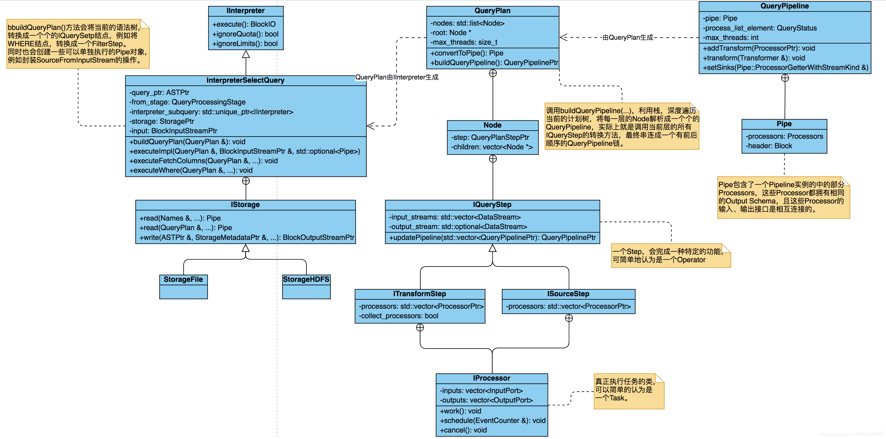
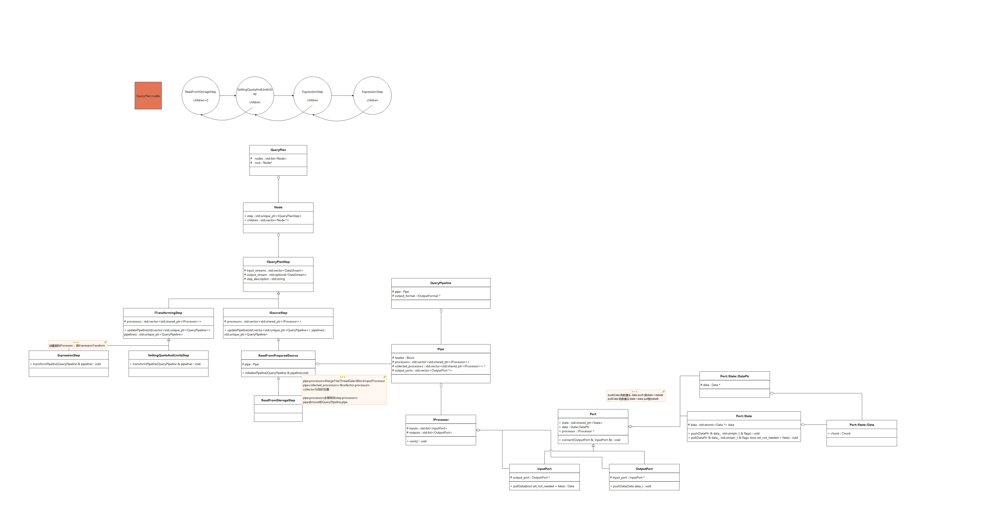
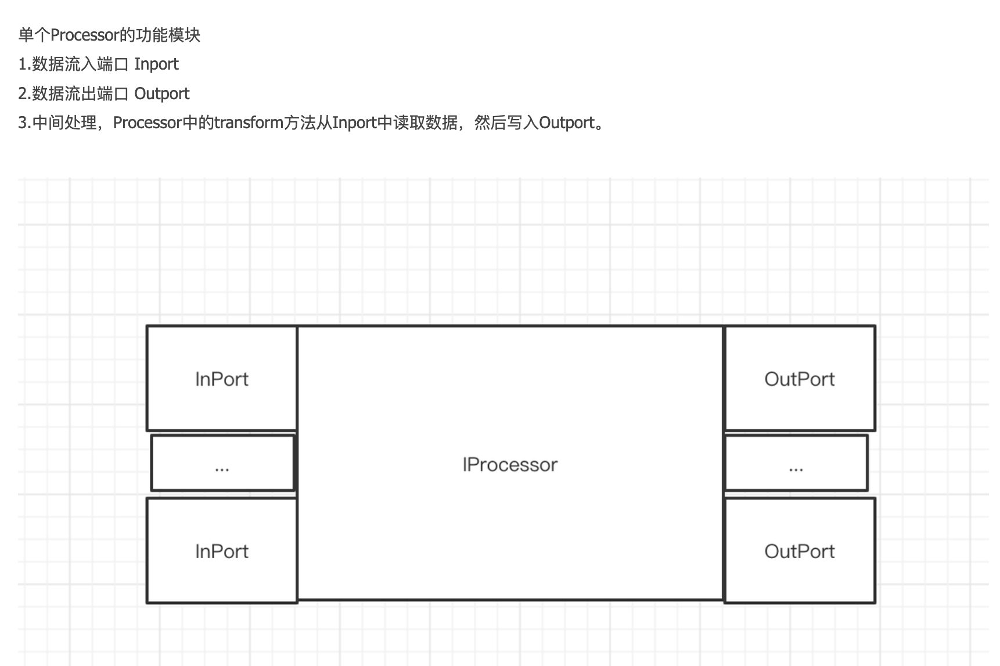
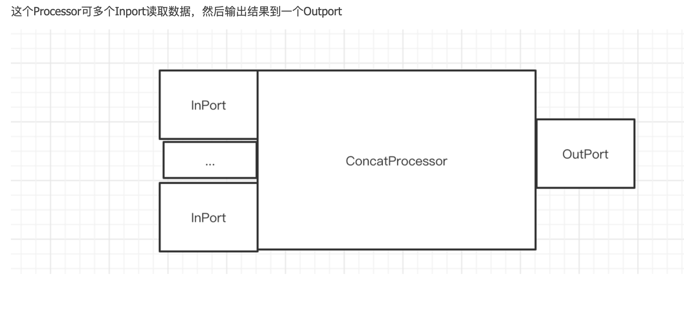
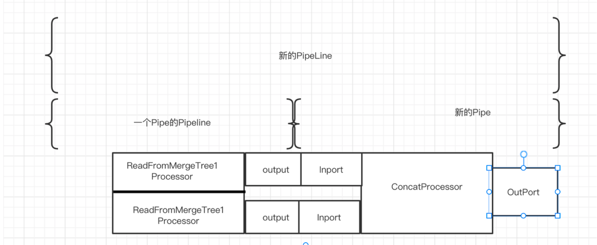
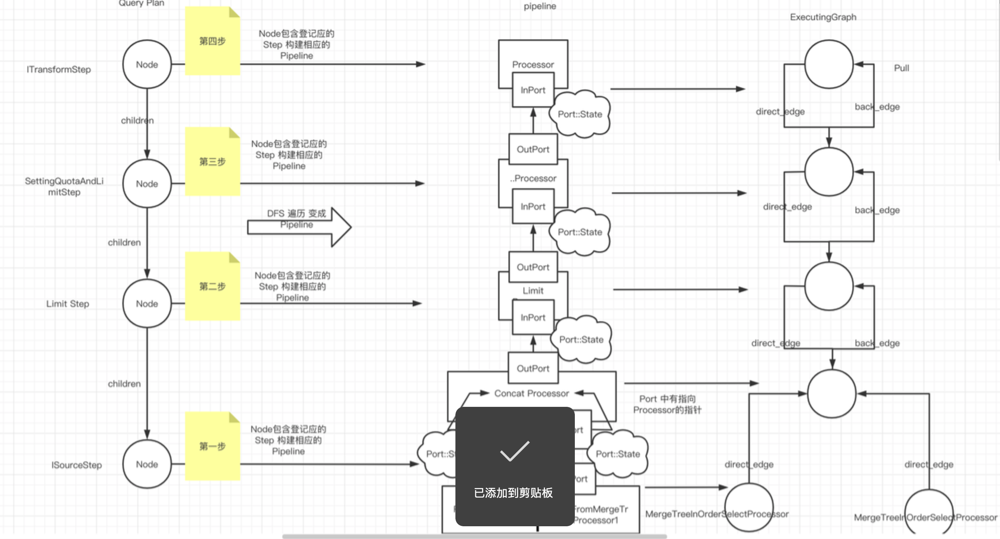
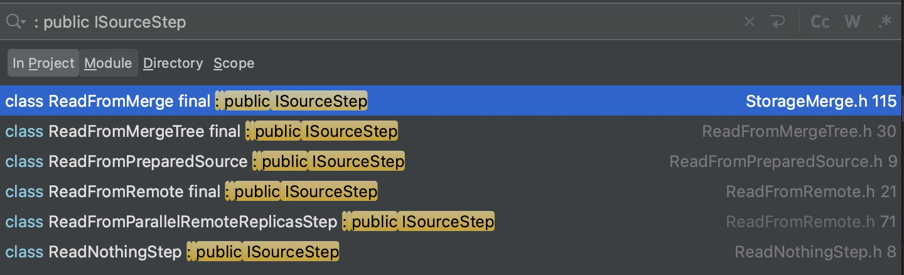
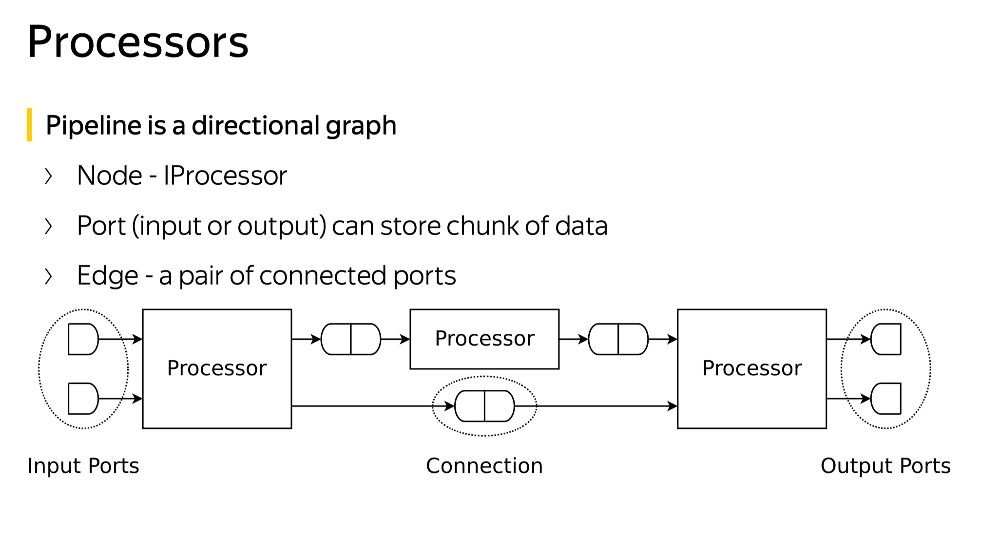

# 概览

所用代码为 2022.10.15 ClickHouse master 分支: 9ccbadc359d05fad8a1f3d80d6677b55b3006c2c

## 概念

Block：数据块，ClickHouse进行数据读、写的基本单元，每一个Block实例，不仅包含数据域，还包含了每个列的meta信息。

Chunk：数据块，保存实际数据的单元，Block中的数据域的指向的就是这个类型的实例。

Row：一行记录，包含多个列索引，Chunk可以认为是由多个Row组成的。

Column：一列数据，包含一个列上的Block Size数量的行。

一个Block对象，可以简单理解为一张表，它的每一列都有相同的长度，每一行长度也等.

## 基本流程

```
# 以TCP连接为例 select id from query_cache;
TCPHandler::runImpl
    BlockIO executeQuery // 解析query
        executeQueryImpl
            ast = parseQuery // 解析生成ast
                ...
            interpreter = InterpreterFactory::get // 根据ast实例化interpreter
            interpreter->execute() // InterpreterSelectWithUnionQuery::execute
                buildQueryPlan // 构建query paln 如 InterpreterSelectQuery::buildQueryPlan
                    InterpreterSelectQuery::executeImpl
                        executeFetchColumns
                            storage->read // StorageMergeTree::read --> MergeTreeDataSelectExecutor::read
                                StorageMergeTree::read
                                    MergeTreeDataSelectExecutor::read
                                        MergeTreeDataSelectExecutor::readFromParts // 根据一定条件选择需要读取的part，这里我们过滤掉如何选择的流程，直接去看怎么构建query plan
                                            spreadMarkRangesAmongStreams // 构建queryplan
                                                MergeTreeThreadSelectBlockInputProcessor
                                                unitePipes // 多个pipe绑定为一个pipe
                                                createPlanFromPipe // step = std::make_unique<ReadFromStorageStep>; plan->addStep(step); processor为MergeTreeThreadSelectBlockInputProcessor
                            query_plan.addStep // 增加step SettingQuotaAndLimits
                        executeExpression // 增加step ExpressionStep
                        executeProjection // 增加step ExpressionStep
                buildQueryPipeline // 构建pipeline
                    updatePipeline // ITransformingStep::updatePipeline-->ExpressionStep::transformPipeline-->addSimpleTransform-->collected_processors指向的processors和pipe.processors都增加processor; 即ExpressionTransform
            pipeline.addSimpleTransform // 增加processor LimitsCheckingTransform
    processOrdinaryQueryWithProcessors
        sendData(header); // 先向client发送header
        PullingAsyncPipelineExecutor executor(pipeline); // 构建一个执行器。 make_shared<LazyOutputFormat>
        PullingAsyncPipelineExecutor::pull
            threadFunction
                PipelineExecutor::execute
                    PipelineExecutor::executeImpl
                        initializeExecution
                            prepareProcessor
                                processor->prepare // 执行pushdata和pulldata操作
                        executeSingleThread
                            executeStepImpl // 根据线程号，弹出任务
                                addJob // 初始化node->job
                                node->job()
                                    executeJob
                                        processor->work() // 各个processor执行
                                            ...
    state.io.onFinish() // log和状态记录
```
















# 具体流程

由于之前一直做优化器相关的 SQL 层, 各个引擎都是大同小异, 所以这里对 SQL 层不会特别深入, CH 的 SQL 层目前也不太完善, 没有太多可介绍的

## Interpreter

```cpp
            interpreter = InterpreterFactory::get(ast, context, SelectQueryOptions(stage).setInternal(internal));
```

在老版本的 CH 中(ch19), interpreter 直接构造了输入输出流(input stream/ output stream), 通过这些 stream 串起了整个查询

对于不同的查询类型(DQL/DML/DDL) 等有不同的 interpreter, 我们这里主要关注和 DQL 相关的``InterpreterSelectQuery`

```cpp
BlockIO InterpreterSelectQuery::execute()
{
    BlockIO res;
    QueryPlan query_plan;

    buildQueryPlan(query_plan);
  
    auto builder = query_plan.buildQueryPipeline(
        QueryPlanOptimizationSettings::fromContext(context), 
        BuildQueryPipelineSettings::fromContext(context));
  
    res.pipeline = QueryPipelineBuilder::getPipeline(std::move(*builder));
    setQuota(res.pipeline);
    return res;
}
```

### buildQueryPlan

构建逻辑执行计划

QueryPlan 实际上是一棵`QueryPlanStep`树

```cpp
struct Node
{
    QueryPlanStepPtr step;
    std::vector<Node *> children = {};
};

using Nodes = std::list<Node>;
class QueryPlan
{
    Nodes nodes;
    Node * root = nullptr;
}
```

#### IQueryPlanStep

这是一个基类, 每个 sql 算子都会又对应的实现

直接继承 IQueryPlanStep 的, 一般都继承 ITransformingStep/ISourceStep, 比较复杂的 case 会直接继承 IQueryPlanStep, 例如 JoinStep, 需要自己实现 `QueryPipelineBuilderPtr updatePipeline` , 比较复杂

```
ISourceStep
CreatingSetsStep
ITransformingStep
IntersectOrExceptStep
JoinStep
UnionStep
```

##### 举例: UnionStep

```cpp
QueryPipelineBuilderPtr UnionStep::updatePipeline(QueryPipelineBuilders pipelines, const BuildQueryPipelineSettings &)
{
    auto pipeline = std::make_unique<QueryPipelineBuilder>();
    QueryPipelineProcessorsCollector collector(*pipeline, this);

    if (pipelines.empty())
    {
        pipeline->init(Pipe(std::make_shared<NullSource>(output_stream->header)));
        processors = collector.detachProcessors();
        return pipeline;
    }

    for (auto & cur_pipeline : pipelines)
    {
        /// Headers for union must be equal.
        /// But, just in case, convert it to the same header if not.
        if (!isCompatibleHeader(cur_pipeline->getHeader(), getOutputStream().header))
        {
            auto converting_dag = ActionsDAG::makeConvertingActions(
                cur_pipeline->getHeader().getColumnsWithTypeAndName(),
                getOutputStream().header.getColumnsWithTypeAndName(),
                ActionsDAG::MatchColumnsMode::Name);

            auto converting_actions = std::make_shared<ExpressionActions>(std::move(converting_dag));
            cur_pipeline->addSimpleTransform([&](const Block & cur_header)
            {
                return std::make_shared<ExpressionTransform>(cur_header, converting_actions);
            });
        }
    }

    *pipeline = QueryPipelineBuilder::unitePipelines(std::move(pipelines), max_threads);

    processors = collector.detachProcessors();
    return pipeline;
}

```


#### ITransformingStep

最重要的是 ITransformingStep, 几乎所有算子都继承自 ITransformingStep, 例如 filter/sort/limit 等等

ITransformingStep 有单个的输入/输出

```
ExpressionStep
AggregatingStep
ArrayJoinStep
CreateSetAndFilterOnTheFlyStep
CreatingSetStep
CubeStep
DistinctStep
ExtremesStep
FillingStep
FilterStep
FilledJoinStep
LimitByStep
LimitStep
Merging AggregatedStep
OffsetStep
RollupStep
SortingStep
TotalsHaving Step
WindowStep
```

##### 举例: FilterStep

step 中会定义 `transformPipeline`, `xxxTransFORM` 就是物理执行的算子(processer), 这个后面 在 query pipeline 中会介绍到, 等于是从逻辑执行计划到物理执行计划的一个转换

```cpp
void FilterStep::transformPipeline(QueryPipelineBuilder & pipeline, const BuildQueryPipelineSettings & settings)
{
    auto expression = std::make_shared<ExpressionActions>(actions_dag, settings.getActionsSettings());
    pipeline.addSimpleTransform([&](const Block & header, QueryPipelineBuilder::StreamType stream_type)
    {
        bool on_totals = stream_type == QueryPipelineBuilder::StreamType::Totals;
        return std::make_shared<FilterTransform>(header, expression, filter_column_name, remove_filter_column, on_totals);
    });
 }
```

#### ISourceStep

Step which takes empty pipeline and initializes it. Returns single logical DataStream.

子类需要实现 `initializePipeline`, 主要就是要构造 `Pipe`



##### 举例: ReadFromRemote

```cpp
void ReadFromRemote::initializePipeline(QueryPipelineBuilder & pipeline, const BuildQueryPipelineSettings &)
{
    Pipes pipes;

    for (const auto & shard : shards)
    {
        if (shard.lazy)
            addLazyPipe(pipes, shard);
        else
            addPipe(pipes, shard);
    }

    auto pipe = Pipe::unitePipes(std::move(pipes));

    for (const auto & processor : pipe.getProcessors())
        processor->setStorageLimits(storage_limits);

    pipeline.init(std::move(pipe));
}
```


#### buildQueryPlan 执行流程


主要执行流程在 `void InterpreterSelectQuery::executeImpl(QueryPlan & query_plan, std::optional<Pipe> prepared_pipe)`中, 代码很长

主体流程就是根据 query 来给 QueryPlan 添加 step, 这里不想过多篇幅花在sql 层, 具体大家可以自己看

例如 InterpreterSelectQuery::executeWhere

```cpp
void InterpreterSelectQuery::executeWhere(QueryPlan & query_plan, const ActionsDAGPtr & expression, bool remove_filter)
{
    auto where_step = std::make_unique<FilterStep>(
        query_plan.getCurrentDataStream(), expression, getSelectQuery().where()->getColumnName(), remove_filter);

    where_step->setStepDescription("WHERE");
    query_plan.addStep(std::move(where_step));
}

```

InterpreterSelectQuery 中的其他 execute 方法, 都会在 `InterpreterSelectQuery::executeImpl` 调用

```
executeMergeAggregatedImpl
executeAggregation
executeDistinct
executeExpression
executeExtremes
executeFetchColumns
executeHaving
executeLimit
executeLimitBy
executeMergeAggregated
executeMergeSorted
executeOffset
executeOrder
executeOrderOptimized
executePreLimit
executeProjection
executeRollupOrCube
executeSubqueriesInSetsAndJoins
executeTotalsAndHaving
executeWhere
executeWindow
executeWithFill
```

最后我们生成了一颗 QueryPlanStep 的树, 完成了 ast 到逻辑执行计划的转换

### buildQueryPipeline

`buildQueryPipeline()`方法会将逻辑树中的一个个`QueryPlanStep`结点, 自底向上, 从左向右转换成`IProcessor`的实例对象, 也就是物理计划树中的结点, 将组织成QueryPipeline的结构

#### IProcessor

基类, 名字一般叫 xxTransform, xxProcessor, 主要关注 ISimpleTransform/ISink/ISource

- 有零个或多个输入端口和零个或多个输出端口
- Block 通过 port 传输
- 每个 port 都有固定的结构：列的名称和类型以及常量的值
- Processors 需要从 input ports pull data, 做一些处理然后 push data 到 output ports
- **Processors同步的处理不要有任何的休眠/io, 只能纯 cpu 的**
- 上面的操作, Processors 更希望是通过异步的操作
  - 可以启动后台任务并且订阅
- Processor may modify its ports (create another processors and connect to them) on the fly
  - 例如首先执行子查询, 根据子查询的结果, 决定如何执行查询的其余部分并构建相应的管道
- source: 没有 input, 1 个 output, **自己生成数据**然后 push 到它的 output port
  - Empty source: Immediately says that data on its output port is finished.
- sink: 1个 input, 0 个 output, 消费上游的数据
  - Null sink. Consumes data and does nothing.
- Simple transformation: single input/output port
  - 最好让每个函数成为一个单独的 processor, 更适合 processor 的分析
- Squashing or filtering transformation: 提取数据, 可能会累积数据, 有时会将其推送到 output port
  - e.g. DISTINCT, WHERE, squashing of blocks for INSERT SELECT.
- Accumulating transformation: 从输入中提取并累积所有数据，直到耗尽, 然后将数据推送到 output port
  - e.g. ORDER BY, GROUP BY
- Limiting transformation. 当数据足够时, input port 不再需要数据
- Resize: 具有任意数量的输入和任意数量的输出
  - 从任何准备好的输入中提取数据并将其推送到随机选择的自由输出, 例子: Union
- Split: 从一个输入读取数据并将其传递到任意输出
- Concat: 有很多输入，只有一个输出。从第一个输入中提取所有数据，直到用完, 然后来自第二个输入的所有数据等，并将所有数据推送到输出。
- Ordered merge: Has many inputs but only one output. Pulls data from selected input in specific order, merges and pushes it to output
-  Fork: 具有一个输入和多个输出。从输入中提取数据并将其复制到所有输出
    * 用于处理具有共同数据源的多个查询
- Select: 具有一个或多个输入和一个输出

```cpp
class IProcessor
{
protected:
    InputPorts inputs;
    OutputPorts outputs;
public:
    IProcessor() = default;

    IProcessor(InputPorts inputs_, OutputPorts outputs_)
        : inputs(std::move(inputs_)), outputs(std::move(outputs_))
    {
        for (auto & port : inputs)
            port.processor = this;
        for (auto & port : outputs)
            port.processor = this;
    }

    /** Method 'prepare' is responsible for all cheap ("instantaneous": O(1) of data volume, no wait) calculations.
      *
      * It may access input and output ports,
      *  indicate the need for work by another processor by returning NeedData or PortFull,
      *  or indicate the absence of work by returning Finished or Unneeded,
      *  it may pull data from input ports and push data to output ports.
      *
      * The method is not thread-safe and must be called from a single thread in one moment of time,
      *  even for different connected processors.
      *
      * Instead of all long work (CPU calculations or waiting) it should just prepare all required data and return Ready or Async.
      *
      * Thread safety and parallel execution:
      * - no methods (prepare, work, schedule) of single object can be executed in parallel;
      * - method 'work' can be executed in parallel for different objects, even for connected processors;
      * - method 'prepare' cannot be executed in parallel even for different objects,
      *   if they are connected (including indirectly) to each other by their ports;
      */
    virtual Status prepare()

    /** You may call this method if 'prepare' returned Ready.
      * This method cannot access any ports. It should use only data that was prepared by 'prepare' method.
      *
      * Method work can be executed in parallel for different processors.
      */
    virtual void work()

    /** Executor must call this method when 'prepare' returned Async.
      * This method cannot access any ports. It should use only data that was prepared by 'prepare' method.
      *
      * This method should instantly return epollable file descriptor which will be readable when asynchronous job is done.
      * When descriptor is readable, method `work` is called to continue data processing.
      *
      * NOTE: it would be more logical to let `work()` return ASYNC status instead of prepare. This will get
      * prepare() -> work() -> schedule() -> work() -> schedule() -> .. -> work() -> prepare()
      * chain instead of
      * prepare() -> work() -> prepare() -> schedule() -> work() -> prepare() -> schedule() -> .. -> work() -> prepare()
      *
      * It is expected that executor epoll using level-triggered notifications.
      * Read all available data from descriptor before returning ASYNC.
      */
    virtual int schedule()

    /** You must call this method if 'prepare' returned ExpandPipeline.
      * This method cannot access any port, but it can create new ports for current processor.
      *
      * Method should return set of new already connected processors.
      * All added processors must be connected only to each other or current processor.
      *
      * Method can't remove or reconnect existing ports, move data from/to port or perform calculations.
      * 'prepare' should be called again after expanding pipeline.
      */
    virtual Processors expandPipeline()
      
    void cancel()
    {
        is_cancelled = true;
        onCancel();
    }
  
protected:
    virtual void onCancel() {}
  
private:
    IQueryPlanStep * query_plan_step = nullptr;

}
```

##### Processor 状态

- NeedData: Processor 需要 input 提供数据, 需要运行另一个 processor 来生成所需的 input, 然后调用 prepare 方法
- PortFull: Processor 由于端口满或者不需要主数据(inNeeded()) 从而不能处理数据, 你需要把数据从 output 端口 transfer 到另一个 processor 的 input 端口然后调用 prepare 方法
- Finished: 所有工作完成 (all data is processed or all output are closed)
- Unneeded: No one needs data on output ports.
- Ready: 你可以调用 "work" 方法, processor 会同步的处理数据
- Async: 你可以调用 "schedule" 方法, processor 会返回一个 descriptor, 你需要 poll(轮询) 这个 descriptor 并且调用 work 方法
- ExpandPipeline: Processor 想添加其他 Processor 到这个 pipeline 中, 新的 processors 必须通过 expandPipeline() 调用获得

##### 重要方法

重点: prepare, work, schedule 单个对象上都不能并行执行, 但是 work 在不同 processor 上可以并行执行

1. `Status prepare()`: 
   1. 负责所有 cheap 的计算(O1, 无等待)
   2. 可能访问input/output ports, 通过返回 NeedData 或 PortFull 表示需要另一个Processor工作, 或通过返回 Finished 或 Unneeded 来表示不需要工作
   3. 它可以从输入端口提取数据并将数据推送到输出端口
   4. 该方法不是线程安全的, 即使对于不同的实例, 也不能并行执行, 如果他们通过端口互相 connect (including indirectly)
   5. 它应该只准备所有需要的数据并返回 Ready 或 Async, 而不是长时间的工作(cpu计算或者 io 等待)
2. `void work()`
   1. prepare 返回 ready 需要调用
   2. 可以在不同 processor 间并行执行 
3. `int schedule()`
   1. prepare 返回 Async 需要调用
   2. 方法不能访问任何 ports, 他只能使用 prepare() 准备的数据
   3. 此方法应立即返回 epollable 文件描述符, 该描述符在异步作业完成时可读, 描述符可读时, 调用方法`work`继续数据处理
   4. 让 `work()` 返回 ASYNC 状态而不是 prepare 会更合乎逻辑:  prepare() -> work() -> schedule() -> work() -> schedule() -> .. -> work() -> prepare() 而不是 prepare() -> work() -> prepare() -> schedule() -> work() -> prepare() -> schedule() -> .. -> work() -> prepare()
   5. executor epoll 使用 level-triggered notifications.
4. ` Processors expandPipeline()`
   1. `prepare` 返回 ExpandPipeline，则需要调用此方法, 方法无法访问任何端口，但可以为当前处理器创建新端口
   2. 方法应返回一组新的已连接处理器
   3. 所有添加的处理器必须仅相互连接或者连接到当前处理器
   4. 方法不能删除或重新连接现有端口、将数据移出/移入端口或执行计算
   5.  `prepare` should be called again after expanding pipeline
5. `void onCancel()`

具体可以看看 `ISimpleTransform` 的实现 

```cpp
ISimpleTransform::ISimpleTransform(Block input_header_, Block output_header_, bool skip_empty_chunks_)
    : IProcessor({std::move(input_header_)}, {std::move(output_header_)})
    , input(inputs.front())
    , output(outputs.front())
    , skip_empty_chunks(skip_empty_chunks_) {}

ISimpleTransform::Status ISimpleTransform::prepare()
{
    /// Check can output.

    if (output.isFinished())
    {
        input.close();
        return Status::Finished;
    }

    if (!output.canPush())
    {
        input.setNotNeeded();
        return Status::PortFull;
    }

    /// Output if has data.
    if (has_output)
    {
        output.pushData(std::move(output_data));
        has_output = false;

        if (!no_more_data_needed)
            return Status::PortFull;

    }

    /// Stop if don't need more data.
    if (no_more_data_needed)
    {
        input.close();
        output.finish();
        return Status::Finished;
    }

    /// Check can input.
    if (!has_input)
    {
        if (input.isFinished())
        {
            output.finish();
            return Status::Finished;
        }

        input.setNeeded();

        if (!input.hasData())
            return Status::NeedData;

        input_data = input.pullData(set_input_not_needed_after_read);
        has_input = true;

        if (input_data.exception)
            /// No more data needed. Exception will be thrown (or swallowed) later.
            input.setNotNeeded();
    }

    /// Now transform.
    return Status::Ready;
}

void ISimpleTransform::work()
{
    if (input_data.exception)
    {
        /// Skip transform in case of exception.
        output_data = std::move(input_data);
        has_input = false;
        has_output = true;
        return;
    }

    try
    {
        transform(input_data.chunk, output_data.chunk);
    }
    catch (DB::Exception &)
    {
        output_data.exception = std::current_exception();
        has_output = true;
        has_input = false;
        return;
    }

    has_input = !needInputData();

    if (!skip_empty_chunks || output_data.chunk)
        has_output = true;

    if (has_output && !output_data.chunk && getOutputPort().getHeader())
        /// Support invariant that chunks must have the same number of columns as header.
        output_data.chunk = Chunk(getOutputPort().getHeader().cloneEmpty().getColumns(), 0);
}

```

##### 子类

```
IAccumulatingTransform
ConcatProcessor
DelayedPortsProcessor
ForkProcessor
IOutputFormat
IInflatingTransform
ISimpleTransform
ISink
ISource
LimitTransform
IMergingTransformBase
OffsetTransform
PingPongProcessor
ResizeProcessor
StrictResizeProcessor
DelayedSource
AggregatinginOrderTransform
ConvertingAggregatedToChunksTransform
AggregatingTransform
CopyTransform
ExceptionKeepingTransform
IntersectOrExceptTransform
JoiningTransform
FillingRightJoinSideTransform
GroupingAggregatedTransform
SortingAggregatedTransform
SortingTransform
WindowTransform
CopyingDataToViewsTransform
FinalizingViewsTransform
```

##### ISimpleTransform

```
MergingAggregatedBucketTransform
TransformWithAdditionalColumns
SendingChunkHeaderTransform
AddingDefaultsTransform
FinalizeAggregatedTransform
ArrayJoinTransform
CheckSortedTransform
CreatingSetsOnTheFlyTransform
FilterBySetOnTheFlyTransform
DistinctSortedChunkTransform
DistinctSortedTransform
DistinctTransform
ExpressionTransform
ExtremesTransform
FillingTransform
FilterSortedStreamByRange
FilterTransform
LimitByTransform
LimitsCheckingTransform
MaterializingTransform
PartialSortingTransform
ReverseTransform
TotalsHavingTransform
WatermarkTransform
AddingAggregatedChunkInfoTransform
```

#### 其他概念



##### pipe

Pipe is a set of processors which represents the part of pipeline.

##### port

存储数据的, clickhouse 是前后两个节点的 in 和 out 共享同一份 data 的

社区最新的 ClickHouse processor model, 里面有一处涉及到执行计划不同节点的数据流动, 因为在一个机器上, 实际上数据不需要真的传输, 但是需要改变数据的状态, 方便pipeline 跑起来了各个计划节点的感知. 社区的写法是, 由于内存最小按一个字节分配, 所以内存地址的末三位必定是 0, ClickHouse 搞了个指向数据的指针, 然后利用这个指针的末三位来存储状态. 在代码里你就会看到 pushData 和 pullData 的接口其实是 data 和 uintptr_t 互相在做类型转换, 顺带从位操作更新指针末三位, 这样就省下了一个字节用来保存状态.

InputPort 有 pullData 方法, OutputPort 有 pushData 方法，数据通过 pull 和 push 在由 port 构成的边上传递

在 ISource, 会构造一个空的 port

```cpp
void connect(OutputPort & output, InputPort & input, bool reconnect)
{
    input.output_port = &output;
    output.input_port = &input;
    input.state = std::make_shared<Port::State>();
    output.state = input.state;
}
```

#### 基本流程

各个 node 分别调用自己的updatePipeline 方法, xxxStep 生成对应的 xxxTransform, 这个方法在上面介绍 step 的时候也介绍过, 例如 FilterStep->FilterTransform

```cpp
struct Frame
{
    Node * node = {};
    QueryPipelineBuilders pipelines = {};
};

QueryPipelineBuilderPtr QueryPlan::buildQueryPipeline(
    const QueryPlanOptimizationSettings & optimization_settings,
    const BuildQueryPipelineSettings & build_pipeline_settings)
{
    checkInitialized();
    optimize(optimization_settings);

    QueryPipelineBuilderPtr last_pipeline;

    std::stack<Frame> stack;
    stack.push(Frame{.node = root});

    while (!stack.empty())
    {
        auto & frame = stack.top();

        if (last_pipeline)
        {
            frame.pipelines.emplace_back(std::move(last_pipeline));
            last_pipeline = nullptr; //-V1048
        }

        size_t next_child = frame.pipelines.size();
        if (next_child == frame.node->children.size())
        {
            bool limit_max_threads = frame.pipelines.empty();
            last_pipeline = frame.node->step->updatePipeline(std::move(frame.pipelines), build_pipeline_settings);

            if (limit_max_threads && max_threads)
                last_pipeline->limitMaxThreads(max_threads);

            stack.pop();
        }
        else
            stack.push(Frame{.node = frame.node->children[next_child]});
    }

    last_pipeline->setProgressCallback(build_pipeline_settings.progress_callback);
    last_pipeline->setProcessListElement(build_pipeline_settings.process_list_element);
    last_pipeline->addResources(std::move(resources));

    return last_pipeline;
}
```

### ExecutingGraph

pipeline在执行前，会被执行器转换成一个ExecutingGraph，由一组Node和对应的Edge集合组成，Node代表单个的Processor，Edge代表连接着OutputPort和InputPort的对象。每个Node持有两条边，分别为direct_edges和back_edges，direct_edges代表本Node的outputport连接其他inputport，back_edges代表某个outputport连接本Node的inputport

```cpp
bool ExecutingGraph::updateNode(uint64_t pid, Queue & queue, Queue & async_queue)
{
    std::stack<Edge *> updated_edges;
    std::stack<uint64_t> updated_processors;
    updated_processors.push(pid);

    UpgradableMutex::ReadGuard read_lock(nodes_mutex);

    while (!updated_processors.empty() || !updated_edges.empty())
    {
        std::optional<std::unique_lock<std::mutex>> stack_top_lock;

        if (updated_processors.empty())
        {
            auto * edge = updated_edges.top();
            updated_edges.pop();

            /// Here we have ownership on edge, but node can be concurrently accessed.

            auto & node = *nodes[edge->to];

            std::unique_lock lock(node.status_mutex);

            ExecutingGraph::ExecStatus status = node.status;

            if (status != ExecutingGraph::ExecStatus::Finished)
            {
                if (edge->backward)
                    node.updated_output_ports.push_back(edge->output_port_number);
                else
                    node.updated_input_ports.push_back(edge->input_port_number);

                if (status == ExecutingGraph::ExecStatus::Idle)
                {
                    node.status = ExecutingGraph::ExecStatus::Preparing;
                    updated_processors.push(edge->to);
                    stack_top_lock = std::move(lock);
                }
                else
                    nodes[edge->to]->processor->onUpdatePorts();
            }
        }

        if (!updated_processors.empty())
        {
            pid = updated_processors.top();
            updated_processors.pop();

            /// In this method we have ownership on node.
            auto & node = *nodes[pid];

            bool need_expand_pipeline = false;

            if (!stack_top_lock)
                stack_top_lock.emplace(node.status_mutex);

            {
#ifndef NDEBUG
                Stopwatch watch;
#endif

                std::unique_lock<std::mutex> lock(std::move(*stack_top_lock));

                try
                {
                    auto & processor = *node.processor;
                    IProcessor::Status last_status = node.last_processor_status;
                    IProcessor::Status status = processor.prepare(node.updated_input_ports, node.updated_output_ports);
                    node.last_processor_status = status;

                    if (profile_processors)
                    {
                        /// NeedData
                        if (last_status != IProcessor::Status::NeedData && status == IProcessor::Status::NeedData)
                        {
                            processor.input_wait_watch.restart();
                        }
                        else if (last_status == IProcessor::Status::NeedData && status != IProcessor::Status::NeedData)
                        {
                            processor.input_wait_elapsed_us += processor.input_wait_watch.elapsedMicroseconds();
                        }

                        /// PortFull
                        if (last_status != IProcessor::Status::PortFull && status == IProcessor::Status::PortFull)
                        {
                            processor.output_wait_watch.restart();
                        }
                        else if (last_status == IProcessor::Status::PortFull && status != IProcessor::Status::PortFull)
                        {
                            processor.output_wait_elapsed_us += processor.output_wait_watch.elapsedMicroseconds();
                        }
                    }
                }
                catch (...)
                {
                    node.exception = std::current_exception();
                    return false;
                }

#ifndef NDEBUG
                node.preparation_time_ns += watch.elapsed();
#endif

                node.updated_input_ports.clear();
                node.updated_output_ports.clear();

                switch (node.last_processor_status)
                {
                    case IProcessor::Status::NeedData:
                    case IProcessor::Status::PortFull:
                    {
                        node.status = ExecutingGraph::ExecStatus::Idle;
                        break;
                    }
                    case IProcessor::Status::Finished:
                    {
                        node.status = ExecutingGraph::ExecStatus::Finished;
                        break;
                    }
                    case IProcessor::Status::Ready:
                    {
                        node.status = ExecutingGraph::ExecStatus::Executing;
                        queue.push(&node);
                        break;
                    }
                    case IProcessor::Status::Async:
                    {
                        node.status = ExecutingGraph::ExecStatus::Executing;
                        async_queue.push(&node);
                        break;
                    }
                    case IProcessor::Status::ExpandPipeline:
                    {
                        need_expand_pipeline = true;
                        break;
                    }
                }

                if (!need_expand_pipeline)
                {
                    /// If you wonder why edges are pushed in reverse order,
                    /// it is because updated_edges is a stack, and we prefer to get from stack
                    /// input ports firstly, and then outputs, both in-order.
                    ///
                    /// Actually, there should be no difference in which order we process edges.
                    /// However, some tests are sensitive to it (e.g. something like SELECT 1 UNION ALL 2).
                    /// Let's not break this behaviour so far.

                    for (auto it = node.post_updated_output_ports.rbegin(); it != node.post_updated_output_ports.rend(); ++it)
                    {
                        auto * edge = static_cast<ExecutingGraph::Edge *>(*it);
                        updated_edges.push(edge);
                        edge->update_info.trigger();
                    }

                    for (auto it = node.post_updated_input_ports.rbegin(); it != node.post_updated_input_ports.rend(); ++it)
                    {
                        auto * edge = static_cast<ExecutingGraph::Edge *>(*it);
                        updated_edges.push(edge);
                        edge->update_info.trigger();
                    }

                    node.post_updated_input_ports.clear();
                    node.post_updated_output_ports.clear();
                }
            }

            if (need_expand_pipeline)
            {
                {
                    UpgradableMutex::WriteGuard lock(read_lock);
                    if (!expandPipeline(updated_processors, pid))
                        return false;
                }

                /// Add itself back to be prepared again.
                updated_processors.push(pid);
            }
        }
    }

    return true;
}
```

注意看这里, 当 IProcessor::Status::Ready 的时候, 会把节点加到 queue 中


### PipelineExecutor

```
PipelineExecutor::execute(size_t num_threads)
-> executeImpl(num_threads);
  -> initializeExecution(num_threads);
    -> graph->initializeExecution(queue);
    // 将所有direct_edges为空的Node提取出来，依次调用updateNode。
      -> updateNode(proc, queue, async_queue);               （2）
     // 以proc为起点，调用prepare函数，如果遇到Ready的node则push到queue中，  如果遇到Async的node则push到async_queue中。然后更新与当前node关联的edge，  通过edge找到下一个node并执行该node的prepare方法，最终将所有状态为Ready      和Async的node放到对应的队列中。
    -> tasks.init();
    -> tasks.fill(queue);
    //tasks持有线程队列和任务队列（任务队列是个二维数组，及为每个线程维护一个任务队列，详情见TaskQueue类），tasks.fill(queue)实际上就是将就绪的node依次分配到任务队列中。
   -> threads.emplace_back(executeSingleThread);
   //在栈上创建一个线程池，依次调用executeSingleThread函数：
     -> executeStepImpl(thread_num);
       -> auto& context = tasks.getThreadContext(thread_num);
       -> tasks.tryGetTask(context);
       // 尝试从task_queue中获取一个task，如果task_queue为空并且async_task也为空的话，则将context.thread_number插入thread_queue（这个对象中记录着当前等待着task的线程id）中，并wait在wakeup_flag || finished上；如果context取到了task，则调用tryWakeupAnyOtherThreadWithTasks函数。
         -> tryWakeupAnyOtherThreadWithTasks(self, lock);
         // 这个函数的目的在于获取一个等待任务的线程进行唤醒：executor_contexts[thread_to_wake]->wakeUp();
       -> context.executeTask();
         -> executeJob(node, read_progress_callback);
           -> node->processor->work();
         -> graph->updateNode(context.getProcessorID(), queue, async_queue);  （1）
         -> tasks.pushTasks(queue, async_queue, context);
         // 将queue中的node插入task_queue，并唤醒其他线程来处理task
           -> tryWakeupAnyOtherThreadWithTasks(context, lock);

从ExecutingGraph中获取direct_edges为空的Node并调用其prepare函数。direct_edges为空的Node一般来说就是ISink类型的节点，即最终的消费者。可以在ISink函数中看到其prepare函数的实现，首次调用时总是会返回Ready，因此调度器会调用其work函数，对ISink对象首次调用work函数会触发OnStart回调。

work函数调用之后，调度器会对该节点调用updateNode函数（见（1）），updateNode具体逻辑在（2）这里，即再次调用其prepare函数。这时ISink会调用input.setNeed函数，这个函数会唤醒对应的Edge（updated_edges.push(edge)），在updateNode逻辑中会处理这些Edge，获取对应的Node继续prepare操作。

因此，可以根据Edge关系从ISink节点出发，一直找到ISource节点并调用其prepare函数，对于ISource节点来说只要output_port可以push就返回Ready，由调度器调用work函数，work函数中执行tryGenerate函数（真正生成数据的函数）。因此当调度器再次执行其prepare函数时，执行output.pushData函数，这个函数和input.setNeed同样会唤醒对应的Edge，因此调度器会找到其下游节点调用prepare函数，这时数据已经从ISource节点交付，因此下游节点会返回Ready，调度器调用其work函数...从上游节点到最终的ISink节点重复这个操作。

最后我们会回到ISink节点，调用其work函数，work函数中会调用consume函数消费数据。当再次调用ISink节点的prepare函数时，会再次调用input.setNeed函数，这样就形成了一个循环。

可以看到，PipelineExecutor是一个pull模型的调度器，我们每次总ISink节点开始向上游节点请求数据，通过唤醒Edge将请求传递到ISource节点，在ISource节点中生产数据，交付下游节点处理，最终回到ISink节点消费数据，如果还有数据需要消费的话，ISink节点会再次向上游节点请求；当数据消费完成后，ISource节点会通过关闭output_port通知下游节点，最终完成所有数据的处理。
```

其实模拟了协程

```cpp
bool PipelineExecutor::executeStep(std::atomic_bool * yield_flag)
{
    if (!is_execution_initialized)
    {
        initializeExecution(1);

        // Acquire slot until we are done
        single_thread_slot = slots->tryAcquire();
        if (!single_thread_slot)
            abort(); // Unable to allocate slot for the first thread, but we just allocated at least one slot

        if (yield_flag && *yield_flag)
            return true;
    }

    executeStepImpl(0, yield_flag);

    if (!tasks.isFinished())
        return true;

    /// Execution can be stopped because of exception. Check and rethrow if any.
    for (auto & node : graph->nodes)
        if (node->exception)
            std::rethrow_exception(node->exception);

    single_thread_slot.reset();
    finalizeExecution();

    return false;
}
```


```cpp
void PipelineExecutor::executeStepImpl(size_t thread_num, std::atomic_bool * yield_flag)
{
    auto & context = tasks.getThreadContext(thread_num);
    bool yield = false;

    while (!tasks.isFinished() && !yield)
    {
        /// First, find any processor to execute.
        /// Just traverse graph and prepare any processor.
        while (!tasks.isFinished() && !context.hasTask())
            tasks.tryGetTask(context);

        while (context.hasTask() && !yield)
        {
            if (tasks.isFinished())
                break;

            if (!context.executeTask())
                cancel();

            if (tasks.isFinished())
                break;

            if (!checkTimeLimitSoft())
                break;

            /// Try to execute neighbour processor.
            {
                Queue queue;
                Queue async_queue;

                /// Prepare processor after execution.
                if (!graph->updateNode(context.getProcessorID(), queue, async_queue))
                    finish();

                /// Push other tasks to global queue.
                tasks.pushTasks(queue, async_queue, context);
            }

            /// Upscale if possible.
            spawnThreads();

            /// We have executed single processor. Check if we need to yield execution.
            if (yield_flag && *yield_flag)
                yield = true;
        }
    }
}
```


# 参考链接

https://bbs.huaweicloud.com/blogs/314808

https://blog.csdn.net/u014445499/article/details/115309076

https://bohutang.me/2020/06/11/clickhouse-and-friends-processor/

https://zhuanlan.zhihu.com/p/545776764
