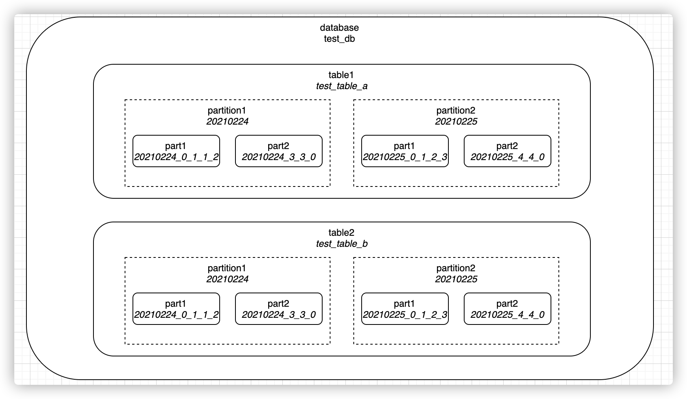
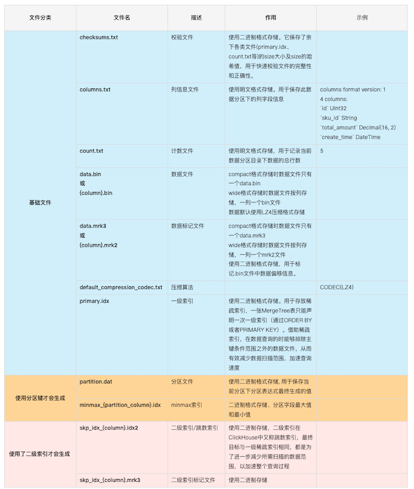
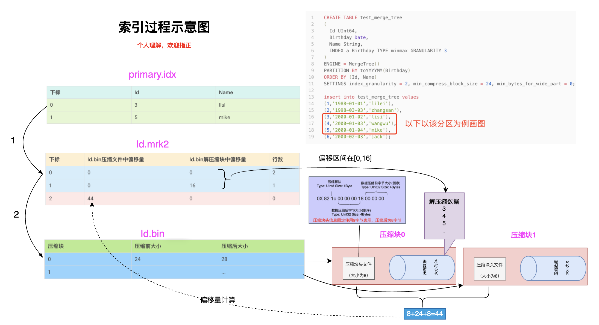
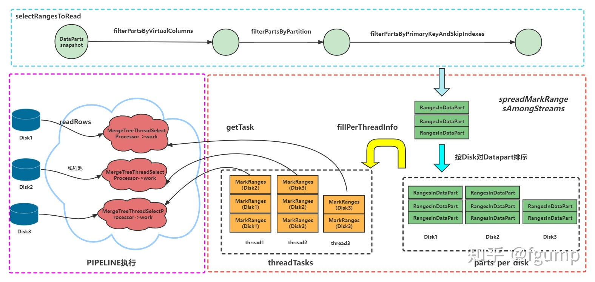
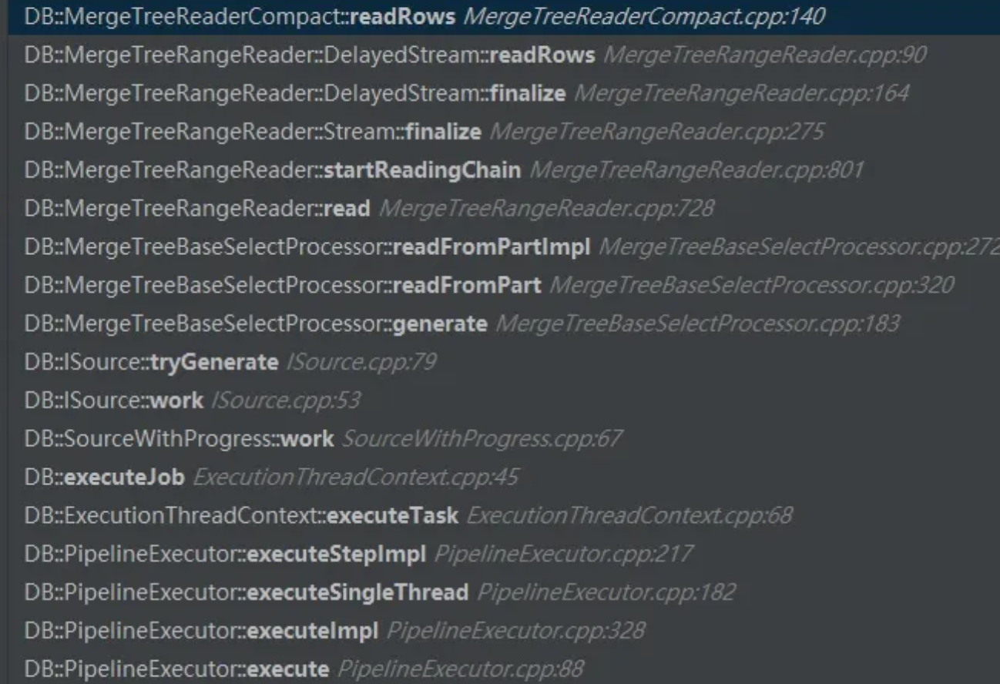
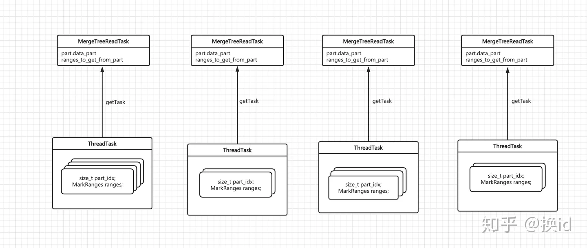

# 基本组成

基础知识, 可以直接参考: https://www.cnblogs.com/eedbaa/p/14512803.html

```
clickhouse
└── test_db
          ├── test_table_a
          │      ├── 20210224_0_1_1_2
          │      ├── 20210224_3_3_0
          │      ├── 20210225_0_1_2_3
          │      └── 20210225_4_4_0
          └── test_table_b
                   ├── 20210224_0_1_1_2
                   ├── 20210224_3_3_0
                   ├── 20210225_0_1_2_3
                   └── 20210225_4_4_0
```



库/表 有具体的目录, 分区是逻辑概念,**分区实际是一系列part的集合**.每张表至少会有一个分区，如果不进行分区配置，则默认为一个all分区

每个part对应一个目录, 一般命名格式为 PartitionId_MinBlockNum_MaxBlockNum_Level , 如果经过mutate操作，则还会有{data_version}的后缀

https://www.cnblogs.com/dreamfly2016/p/16409655.html

### 文件介绍

| 文件名              | 描述       | 作用                                                         |
| ------------------- | ---------- | ------------------------------------------------------------ |
| primary.idx         | 索引文件   | 用于存放稀疏索引                                             |
| [Column].mrk2       | 标记文件   | 保存了bin文件中数据的偏移信息，用于建立primary.idx和[Column].bin文件之间的映射 |
| [Column].bin        | 数据文件   | 存储数据，默认使用lz4压缩存储                                |
| partition.dat       | 分区文件   | 用于保存分区表达式生成的值                                   |
| minmax_[Column].idx | minmax索引 | 用于记录当前分区下分区字段的最小最大值                       |
| columns.txt         | 列信息文件 | 用于保存表的列字段信息                                       |
| count.txt           | 计数文件   | 用于记录当前分区目录下数据的总行数                           |
| checksums.txt       | 校验文件   | 存放以上各个文件的size以及哈希值，用于快速校验文件的完整性   |







https://www.jianshu.com/p/6d547cbdc7ac

# 源码阅读

https://zhuanlan.zhihu.com/p/512314306

https://zhuanlan.zhihu.com/p/465063751

https://zhuanlan.zhihu.com/p/253016147



## call tree

```
- InterpreterSelectQuery::InterpreterSelectQuery
  - MergeTreeWhereOptimizer::optimize
- InterpreterSelectQuery::executeImpl
  - InterpreterSelectQuery::executeFetchColumns
    - MergeTreeDataSelectExecutor::read
      - MergeTreeDataSelectExecutor::readFromParts
        - ReadFromMergeTree::initializePipeline
          - ReadFromMergeTree::getAnalysisResult
            - ReadFromMergeTree::selectRangesToRead
              - MergeTreeDataSelectExecutor::filterPartsByPartition
              - MergeTreeDataSelectExecutor::filterPartsByPrimaryKeyAndSkipIndexes
                - MergeTreeDataSelectExecutor::markRangesFromPKRange
                - MergeTreeDataSelectExecutor::filterMarksUsingIndex
            - ReadFromMergeTree::spreadMarkRangesAmongStreams
              - ReadFromMergeTree::read
                - ReadFromMergeTree::readFromPool
                  - MergeTreeReadPool
                    - MergeTreeReadPool::fillPerThreadInfo
                  - Parallel Thread: MergeTreeThreadSelectProcessor
                    - MergeTreeBaseSelectProcessor::generate
                      - MergeTreeReadPool::getTask
                      - MergeTreeBaseSelectProcessor::readFromPartImpl
                        - MergeTreeRangeReader::read
                          - MergeTreeRangeReader::startReadingChain
                          - MergeTreeRangeReader::executePrewhereActionsAndFilterColumns
                          - MergeTreeRangeReader::continueReadingChain
                            - MergeTreeReaderWide::readRows
                              - MergeTreeReaderWide::readData
                                - SerializationString DB::deserializeBinarySSE2
```

```cpp
Pipe ReadFromMergeTree::readFromPool(
    RangesInDataParts parts_with_range,
    Names required_columns,
    size_t max_streams,
    size_t min_marks_for_concurrent_read,
    bool use_uncompressed_cache)
{
	  auto pool = std::make_shared<MergeTreeReadPool>(...);
    for (size_t i = 0; i < max_streams; ++i)
    {
        auto source = std::make_shared<MergeTreeThreadSelectProcessor>(
            i, pool, ....;    
        pipes.emplace_back(std::move(source));
    }
    
    return Pipe::unitePipes(std::move(pipes));  
}
```

## 划分ThreadTask

spreadMarkRangesAmongStreams函数中主要通过构建多个MergeTreeThreadSelectProcessor并与同一个MergeTreeReadPool相关联。而MergeTreeReadPool的构造函数中会调用fillPerPartInfo和fillPerThreadInfo方法。fillPerPartInfo方法主要是统计了每个待读取的DataPart的相关信息，比如每个DataPart含有的总mark数。而fillPerThreadInfo方法中则是首先将所有的DataPart按照所在的disk名字进行排序，然后将这些的DataPart，进一步分成小的MarkRanges。Mark作为ClickHouse中读取数据的最小单位，markrange记录了每个DataPart中mark的范围[begin,end)。

```cpp
void MergeTreeReadPool::fillPerThreadInfo(
    size_t threads, size_t sum_marks, std::vector<size_t> per_part_sum_marks,
    const RangesInDataParts & parts, size_t min_marks_for_concurrent_read)
{
    threads_tasks.resize(threads);      //thread_taks类似于一个二维数组，存放每个线程tasks
    ...

    using PartsInfo = std::vector<PartInfo>;
    std::queue<PartsInfo> parts_queue;

    {
        // 根据DataPart所在Disk的名字排序
        std::map<String, std::vector<PartInfo>> parts_per_disk;

        for (size_t i = 0; i < parts.size(); ++i)
        {
            PartInfo part_info{parts[i], per_part_sum_marks[i], i};
            if (parts[i].data_part->isStoredOnDisk())
                parts_per_disk[parts[i].data_part->volume->getDisk()->getName()].push_back(std::move(part_info));
            else
                parts_per_disk[""].push_back(std::move(part_info));
        }

        for (auto & info : parts_per_disk)
            parts_queue.push(std::move(info.second));
    }

    const size_t min_marks_per_thread = (sum_marks - 1) / threads + 1;

    // 遍历每一个线程，为每一个线程分配任务
    for (size_t i = 0; i < threads && !parts_queue.empty(); ++i)
    {
        auto need_marks = min_marks_per_thread;

        while (need_marks > 0 && !parts_queue.empty())
        {
            auto & current_parts = parts_queue.front();
            RangesInDataPart & part = current_parts.back().part;
            size_t & marks_in_part = current_parts.back().sum_marks;
            const auto part_idx = current_parts.back().part_idx;

            /// Do not get too few rows from part.
            if (marks_in_part >= min_marks_for_concurrent_read &&
                need_marks < min_marks_for_concurrent_read)
                need_marks = min_marks_for_concurrent_read;

            /// Do not leave too few rows in part for next time.
            if (marks_in_part > need_marks &&
                marks_in_part - need_marks < min_marks_for_concurrent_read)
                need_marks = marks_in_part;

            MarkRanges ranges_to_get_from_part;
            size_t marks_in_ranges = need_marks;gett

            /// Get whole part to read if it is small enough.
            if (marks_in_part <= need_marks)
            {
                ranges_to_get_from_part = part.ranges;
                marks_in_ranges = marks_in_part;

                need_marks -= marks_in_part;
                current_parts.pop_back();
                if (current_parts.empty())
                    parts_queue.pop();
            }
            else
            {
                /// Loop through part ranges.
                while (need_marks > 0)
                {
                    if (part.ranges.empty())
                        throw Exception("Unexpected end of ranges while spreading marks among threads", ErrorCodes::LOGICAL_ERROR);

                    MarkRange & range = part.ranges.front();

                    const size_t marks_in_range = range.end - range.begin;
                    const size_t marks_to_get_from_range = std::min(marks_in_range, need_marks);

                    ranges_to_get_from_part.emplace_back(range.begin, range.begin + marks_to_get_from_range);
                    range.begin += marks_to_get_from_range;
                    marks_in_part -= marks_to_get_from_range;
                    need_marks -= marks_to_get_from_range;
                    if (range.begin == range.end)
                        part.ranges.pop_front();
                }
            }
            //
            threads_tasks[i].parts_and_ranges.push_back({ part_idx, ranges_to_get_from_part });
            threads_tasks[i].sum_marks_in_parts.push_back(marks_in_ranges);
            if (marks_in_ranges != 0)
                remaining_thread_tasks.insert(i);
        }

        //切换到分配下一个线程任务之前，切换disk。这样尽可能的是不同的磁盘负载到不同的线程中去，依次来最大化磁盘并行度。
        if (parts_queue.size() > 1)
        {
            parts_queue.push(std::move(parts_queue.front()));
            parts_queue.pop();
        }
    }
}
```

## PIPELINE执行

在pipeline执行的时候，MergeTreeThreadSelectProcessor的work方法会调用到getTask方法向MergeTreeReadPool中请求Task。

```cpp
MergeTreeReadTaskPtr MergeTreeReadPool::getTask(size_t min_marks_to_read, size_t thread, const Names & ordered_names)
{
    ...
    auto thread_idx = thread;
    if (!tasks_remaining_for_this_thread)
    {
      ... //如果本线程的task做完，则尝试窃取其他线程的任务                                                  
    }

    ...
    /// Do not leave too little rows in part for next time.
    // 如果此次获取到的range后，剩下的mark比较少，那么就一次行读整个DataPart，提高效率。
    if (marks_in_part > need_marks &&
        marks_in_part - need_marks < min_marks_to_read)
        need_marks = marks_in_part;

    MarkRanges ranges_to_get_from_part;

    /// Get whole part to read if it is small enough.
    //DataPart本身含有的mark总数就比较少，也一次性的读取整个DataPart
    if (marks_in_part <= need_marks)
    {
        const auto marks_to_get_from_range = marks_in_part;
        ranges_to_get_from_part = thread_task.ranges;

        marks_in_part -= marks_to_get_from_range;

        thread_tasks.parts_and_ranges.pop_back();
        thread_tasks.sum_marks_in_parts.pop_back();

        if (thread_tasks.sum_marks_in_parts.empty())
            remaining_thread_tasks.erase(thread_idx);
    }
    else
    {   

        /// Loop through part ranges.
        // 遍历这个DataPart的range，找到足够数量的mark然后返回。
        while (need_marks > 0 && !thread_task.ranges.empty())
        {
            auto & range = thread_task.ranges.front();

            const size_t marks_in_range = range.end - range.begin;
            const size_t marks_to_get_from_range = std::min(marks_in_range, need_marks);

            ranges_to_get_from_part.emplace_back(range.begin, range.begin + marks_to_get_from_range);
            range.begin += marks_to_get_from_range;
            if (range.begin == range.end)
                thread_task.ranges.pop_front();

            marks_in_part -= marks_to_get_from_range;
            need_marks -= marks_to_get_from_range;
        }
    }

    return std::make_unique<MergeTreeReadTask>(
        part.data_part, ranges_to_get_from_part, part.part_index_in_query, ordered_names,
        per_part_column_name_set[part_idx], per_part_columns[part_idx], per_part_pre_columns[part_idx],
        prewhere_info && prewhere_info->remove_prewhere_column, per_part_should_reorder[part_idx], std::move(curr_task_size_predictor));
}
```

MergeTreeThreadSelectProcessor的work在执行完getTask方法后，会根据返回的结果去读取数据。



## MergeTreeReadPool

拿到索引筛选出的 Part Range 对应关系，和指定的查询线程数，平均分配每个thread_task 需要读取的数据mark

MergeTreeReadPool 初始化时摆放好这些待读取的parts，ranges，marks。上层读取时 通过 getTask 方法获取 MergeTreeReadTask

MergeTreeReadTask 每次只针对单个Part的 ranges 进行读取

每次getTask 返回的MergeTreeReadTask 只负责读取单个part的 全部 ranges 或者部分 ranges



上层 MergeTreeReadTask finished之后，继续getTask，从ThreadTask 中选出来剩余未读取完的ranges，构造出新的 MergeTreeReadTask 返回给上层。

如果设置 do_not_steal_tasks 为false，那本线程对应的 ThreadTask 已经读取消耗完了，getTask时它可以偷其他 ThreadTask 的 ranges来读取。

所以 MergeTreeReadPool 就相当于一个待读取消费的资源池。

MergeTreeReadPool 在初始化时，如何尽量划分平均？

其实就是平均划分mark数就可以了。

比如总的需要读取的 mark 数是 21，目前4个线程，那每个线程需要读取的最小mark数，就是6（向上取整）


```text
  mark:0    1    2    3    4    5    6    7    8
part1: [----------------------------------------]

  mark:0    1    2    3    4    5    6    7    8    9
part2: [--------------------------------------------]

  mark:0    1    2    3    4
part3: [-------------------]
```

4个线程平分这些marks，而且尽量保持marks连续

```cpp
for (int i=0; i < 4 && !parts.empty(); ++i)
{
    need_marks = 6;
    while(need_marks > 0 && !parts.empty())
    {
        ...
    }    
}
```
