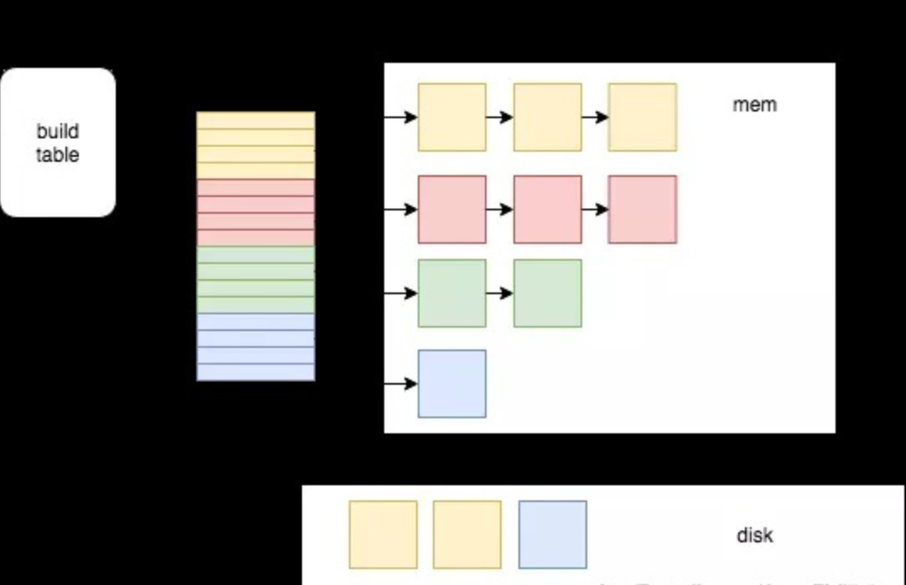
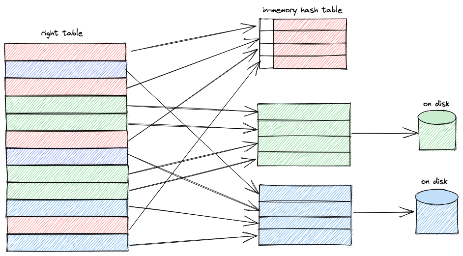
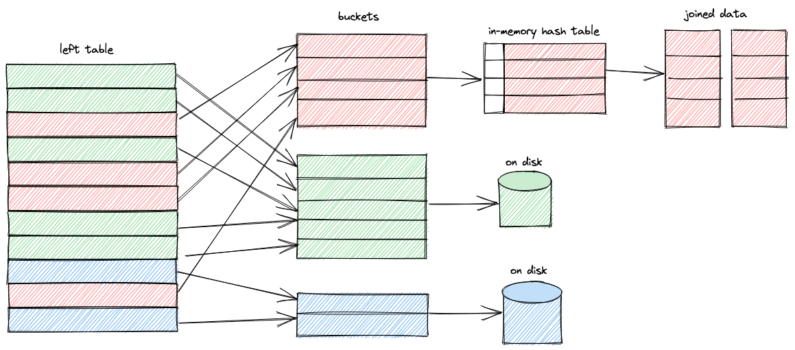
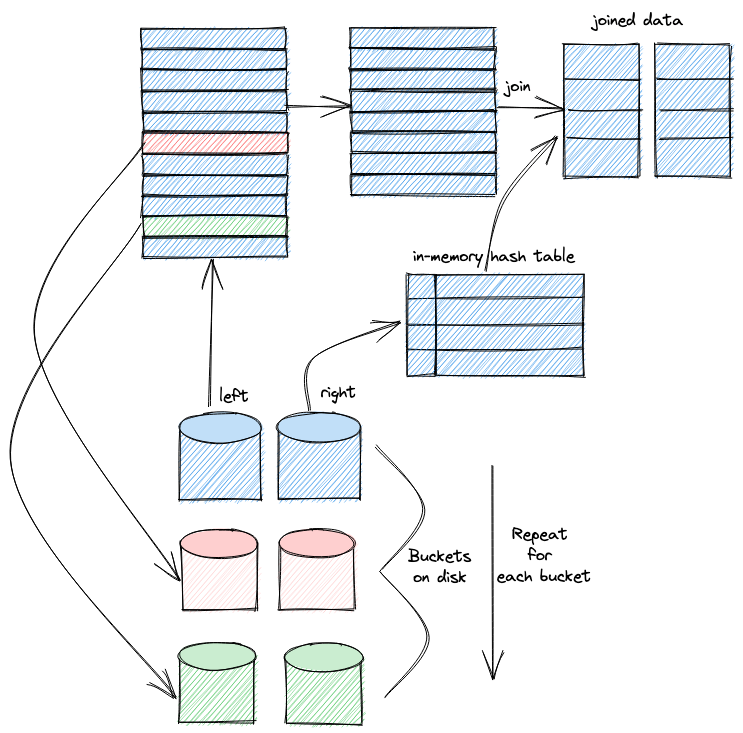
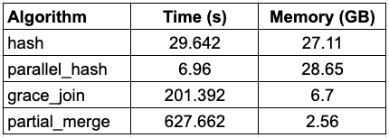

# Hash join

**build 侧(小表)**: 建立 hash 表

**probe 侧(大表)**: 扫描建立的 hash 表是否有相等的行 probe(探测)

hash 冲突严重的话, 会退化成 NLJ(nest loop join)

# Grace Hash Join

build 表大, 内存无法存下所有数据, 需要刷盘

有两种方法: 

1. 改成 SMJ 
2. 分片 build (GHJ)

具体做法:

1. 对两个表用同一个 hash 函数进行分片(PartCount)
2. 再对不同分片进行 join
3. union 第二步的结果

```pascal
t1, t2 是待join两个表
PartCount是分片的个数def graceJoin(t1, t2):
    for row in t1:
        hashValue = hash_func(row)
        N = hashValue % PartCount;
        write row to file t1_N;

    for row in t2:
        hashValue = hash_func(row)
        N = hashValue % PartCount;
        write row to file t2_N;

    for i in range(0, PartSize):
        join(t1_i, t2_i)    
```

重点是这个 PartCount: PartCount 在保证刷盘经济上的情况下越大越好, 这个需要优化器根据表的统计信息来确定

另外 hash 函数的选取需要避免热点

# Hybrid Hash Join

Hybrid Hash Join 是 Grace Hash Join 的一种改进

在 Grace Hash Join 第一张表分片的过程中, 尽量把越多的完整的分片保留在内存中.

这样在第二张表做分片的过程中, 就可以同时对留在内存中的分片做 probe 操作, 这样省去了留在内存中分片的刷盘操作, 同时第二张表对应的分片也不需要刷盘, 提高效率.如果第一张表所有的分片都能留在内存中, 其实就是 In-memory Hash Join.

举例来说: 

1. hash table 被分成了4个分片，图中每个分片用不同的颜色表示

2. 内存块 (block) 在图中使用正方形的小方块表示, block 是一个刷盘的最小单位, 当放 block 的内存快满的时候，就会把其中一些 block 刷到磁盘中，刷盘的时候会尽量保证某些分片完整的留在内存中，所以尽量把那些已经落到磁盘中的分片的 block 刷出去, 在图中，红色和绿色的分片应该尽量保留在内存中，会优先刷蓝色和黄色的 block

3. 在 probe 阶段，扫描probe表，然后在 hash table中找到对应的 hash 桶。如果 hash 到磁盘上没有数据的分片（红色，绿色）所在的hash桶，那么就可以直接做 join 返回结果。如果hash到在磁盘上有数据的分片（黄色，蓝色），那么就把 probe 表的行写内存中的对应分片的 block 中，当一个 block 被写满以后就刷到磁盘中

   



# Clickhouse grace hash join

1. 通过 addJoinedBlock 处理右表数据, 每个 input block 会根据 join 的keys 切分成成多个 buckets(分片个数由grace_hash_join_initial_buckets 决定), 第一个 bucket 会被加载到内存中, 剩下的 buckets 会写到磁盘上, 当内存超过限制的时候, 会把 bucket 数量翻倍, 类似ConcurrentHashJoin, addJoinedBlock是多线程调用的



1. 通过 joinBlock 处理左表数据, 和右表一样, 先切分成多个 buckets, 第一个 bucket 通过HashJoin::joinBlock 进行 in memroy join, 剩下的 bucket 进行刷盘



1. 当最后一个线程读取完成左表的 block, 最后一个步骤开始, 每个DelayedJoinedBlocksTransform会被getDelayedBlocks重复调用直到没有剩余的没完成的 bucket 
   1. 在 getDelayedBlocks 中, 我们会选择下一个没被处理的 bucket, 从磁盘加载右/左表数据, 然后进行 in-memory 的 hash join
   2. 当 join 左表的 block 完成后, 我们可以从右表加载 non-joined rows, 当 join 是 RIGHT/FULL join
   3. non-joined rows是多线程处理的
   4. 

# 关键代码路径

## 配置

1. grace_hash_join_initial_buckets, 默认 1, 初始的 bucket 个数, 2 的次幂取值(roundUpToPowerOfTwoOrZero), 比如配置 3 实际上是 4
2. grace_hash_join_max_buckets, 最大的 bucket num 个数, 默认 1024

## 代码

TBD

# 官方数据



```Bash
SELECT
    query,
    formatReadableTimeDelta(query_duration_ms / 1000) AS query_duration,
    formatReadableSize(memory_usage) AS memory_usage,
    formatReadableQuantity(read_rows) AS read_rows,
    formatReadableSize(read_bytes) AS read_data
FROM clusterAllReplicas(default, system.query_log)
WHERE (type = 'QueryFinish') AND hasAll(tables, ['imdb_large.actors', 'imdb_large.roles'])
ORDER BY initial_query_start_time DESC
LIMIT 2
FORMAT Vertical;

Row 1:
──────
query:          SELECT *
                FROM actors AS a
                JOIN roles AS r ON a.id = r.actor_id
                FORMAT `Null`
                SETTINGS join_algorithm = 'grace_hash', grace_hash_join_initial_buckets = 3
query_duration: 13 seconds
memory_usage:   3.72 GiB
read_rows:      101.00 million
read_data:      3.41 GiB

Row 2:
──────
query:          SELECT *
                FROM actors AS a
                JOIN roles AS r ON a.id = r.actor_id
                FORMAT `Null`
                SETTINGS join_algorithm = 'hash'
query_duration: 5 seconds
memory_usage:   8.96 GiB
read_rows:      101.00 million
read_data:      3.41 GiB
```

增大 grace_hash_join_initial_buckets

```Bash
SELECT
    query,
    formatReadableTimeDelta(query_duration_ms / 1000) AS query_duration,
    formatReadableSize(memory_usage) AS memory_usage,
    formatReadableQuantity(read_rows) AS read_rows,
    formatReadableSize(read_bytes) AS read_data
FROM clusterAllReplicas(default, system.query_log)
WHERE (type = 'QueryFinish') AND hasAll(tables, ['imdb_large.actors', 'imdb_large.roles'])
ORDER BY initial_query_start_time DESC
LIMIT 2
FORMAT Vertical;

Row 1:
──────
query:          SELECT *
                FROM actors AS a
                JOIN roles AS r ON a.id = r.actor_id
                FORMAT `Null`
                SETTINGS join_algorithm = 'grace_hash', grace_hash_join_initial_buckets = 8
query_duration: 16 seconds
memory_usage:   2.10 GiB
read_rows:      101.00 million
read_data:      3.41 GiB

Row 2:
──────
query:          SELECT *
                FROM actors AS a
                JOIN roles AS r ON a.id = r.actor_id
                FORMAT `Null`
                SETTINGS join_algorithm = 'grace_hash', grace_hash_join_initial_buckets = 3
query_duration: 13 seconds
memory_usage:   3.72 GiB
read_rows:      101.00 million
read_data:      3.41 GiB
```

# Clickhouse merge join

CH 要把小表作为右表, 右表会构建 hash 表(之后优化器做好了应该也不需要)

CH 默认是 hashjoin, 如果发现右表放不下内存会 Switch 到 mergejoin, 这里比较简单就带过了

## Join 基本接口

### addJoinedBlock

把右表的 block 加载进来

### joinBlock

用左表的 block join 右表的 block, 其中右表的 block 已经提前构建好了(addJoinedBlock)

### setTotals/getTotals

## merge join

### SMJ

分为排序和归并两个阶段。

排序: 就是对两表根据 Join Key 进行排序

归并: 因为两张表已经按照同样的顺序排列，两表各一次循环遍历即可。

A、B 两个表各设置一个指针, 分别为 I 和 J, 若A表第 I 行 Key 小于 B 表第 J 行 Key, 则 I ++, 否则 J ++, 直到匹配到数据则添加到结果集; 若表的记录本身就是有序的, 或者 Join key 刚好是索引列, 选择排序归并成本更低


# 一些思考

对于分布式场景下的 shuffle hash join, 其实本质上非常类似 grace hash join

# 参考文档

https://zhuanlan.zhihu.com/p/35040231

https://juejin.cn/post/7105938321326473252
