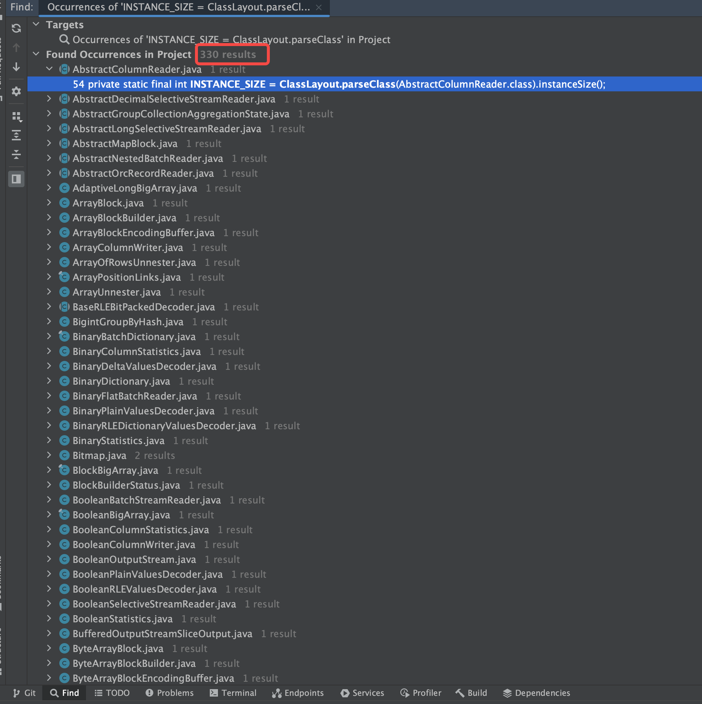

# Presto Spill 101

## 内存管理

### worker 视角

Presto 中的每个操作符都(比如 `ScanFilterAndProjectOperator`, `HashAggregationOperator`,)有一个操作符上下文 `OperatorContext` ，其中存储了关于这个 operator、计数器counters 以及 get/create memory context 的信息。内存上下文实例（Memory context instances）用于代表 Presto 引擎中的内存占用。通常的实现模式是：从操作符上下文 operator context 中 get/create 一个内存上下文 memory context，然后在这个memory context 上调用 setBytes(N) 方法来为这个运算符申请 N 字节的内存

内存上下文是个树形结构, operators -> drivers -> pipelines -> tasks -> query, 通过这种跟踪机制，内存池可以跟踪每个算子以及该工作线程上运行的每个查询使用的内存，这些指标通过 REST 暴露 p.s. presto 也有一些内存无法追踪(memory.heap-headroom-per-node, 三方库中分配的内存, local/stack allocations)

Presto 引擎的数据结构很复杂，因此需要正确计算 java 对象内存占用(这个代价并不总是轻微的, It is worth noting that calculating N is not always trivial as the engine has complex data structures and we need to properly account for the Java object overhead and we need to make sure that we don’t account for a piece of memory multiple times if there are multiple references to it )，对于这个问题, JOL (Java Object Layout) 库[3] 中提供了 API 来计算 Java 对象的保留大小。确保如果一个对象有多个引用的话，不会计算一段内存多次。只能通过仔细计算整个引擎的数据结构，避免重复计算

`LongBigArray.java`

```java
        private static final int INSTANCE_SIZE = ClassLayout.parseClass(LongBigArray.class).instanceSize(); // jol 的 api
    
    public long sizeOf()
    {
        return INSTANCE_SIZE + SizeOf.sizeOf(array) + (segments * SIZE_OF_SEGMENT);
    }

```

几乎所有的数据结构都有计算内存占用的方法




### coordinator 视角

coordinator 定期从所有worker收集内存池信息，并构建集群中所有内存池的全局状态, 提供集群级别的视角管理查询的内存使用, 以下是他的一些职责

- 查询的分布式内存限制
- 将查询分配给保留池(一般保留池都是关闭的), 如果集群中的任何worker耗尽了其通用池，协调器会将最大的查询分配给所有worker的保留池。

- 当发生 oom 时 kill query
- 检测 memory leaks: 如果查询在 1min 前完成，但它在worker上仍然有非零的内存预留，则coordinator将查询标记为“可能泄漏”


## 代码

### 内存申请

Presto 的内存申请是在Operator操作中完成的, 比如 TableScanOperator / AggregationOperator 中申请的

```java
public class TableScanOperator implements SourceOperator, Closeable
{
    @Override
    public Page getOutput()
    {
        ...

        // updating system memory usage should happen after page is loaded.
        systemMemoryContext.setBytes(source.getSystemMemoryUsage());

        return page;
    }

}

/**
 * Group input data and produce a single block for each sequence of identical values.
 */
public class AggregationOperator implements Operator
{

    @Override
    public void addInput(Page page)
    {
        ...

        long memorySize = 0;
        for (Aggregator aggregate : aggregates) {
            aggregate.processPage(page);
            memorySize += aggregate.getEstimatedSize();
        }

        if (useSystemMemory) {
            systemMemoryContext.setBytes(memorySize);
        }
        else {
            userMemoryContext.setBytes(memorySize);
        }
    }
  
    @Override
    public void close()
    {
        userMemoryContext.setBytes(0);
        systemMemoryContext.setBytes(0);
    }  
}

public class SpillableHashAggregationBuilder
{
    @Override
    public void updateMemory()
    {
        checkState(spillInProgress.isDone());
        if (producingOutput) {
            localRevocableMemoryContext.setBytes(0);
            localUserMemoryContext.setBytes(hashAggregationBuilder.getSizeInMemory());
            return;
        }
        localUserMemoryContext.setBytes(emptyHashAggregationBuilderSize);
        localRevocableMemoryContext.setBytes(hashAggregationBuilder.getSizeInMemory() - emptyHashAggregationBuilderSize);
    }
}

public class HashBuilderOperator
{
    private void finishInput()
    {
        checkState(state == State.CONSUMING_INPUT);
        if (lookupSourceFactoryDestroyed.isDone()) {
            close();
            return;
        }

        LookupSourceSupplier partition = buildLookupSource();
        if (spillEnabled) {
            localRevocableMemoryContext.setBytes(partition.get().getInMemorySizeInBytes());
        }
        else {
            localUserMemoryContext.setBytes(partition.get().getInMemorySizeInBytes(), enforceBroadcastMemoryLimit);
        }
        lookupSourceNotNeeded = Optional.of(lookupSourceFactory.lendPartitionLookupSource(partitionIndex, partition));

        state = State.LOOKUP_SOURCE_BUILT;
    }
}
```

一共有三种 memory context, 如果 spill 开了的话, 就把内存加到 `RevocableMemoryContext` 中去, 代表这部分内存是可以被 spill 的

```java
AggregatedMemoryContext userAggregateMemoryContext
AggregatedMemoryContext revocableAggregateMemoryContext
AggregatedMemoryContext systemAggregateMemoryContext
```

**SimpleLocalMemoryContext#setBytes(long)**

1. 记录内存使用
2. memory pool 的 `reserve()`

```java
@Override
public synchronized ListenableFuture<?> setBytes(long bytes)
{
    checkState(!closed, "SimpleLocalMemoryContext is already closed");
    checkArgument(bytes >= 0, "bytes cannot be negative");

    if (bytes == usedBytes) {
        return NOT_BLOCKED;
    }

    // update the parent first as it may throw a runtime exception (e.g., ExceededMemoryLimitException)
    ListenableFuture<?> future = parentMemoryContext.updateBytes(allocationTag, bytes - usedBytes, false);
    usedBytes = bytes;
    return future;
}

@Override
synchronized ListenableFuture<?> updateBytes(String allocationTag, long bytes, boolean enforceBroadcastMemoryLimit)
{
    checkState(!isClosed(), "RootAggregatedMemoryContext is already closed");
    ListenableFuture<?> future = reservationHandler.reserveMemory(allocationTag, bytes, enforceBroadcastMemoryLimit);
    addBytes(bytes);
    if (enforceBroadcastMemoryLimit) {
        addBroadcastBytes(bytes);
    }
    // make sure we never block queries below guaranteedMemory
    if (getBytes() < guaranteedMemory) {
        future = NOT_BLOCKED;
    }
    return future;
}

```

```java
private synchronized ListenableFuture<?> updateUserMemory(String allocationTag, long delta)
{
    if (delta >= 0) {
        enforceUserMemoryLimit(queryMemoryContext.getUserMemory(), delta, maxUserMemory, allocationTag);
        long totalMemory = memoryPool.getQueryMemoryReservation(queryId);
        enforceTotalMemoryLimit(totalMemory, delta, maxTotalMemory, allocationTag);
        return memoryPool.reserve(queryId, allocationTag, delta);
    }
    memoryPool.free(queryId, allocationTag, -delta);
    return NOT_BLOCKED;
}
```

```java
/**
 * Reserves the given number of bytes. Caller should wait on the returned future, before allocating more memory.
 */
public ListenableFuture<?> reserve(QueryId queryId, String allocationTag, long bytes)
{
    checkArgument(bytes >= 0, "bytes is negative");

    ListenableFuture<?> result;
    synchronized (this) {
        if (bytes != 0) {
            queryMemoryReservations.merge(queryId, bytes, Long::sum);
            updateTaggedMemoryAllocations(queryId, allocationTag, bytes);
        }
        reservedBytes += bytes;
        if (getFreeBytes() <= 0) {
            if (future == null) {
                future = NonCancellableMemoryFuture.create();
            }
            checkState(!future.isDone(), "future is already completed");
            result = future;
        }
        else {
            result = NOT_BLOCKED;
        }
    }

    onMemoryReserved(queryId);
    return result;
}
```


```java
public QueryContext(...)
{
        ...
    this.queryMemoryContext = new MemoryTrackingContext(
                newRootAggregatedMemoryContext(new QueryMemoryReservationHandler(this::updateUserMemory, this::tryUpdateUserMemory, this::updateBroadcastMemory, this::tryUpdateBroadcastMemory), GUARANTEED_MEMORY),
                newRootAggregatedMemoryContext(new QueryMemoryReservationHandler(this::updateRevocableMemory, this::tryReserveMemoryNotSupported, this::updateBroadcastMemory, this::tryUpdateBroadcastMemory), 0L),
                newRootAggregatedMemoryContext(new QueryMemoryReservationHandler(this::updateSystemMemory, this::tryReserveMemoryNotSupported, this::updateBroadcastMemory, this::tryUpdateBroadcastMemory), 0L));
}
//////////////////////////////////
public final class MemoryTrackingContext
{
    private final AggregatedMemoryContext userAggregateMemoryContext;
    private final AggregatedMemoryContext revocableAggregateMemoryContext;
    private final AggregatedMemoryContext systemAggregateMemoryContext;
}
 
```

### spill 代码分析

#### MemoryRevokingScheduler

配置相关:

```java
config.getMemoryRevokingThreshold(): Revoke memory when memory pool is filled over threshold
config.getMemoryRevokingTarget(): When revoking memory, try to revoke so much that pool is filled below target at the end
config.getTaskSpillingStrategy(): PER_TASK_MEMORY_THRESHOLD 不支持 MemoryRevokingScheduler
config.isQueryLimitSpillEnabled(): Spill whenever the total memory used by the query (including revocable and non-revocable memory) exceeds maxTotalMemoryPerNode, 当节点上的查询的用的内存到阈值就刷盘, 否则是看 memory pool 中的内存水位
```


成员变量`memoryPoolListener`: `private final MemoryPoolListener memoryPoolListener = this::onMemoryReserved;`,当memory reservation 完成的时候,  ` MemoryPoolListener#onMemoryReserved` 会被调用(`queryMemoryReservation: the total amount of memory reserved by the query (revocable and regular)`)

```java
private void onMemoryReserved(MemoryPool memoryPool, QueryId queryId, long queryMemoryReservation)
{
    try {
        if (queryLimitSpillEnabled) {
            QueryContext queryContext = queryContextSupplier.apply(queryId);
            verify(queryContext != null, "QueryContext not found for queryId %s", queryId);
            long maxTotalMemory = queryContext.getMaxTotalMemory();
            if (memoryRevokingNeededForQuery(queryMemoryReservation, maxTotalMemory)) {
                log.debug("Scheduling check for %s", queryId);
                scheduleQueryRevoking(queryContext, maxTotalMemory);
            }
        }
        if (memoryRevokingNeededForPool(memoryPool)) {
            log.debug("Scheduling check for %s", memoryPool);
            scheduleMemoryPoolRevoking(memoryPool);
        }
    }
    catch (Exception e) {
        log.error(e, "Error when acting on memory pool reservation");
    }
}
```

在 `revokeQueryMemory` 调用`operatorContext.requestMemoryRevoking()`, 设置 `memoryRevokingRequested` 为 true

***

#### 算子 spill 代码

判断 spill 是否开启, 选择算子


通常在算子添加输入的时候判断是否内存超限，如果超限则进行spill，但是Presto较为特殊，在Driver执行前遍历所有的可Spill算子进行spill

**Driver.cpp**

```java
@GuardedBy("exclusiveLock")
private ListenableFuture<?> processInternal(OperationTimer operationTimer)
{
    ...
    // 检查可spill算子，并进行spill
    handleMemoryRevoke();

    // 执行算子    
    for (int i = 0; i < activeOperators.size() - 1 && !driverContext.isDone(); i++) {
        Operator current = activeOperators.get(i);
        Operator next = activeOperators.get(i + 1);
        ...
     }
      ...
}
```

判断`operator.getOperatorContext().isMemoryRevokingRequested()` , 如果是 true 则算子开始 memory revoke, 这个 `memoryRevokingRequested` 是``MemoryRevokingScheduler` 在每次 memory reserve 的时候设置的

```java
    @GuardedBy("exclusiveLock")
    private void handleMemoryRevoke()
    {
        for (int i = 0; i < activeOperators.size() && !driverContext.isDone(); i++) {
            Operator operator = activeOperators.get(i);

            if (revokingOperators.containsKey(operator)) {
                checkOperatorFinishedRevoking(operator);
            }
            else if (operator.getOperatorContext().isMemoryRevokingRequested()) {
                ListenableFuture<?> future = operator.startMemoryRevoke();
                revokingOperators.put(operator, future);
                checkOperatorFinishedRevoking(operator);
            }
        }
    }

```

```java
/**
 * After calling this method operator should revoke all reserved revocable memory.
 * As soon as memory is revoked returned future should be marked as done.

 * Spawned threads can not modify OperatorContext because it's not thread safe.
 * For this purpose implement {@link #finishMemoryRevoke()}
 * <p>
 * Since memory revoking signal is delivered asynchronously to the Operator, implementation
 * must gracefully handle the case when there no longer is any revocable memory allocated.

 * After this method is called on Operator the Driver is disallowed to call any
 * processing methods on it (isBlocked/needsInput/addInput/getOutput) until
 * {@link #finishMemoryRevoke()} is called.
 */
default ListenableFuture<?> startMemoryRevoke()
{
    return NOT_BLOCKED;
}
```


##### OrderBy

落盘调用路径如下

```text
Driver::processInternal
    \_ Driver::handleMemoryRevoke
        \_ OrderByOperator::startMemoryRevoke
            \_ OrderByOperator::spillToDisk
                   // 排序
                \_ PagesIndex::sort
                   // 落盘
                \_ GenericSpiller::spill
                    \_ FileSingleStreamSpiller::spill
                        \_ FileSingleStreamSpiller::writePages
                               // 序列化
                            \_ PagesSerde::serialize
                               // 写序列化Page
                            \_ PagesSerdeUtil::writeSerializedPage
```

读取Spill文件

```text
\_ OrderByOperator::finish
    \_ OrderByOperator::getSpilledPages
       // spilledPages是落盘数据，sortedPagesIndex是内存中数据，各自为1路Merge
    \_ OrderByOperator::mergeSpilledAndMemoryPages(spilledPages, sortedPagesIndex)
        \_ MergeSortedPages mergeSortedPages
            \_ WorkProcessor::mergeSorted
                \_ WorkProcessorUtils::mergeSorted
```

合并逻辑

```java
static <T> WorkProcessor<T> mergeSorted(Iterable<WorkProcessor<T>> processorIterable, Comparator<T> comparator)
{
    ...
    // 使用优先级队列进行Merge，每一个元素是ElementAndProcessor，里面的element是process一次的结果
    PriorityQueue<ElementAndProcessor<T>> queue = new PriorityQueue<>(2, comparing(ElementAndProcessor::getElement, comparator));

    return create(new WorkProcessor.Process<T>()
    {
        WorkProcessor<T> processor = requireNonNull(processorIterator.next());

        @Override
        public ProcessState<T> process()
        {
            while (true) {
                // processor对应Merge的一路，如果有数据入队
                if (processor.process()) {
                    if (!processor.isFinished()) {
                        queue.add(new ElementAndProcessor<>(processor.getResult(), processor));
                    }
                }
                ...
                // 循环添加归并路数，直到所有归并路添加完
                if (processorIterator.hasNext()) {
                    processor = requireNonNull(processorIterator.next());
                    continue;
                }

                if (queue.isEmpty()) {
                    return ProcessState.finished();
                }
                
                // 优先级队列出一个数据，然后更新processor，在下一次循环中，processor会再次入队
                ElementAndProcessor<T> elementAndProcessor = queue.poll();
                processor = elementAndProcessor.getProcessor();
                return ProcessState.ofResult(elementAndProcessor.getElement());
            }
        }
    });
}
```

##### Aggregation

落盘逻辑

```text
\_ SpillableHashAggregationBuilder::startMemoryRevoke
    \_ SpillableHashAggregationBuilder::spillToDisk
           // 对HashTable进行排序
        \_ InMemoryHashAggregationBuilder::buildHashSortedResult
            \_ GroupByHash::getHashSortedGroupIds
                \_ IntBigArray::sort
        \_ Spiller::spill
           // 清理掉原来的HashTable，构建新的HashTable
        \_ SpillableHashAggregationBuilder::rebuildHashAggregationBuilder
```

归并逻辑

```text
\_ SpillableHashAggregationBuilder::buildResult
       // 对落盘文件进行归并
    \_ SpillableHashAggregationBuilder::mergeFromDiskAndMemory
        \_ MergeHashSort::merge
            \_ MergeSortedPages::mergeSortedPages
                \_ WorkProcessorUtils::mergeSorted
           // 构造结果
        \_ SpillableHashAggregationBuilder::mergeSortedPages
            \_ MergingHashAggregationBuilder::buildResult
```

##### 文件Buffer

无论是OrderBy还是Aggregation，读取的spill的链路都是一样的

```text
\_ GenericSpiller::getSpills
    \_ FileSingleStreamSpiller::getSpilledPages
        \_ FileSingleStreamSpiller::readPages
               // Buffer的大小为 4K
            \_ PagesSerdeUtil.readPages(serde, new InputStreamSliceInput(input, BUFFER_SIZE));
```

Spill File Buffer内存的分配没有内存池管理，直接进行分配

```java
public InputStreamSliceInput(InputStream inputStream, int bufferSize)
{
    ...
    this.inputStream = inputStream;
    // 没有用内存池进行管理，直接分配
    this.buffer = new byte[bufferSize];
    this.slice = Slices.wrappedBuffer(buffer);
}
```