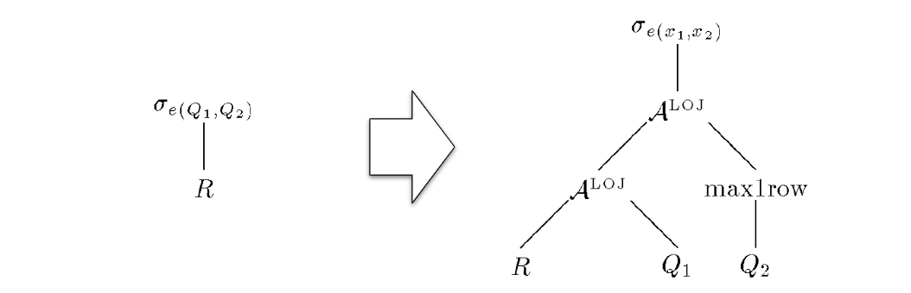

转载防止失联: https://ericfu.me/subquery-optimization/

**子查询**（Subquery）的优化一直以来都是 SQL 查询优化中的难点之一。关联子查询的基本执行方式类似于 Nested-Loop，但是这种执行方式的效率常常低到难以忍受。当数据量稍大时，必须在优化器中对其进行**去关联化**（Decoorelation 或 Unnesting），将其改写为类似于 Semi-Join 这样的更高效的算子。

前人已经总结出一套完整的方法论，理论上能对任意一个查询进行去关联化。本文结合 SQL Server 以及 HyPer 的几篇经典论文，由浅入深地讲解一下这套去关联化的理论体系。它们二者所用的方法大同小异，基本思想是想通的。


本文的例子都基于 TPC-H 的表结构，[这里](https://ericfu.me/images/2019/04/The-TPC-H-Schema.png) 有一份供你参考。

## 子查询简介

子查询是定义在 SQL 标准中一种语法，它可以出现在 SQL 的几乎任何地方，包括 SELECT, FROM, WHERE 等子句中。

总的来说，子查询可以分为**关联子查询（Correlated Subquery）**和**非关联子查询（Non-correlated Subquery）**。后者非关联子查询是个很简单的问题，最简单地，只要先执行它、得到结果集并物化，再执行外层查询即可。下面是一个例子：

```
SELECT c_count, count(*) AS custdist
FROM (
     SELECT c_custkey, count(o_orderkey) AS c_count
     FROM CUSTOMER
     LEFT OUTER JOIN ORDERS ON c_custkey = o_custkey
     AND o_comment NOT LIKE '%pending%deposits%'
     GROUP BY c_custkey
     ) c_orders
GROUP BY c_count
ORDER BY custdist DESC, c_count DESC;
```

▲ TPCH-13 是一个非关联子查询

**非关联子查询不在本文讨论范围之列**，除非特别声明，以下我们说的子查询都是指关联子查询。

关联子查询的特别之处在于，其本身是不完整的：**它的闭包中包含一些外层查询提供的参数**。显然，只有知道这些参数才能运行该查询，所以我们不能像对待非关联子查询那样。

根据产生的数据来分类，子查询可以分成以下几种：

**标量（Scalar-valued）**子查询：输出一个只有一行一列的结果表，这个标量值就是它的结果。如果结果为空（0 行），则输出一个 NULL。但是注意，超过 1 行结果是不被允许的，会产生一个运行时异常。

标量子查询可以出现在任意包含标量的地方，例如 SELECT、WHERE 等子句里。下面是一个例子：

```
SELECT c_custkey
FROM CUSTOMER
WHERE 1000000 < (
    SELECT SUM(o_totalprice)
    FROM ORDERS
    WHERE o_custkey = c_custkey
)
```

▲ Query 1: 一个出现在 WHERE 子句中的标量子查询，关联参数用红色字体标明了

```
SELECT o_orderkey, (
    SELECT c_name
    FROM CUSTOMER
    WHERE c_custkey = o_custkey
) AS c_name FROM ORDERS
```

▲ Query 2: 一个出现在 SELECT 子句中的标量子查询

**存在性检测（Existential Test）**子查询：特指 EXISTS 的子查询，返回一个布尔值。如果出现在 WHERE 中，这就是我们熟悉的 Semi-Join。当然，它可能出现在任何可以放布尔值的地方。

```
SELECT c_custkey
FROM CUSTOMER
WHERE c_nationkey = 86 AND EXISTS(
    SELECT * FROM ORDERS
    WHERE o_custkey = c_custkey
)
```

▲ Query 3: 一个 Semi-Join 的例子

**集合比较（Quantified Comparision）**子查询：特指 IN、SOME、ANY 的查询，返回一个布尔值，常用的形式有：`x = SOME(Q)` （等价于 `x IN Q`）或 `X <> ALL(Q)`（等价于 `x NOT IN Q`）。同上，它可能出现在任何可以放布尔值的地方。

```
SELECT c_name
FROM CUSTOMER
WHERE c_nationkey <> ALL (SELECT s_nationkey FROM SUPPLIER)
```

▲ Query 4: 一个集合比较的非关联子查询

## 原始执行计划

我们以 Query 1 为例，直观地感受一下，为什么说关联子查询的去关联化是十分必要的。

下面是 Query 1 的未经去关联化的原始查询计划（Relation Tree）。与其他查询计划不一样的是，我们特地画出了表达式树（Expression Tree），可以清晰地看到：子查询是实际上是挂在 Filter 的条件表达式下面的。


实际执行时，查询计划执行器（Executor）在执行到 Filter 时，调用表达式执行器（Evaluator）；由于这个条件表达式中包含一个标量子查询，所以 Evaluator 又会调用 Executor 计算标量子查询的结果。

**这种 Executor - Evaluator - Executor 的交替调用十分低效**！考虑到 Filter 上可能会有上百万行数据经过，如果为每行数据都执行一次子查询，那查询执行的总时长显然是不可接受的。

## Apply 算子

上文说到的 Relation - Expression - Relation 这种交替引用不仅执行性能堪忧，而且，对于优化器也是个麻烦的存在——我们的优化规则都是在匹配并且对 Relation 进行变换，而这里的子查询却藏在 Expression 里，令人无从下手。

为此，在开始去关联化之前，我们引入 Apply 算子：

**Apply 算子**（也称作 Correlated Join）接收两个关系树的输入，与一般 Join 不同的是，Apply 的 Inner 输入（图中是右子树）是一个带有参数的关系树。

Apply 的含义用下图右半部分的集合表达式定义：对于 Outer Relation R� 中的每一条数据 r�，计算 Inner Relation E(r)�(�)，输出它们连接（Join）起来的结果 r⊗E(r)�⊗�(�)。Apply 的结果是所有这些结果的并集（本文中说的并集指的是 Bag 语义下的并集，也就是 UNION ALL）。


> Apply 是 SQL Server 的命名，它在 HyPer 的文章中叫做 Correlated Join。它们是完全等价的。考虑到 SQL Server 的文章发表更早、影响更广，本文中都沿用它的命名。

根据连接方式（⊗⊗）的不同，Apply 又有 4 种形式：

- **Cross Apply** A×�×：这是最基本的形式，行为刚刚我们已经描述过了；
- **Left Outer Apply** ALOJ����：即使 E(r)�(�) 为空，也生成一个 r∘{NULLs}�∘{�����}。
- **Semi Apply** A∃�∃：如果 E(r)�(�) 不为空则返回 r�，否则丢弃；
- **Anti-Semi Apply** A∄�∄：如果 E(r)�(�) 为空则返回 r�，否则丢弃；

我们用刚刚定义的 Apply 算子来改写之前的例子：把子查询从 Expression 内部提取出来。结果如下：


上面的例子中，我们可以肯定 Scalar Agg 子查询**有且只有**一行结果，所以可以直接转成 Apply。但某些情况下，可能无法肯定子查询一定能返回 0 或 1 行结果（例如，想象一下 Query 2 如果 c_custkey 不是唯一的），为了确保 SQL 语义，还要在 Apply 右边加一个 Max1RowMax1Row 算子：


Max1Row(E)=⎧⎩⎨⎪⎪Null,E,error,if |E|=0if |E|=1otherwiseMax1Row(�)={Null,if |�|=0�,if |�|=1error,otherwise


理论上，我们**可以将所有的子查询转换成 Apply 算子**，一个通用的方法如下：

1. 如果某个算子的表达式中出现了子查询，我们就把这个子查询提取到该算子下面（留下一个子查询的结果变量），构成一个 ALOJ���� 算子。如果不止一个子查询，则会产生多个 ALOJ����。必要的时候加上 Max1RowMax1Row 算子。
2. 然后应用其他一些规则，将 ALOJ���� 转换成 A×�×、A∃�∃、A∄�∄。例如上面例子中的子查询结果 X� 被用作 Filter 的过滤条件，NULL 值会被过滤掉，因此可以安全地转换成 A×�×。

下面这个例子中，Filter 条件表达式中包含 Q1�1、Q2�2 两个子查询。转换之后分别生成了对应的 Apply 算子。其中 Q2�2 无法确定只会生成恰好一条记录，所以还加上了 Max1RowMax1Row 算子。



## 基本消除规则

第一组规则是最基本的规则，等式中的 ⊗⊗ 说明它不限制连接类型，可以是 {×,LOJ,∃,∄}{×,���,∃,∄} 中的任意一个。


这两条规则是非常显而易见的，翻译成大白话就是：如果 Apply 的右边不包含来自左边的参数，那它就和直接 Join 是等价的。

下面是对 Query 3 应用规则 (2) 的例子：


## Project 和 Filter 的去关联化

第二组规则描述了如何处理子查询中的 Project 和 Filter，其思想可以用一句话来描述：**尽可能把 Apply 往下推、把 Apply 下面的算子向上提**。


注意这些规则仅处理 Cross Apply 这一种情况。其他 3 种 Apply 的变体，理论上都可以转换成 Cross Apply，暂时我们只要知道这个事实就可以了。

你可能会问：通常我们都是尽可能把 Filter、Project 往下推，为什么这里会反其道而行呢？关键在于：Filter、Project 里面原本包含了带有关联变量的表达式，但是把它提到 Apply 上方之后，**关联变量就变成普通变量了！**这正是我们想要的。

我们稍后就会看到这样做的巨大收益：**当 Apply 被推最下面时，就可以应用第一组规则，直接把 Apply 变成 Join**，也就完成了子查询去关联化的优化过程。

下面是对 Query 2 应用规则 (3) 的例子。之后再应用规则 (1)，就完成了去关联化过程。


## Aggregate 的去关联化

第三组规则描述如何处理子查询中的 Aggregate（即 Group By）。和上一组一样，我们的指导思想仍然是：**尽可能把 Apply 往下推、把 Apply 下面的算子向上提**。

下面等式中，GA,F��,� 表示带有 Group By 分组的聚合（Group Agg），其中 A� 表示分组的列，F� 表示聚合函数的列；G1F��1 表示不带有分组的聚合（Scalar Agg）。


这一组规则不像之前那么简单直白，我们先看一个例子找找感觉。下面是对 Query 1 运用规则 (9) 的结果：


规则 (9) 在下推 Apply 的同时，还将 ScalarAgg 变成了 GroupAgg，其中，**分组列就是 R 的 key**，在这里也就是 CUSTOMER 的主键 c_custkey。

> 如果 R 没有主键或唯一键，理论上，我们可以在 Scan 时生成一个。

为什么变换前后是等价的呢？变换前，我们是给每个 R 的行做了一次 ScalarAgg 聚合计算，然后再把聚合的结果合并起来；变换后，我们先是将所有要聚合的数据准备好（这被称为 augment），然后使用 GroupAgg 一次性地做完所有聚合。

这也解释了为什么我们要用 ALOJ���� 而不是原本的 A×�× ：原来的 ScalarAgg 上，即使输入是空集，也会输出一个 NULL。如果我们这里用 ALOJ����，恰好也会得到一样的行为（＊）；反之，如果用 A×�× 就有问题了——没有对应 ORDERS 的客户在结果中消失了！

规则 (8) 处理的是 GroupAgg，道理也是一样的，只不过原来的分组列也要留着。

**ScalarAgg 转换中的细节＊**

细心的读者可能注意到，规则 (9) 右边产生的聚合函数是 F′�′，多了一个单引号，这暗示它和原来的聚合函数 F� 可能是有些不同的。那什么情况下会不同呢？这个话题比较深入了，不感兴趣的同学可以跳过。

首先我们思考下，GroupAgg 以及 ALOJ���� 的行为真的和变换前一模一样吗？其实不然。举个反例：

```text
SELECT c_custkey, (
    SELECT COUNT(*)
    FROM ORDERS
    WHERE o_custkey = c_custkey
) AS count_orders
FROM CUSTOMER
```

设想一下：客户 Eric 没有任何订单，那么这个查询应当返回一个 `['Eric', 0]` 的行。但是，当我们应用了规则 (9) 做变换之后，却得到了一个 `['Eric', 1]` 的值，结果出错了！

为何会这样呢？变换之后，我们是先用 LeftOuterJoin 准备好中间数据（augment），然后用 GroupAgg 做聚合。LeftOuterJoin 为客户 Eric 生成了一个 `['Eric', NULL, NULL, ...]` 的行；之后的 GroupAgg 中，聚合函数 `COUNT(*)` 认为 Eric 这个分组有 1 行数据，所以输出了 `['Eric', 1]`。

下面是个更复杂的例子，也有类似的问题：

```text
SELECT c_custkey
FROM CUSTOMER
WHERE 200000 < (
    SELECT MAX(IF_NULL(o_totalprice, 42)) -- o_totalprice may be NULL
    FROM ORDERS
    WHERE o_custkey = c_custkey
)
```

作为总结，问题的根源在于：F(∅)≠F({NULL})�(∅)≠�({NULL})，这样的聚合函数 F� 都有这个问题。

**变换后的 GroupAgg 无法区分它看到的 NULL 数据到底是 OuterJoin 产生的，还是原本就存在的**，有时候，这两种情形在变换前的 ScalarAgg 中会产生不同的结果。

幸运的是，SQL 标准中定义的聚合函数 F(col)�(���) 都是 OK 的——它们都满足 F(∅)=F({NULL})�(∅)=�({NULL})，我们只要对 F� 稍加变换就能解决这个问题。

- 对于例子一，将 `COUNT(*)` 替换成一个对非空列（例如主键）的 Count 即可，例如：`COUNT(o_orderkey)`；
- 对于例子二，需要把 `MIN(IF_NULL(o_totalprice, 42))` 分成两步来做：定义中间变量 `X`，先用 Project 计算 `X = IF_NULL(o_totalprice, 42)`，再对聚合函数 `MIN(X)` 进行去关联化即可。

## 集合运算的去关联化

最后一组优化规则用来处理带有 Union（对应 `UNION ALL`）、Subtract（对应 `EXCEPT ALL`） 和 Inner Join 算子的子查询。再强调一遍，我们的指导思想是：**尽可能把 Apply 往下推、把 Apply 下面的算子向上提**。

下面的等式中，×× 表示 Cross Join，⋈R.key⋈�.��� 表示按照 R� 的 Key 做自然连接：r∘e1∘e2�∘�1∘�2 。和之前一样，我们假设 R� 存在主键或唯一键，如果没有也可以在 Scan 的时候加上一个。


注意到，这些规则与之前我们见过的规则有个显著的不同：等式右边 R� 出现了两次。这样一来，要么我们把这颗子树拷贝一份，要么做成一个 DAG 的执行计划，总之会麻烦许多。

事实上，这一组规则很少能派上用场。在 [2] 中提到，在 TPC-H 的 Schema 下甚至很难写出一个带有 Union All 的、有意义的子查询。

## 其他

有几个我认为比较重要的点，用 FAQ 的形式列在下面。

**► 是否任意的关联子查询都可以被去关联化？**

可以说是这样的，在加上少量限定之后，理论上可以证明：任意的关联子查询都可以被去关联化。

证明方法在 [1]、[3] 中都有提及。以 [1] 中为例，思路大致是：

1. 对于任意的查询关系树，首先将关联子查询从表达式中提取出来，用 Apply 算子表示；
2. 一步步去掉其中非基本关系算子，首先，通过等价变换去掉 Union 和 Subtract；
3. 进一步缩小算子集合，去掉 OuterJoin、ALOJ����、A∃�∃、A∄�∄；
4. 最后，去掉所有的 A×�×，剩下的关系树仅包含基本的一些关系算子，即完成了去关联化。

另一方面，现实世界中用户使用的子查询大多是比较简单的，本文中描述的这些规则可能已经覆盖到 99% 的场景。虽然理论上任意子查询都可以处理，但是实际上，没有任何一个已知的 DBMS 实现了所有这些变换规则。

**► HyPer 和 SQL Server 的做法有什么异同？**

HyPer 的理论覆盖了更多的去关联化场景。例如各种 Join 等算子，[3] 中都给出了相应的等价变换规则（作为例子，下图是对 Outer Join 的变换）。而在 [1] 中仅仅是证明了这些情况都可以被规约到可处理的情形（实际上嘛，可想而知，一定是没有处理的）。


另一个细节是，HyPer 中还存在这样一条规则：


其中，D=ΠF(T2)∩A(T1)(T1)�=Π�(�2)∩�(�1)(�1)，表示对 T1�1 的 Distinct Project 结果（所谓的 *Magic Set*）。直接看等式比较晦涩，看下面的例子就容易理解了：


图中，在做 Apply 之前，先拿到需要 Apply 的列的 Distinct 值集合，拿这些值做 Apply，之后再用普通的 Join 把 Apply 的结果连接上去。

这样做的好处是：如果被 Apply 的数据存在大量重复，则 Distinct Project 之后需要 Apply 的行数大大减少。这样一来，即使之后 Apply 没有被优化掉，迭代执行的代价也会减小不少。

**► 本文说的这些变换规则，应该用在 RBO 还是 CBO 中呢？换句话说，去关联化后之后的执行计划一定比去关联化之前更好吗？**

答案是，不一定。

直观的看，如果 Apply 的左边数据量比较少（例如，仅有 1 条数据），那直接带入 Apply 的右边计算反而是更好的方式。另一种情况是，右边有合适的索引，这种情况下，多次 Apply 的代价也并非不可接受。

所以把这些规则放进一个 CBO 的优化器是更合适的，优化器根据代价估计选出最优的计划来。甚至，在某些情况下，我们还会自右向左地运用这些等式，做“加关联化”。

这和用 HashJoin 还是 NestedLoopJoin 是同样的道理。事实上，NestedLoopJoin 就是 Apply 的一个特例。如果存在合适的索引，NestedLoopJoin 效率高于 HashJoin 是很常见的事情。

## References

1. [Parameterized Queries and Nesting Equivalencies - C Galindo-Legaria](https://www.microsoft.com/en-us/research/wp-content/uploads/2016/02/tr-2000-31.pdf)
2. [Orthogonal Optimization of Subqueries and Aggregation - C Galindo-Legaria, M Joshi](http://citeseerx.ist.psu.edu/viewdoc/download?doi=10.1.1.563.8492&rep=rep1&type=pdf)
3. [Unnesting Arbitrary Queries - T Neumann, A Kemper](https://dl.gi.de/bitstream/handle/20.500.12116/2418/383.pdf?sequence=1)
4. [The Complete Story of Joins (inHyPer) - T Neumann, V Leis, A Kemper](https://dl.gi.de/bitstream/handle/20.500.12116/657/paper04.pdf?sequence=1&isAllowed=y)

- **本文作者：** Eric Fu
- **本文链接：** https://ericfu.me/subquery-optimization/
- **版权声明：** 本博客所有文章除特别声明外，均采用 [BY-NC-SA](https://creativecommons.org/licenses/by-nc-sa/4.0/) 许可协议。转载请注明出处！
