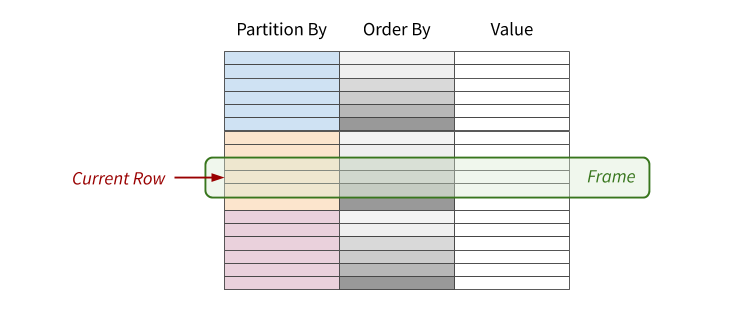
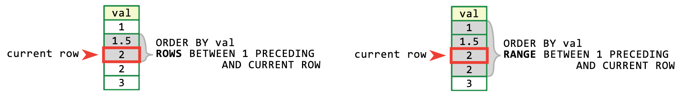
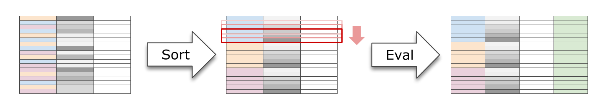
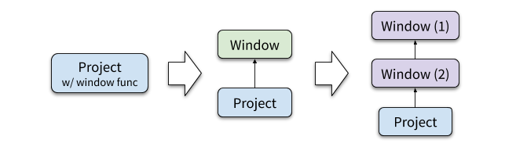
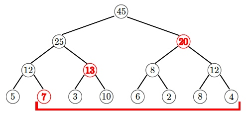

转载防止失联: https://ericfu.me/sql-window-function/

**窗口函数（Window Function）**是 SQL2003 标准中定义的一项新特性，并在 SQL2011、SQL2016 中又加以完善，添加了若干处拓展。窗口函数不同于我们熟悉的普通函数和聚合函数，它为每行数据进行一次计算：**输入多行（一个窗口）、返回一个值**。在报表等分析型查询中，窗口函数能优雅地表达某些需求，发挥不可替代的作用。

本文首先介绍窗口函数的定义及基本语法，之后将介绍在 DBMS 和大数据系统中是如何实现高效计算窗口函数的，包括窗口函数的优化、执行以及并行执行。


## 什么是窗口函数？

窗口函数出现在 SELECT 子句的表达式列表中，它最显著的特点就是 `OVER` 关键字。语法定义如下：

```
window_function (expression) OVER (
   [ PARTITION BY part_list ]
   [ ORDER BY order_list ]
   [ { ROWS | RANGE } BETWEEN frame_start AND frame_end ] )
```

其中包括以下可选项：

- **PARTITION BY** 表示将数据先按 `part_list` 进行分区
- **ORDER BY** 表示将各个分区内的数据按 `order_list` 进行排序

Figure 1. 窗口函数的基本概念

最后一项表示 Frame 的定义，即：当前窗口包含哪些数据？

- **ROWS** 选择前后几行，例如 `ROWS BETWEEN 3 PRECEDING AND 3 FOLLOWING` 表示往前 3 行到往后 3 行，一共 7 行数据（或小于 7 行，如果碰到了边界）
- **RANGE** 选择数据范围，例如 `RANGE BETWEEN 3 PRECEDING AND 3 FOLLOWING` 表示所有值在 [c−3,c+3][�−3,�+3] 这个范围内的行，c� 为当前行的值

Figure 2. Rows 窗口和 Range 窗口

逻辑语义上说，一个窗口函数的计算“过程”如下：

1. 按窗口定义，将所有输入数据分区、再排序（如果需要的话）
2. 对每一行数据，计算它的 Frame 范围
3. 将 Frame 内的行集合输入窗口函数，计算结果填入当前行

举个例子：

```
SELECT dealer_id, emp_name, sales,
       ROW_NUMBER() OVER (PARTITION BY dealer_id ORDER BY sales) AS rank,
       AVG(sales) OVER (PARTITION BY dealer_id) AS avgsales 
FROM sales
```

上述查询中，`rank` 列表示在当前经销商下，该雇员的销售排名；`avgsales` 表示当前经销商下所有雇员的平均销售额。查询结果如下：

```
+------------+-----------------+--------+------+---------------+
| dealer_id  | emp_name        | sales  | rank | avgsales      |
+------------+-----------------+--------+------+---------------+
| 1          | Raphael Hull    | 8227   | 1    | 14356         |
| 1          | Jack Salazar    | 9710   | 2    | 14356         |
| 1          | Ferris Brown    | 19745  | 3    | 14356         |
| 1          | Noel Meyer      | 19745  | 4    | 14356         |
| 2          | Haviva Montoya  | 9308   | 1    | 13924         |
| 2          | Beverly Lang    | 16233  | 2    | 13924         |
| 2          | Kameko French   | 16233  | 3    | 13924         |
| 3          | May Stout       | 9308   | 1    | 12368         |
| 3          | Abel Kim        | 12369  | 2    | 12368         |
| 3          | Ursa George     | 15427  | 3    | 12368         |
+------------+-----------------+--------+------+---------------+
```

> 注：语法中每个部分都是可选的：
>
> - 如果不指定 `PARTITION BY`，则不对数据进行分区；换句话说，所有数据看作同一个分区
> - 如果不指定 `ORDER BY`，则不对各分区做排序，通常用于那些顺序无关的窗口函数，例如 `SUM()`
> - 如果不指定 Frame 子句，则默认采用以下的 Frame 定义：
>   - 若不指定 `ORDER BY`，默认使用分区内所有行 `RANGE BETWEEN UNBOUNDED PRECEDING AND UNBOUNDED FOLLOWING`
>   - 若指定了 `ORDER BY`，默认使用分区内第一行到当前值 `RANGE BETWEEN UNBOUNDED PRECEDING AND CURRENT ROW`

最后，窗口函数可以分为以下 3 类：

- **聚合（Aggregate）**：`AVG()`, `COUNT()`, `MIN()`, `MAX()`, `SUM()`...
- **取值（Value）**：`FIRST_VALUE()`, `LAST_VALUE()`, `LEAD()`, `LAG()`...
- **排序（Ranking）**：`RANK()`, `DENSE_RANK()`, `ROW_NUMBER()`, `NTILE()`...

受限于篇幅，本文不去探讨各个窗口函数的含义，有兴趣的读者可以参考[这篇文档](https://drill.apache.org/docs/sql-window-functions-introduction/#types-of-window-functions)。

> 注：Frame 定义并非所有窗口函数都适用，比如 `ROW_NUMBER()`、`RANK()`、`LEAD()` 等。这些函数总是应用于整个分区，而非当前 Frame。

## 窗口函数 VS. 聚合函数

从*聚合*这个意义上出发，似乎窗口函数和 Group By 聚合函数都能做到同样的事情。但是，它们之间的相似点也仅限于此了！这其中的关键区别在于：**窗口函数仅仅只会将结果附加到当前的结果上，它不会对已有的行或列做任何修改**。而 Group By 的做法完全不同：对于各个 Group 它仅仅会保留一行聚合结果。

有的读者可能会问，加了窗口函数之后返回结果的顺序明显发生了变化，这不算一种修改吗？因为 SQL 及关系代数都是以 multi-set 为基础定义的，**结果集本身并没有顺序可言**，`ORDER BY` 仅仅是最终呈现结果的顺序。

另一方面，从逻辑语义上说，SELECT 语句的各个部分可以看作是按以下顺序“执行”的：

Figure 3. SQL 各部分的逻辑执行顺序

注意到窗口函数的求值仅仅位于 `ORDER BY` 之前，而位于 SQL 的绝大部分之后。这也和窗口函数**只附加、不修改**的语义是呼应的——结果集在此时已经确定好了，再依此计算窗口函数。

## 窗口函数的执行

窗口函数经典的执行方式分为**排序**和**函数求值**这 2 步。

Figure 4. 一个窗口函数的执行过程，通常分为排序和求值 2 步

窗口定义中的 `PARTITION BY` 和 `ORDER BY` 都很容易通过排序完成。例如，对于窗口 `PARTITION BY a, b ORDER BY c, d`，我们可以对输入数据按 (a,b,c,d)(�,�,�,�) 或 (b,a,c,d)(�,�,�,�) 做排序，之后数据就排列成 Figure 1 中那样了。

接下来考虑：**如何处理 Frame？**

- 对于整个分区的 Frame（例如 `RANGE BETWEEN UNBOUNDED PRECEDING AND UNBOUNDED FOLLOWING`），只要对整个分区计算一次即可，没什么好说的；
- 对于逐渐增长的 Frame（例如 `RANGE BETWEEN UNBOUNDED PRECEDING AND CURRENT ROW`），可以用 Aggregator 维护累加的状态，这也很容易实现；
- 对于滑动的 Frame（例如 `ROWS BETWEEN 3 PRECEDING AND 3 FOLLOWING`）相对困难一些。一种经典的做法是要求 Aggregator 不仅支持增加还支持删除（Removable），这可能比你想的要更复杂，例如考虑下 `MAX()` 的实现。

## 窗口函数的优化

对于窗口函数，优化器能做的优化有限。这里为了行文的完整性，仍然做一个简要的说明。

通常，我们首先会把窗口函数从 Project 中抽取出来，成为一个独立的算子称之为 Window。

Figure 5. 窗口函数的优化过程

有时候，一个 SELECT 语句中包含多个窗口函数，它们的窗口定义（`OVER` 子句）可能相同、也可能不同。显然，对于相同的窗口，完全没必要再做一次分区和排序，我们可以将它们合并成一个 Window 算子。

对于不同的窗口，最朴素地，我们可以将其全部分成不同的 Window，如上图所示。实际执行时，**每个 Window 都需要先做一次排序**，代价不小。

那是否可能利用一次排序计算多个窗口函数呢？某些情况下，这是可能的。例如本文例子中的 2 个窗口函数：

```
... ROW_NUMBER() OVER (PARTITION BY dealer_id ORDER BY sales) AS rank,
    AVG(sales) OVER (PARTITION BY dealer_id) AS avgsales ...
```

虽然这 2 个窗口并非完全一致，但是 `AVG(sales)` 不关心分区内的顺序，完全可以复用 `ROW_NUMBER()` 的窗口。[这篇论文](http://vldb.org/pvldb/vol5/p1244_yucao_vldb2012.pdf) 提供了一种启发式的算法，能尽可能利用能够复用的机会。

## 窗口函数的并行执行 *

现代 DBMS 大多支持并行执行。对于窗口函数，由于各个分区之间的计算完全不相关，我们可以很容易地将各个分区分派给不同的节点（线程），从而达到**分区间并行**。

但是，如果窗口函数只有一个全局分区（无 `PARTITION BY` 子句），或者分区数量很少、不足以充分并行时，怎么办呢？上文中我们提到的 Removable Aggregator 的技术显然无法继续使用了，它依赖于单个 Aggregator 的内部状态，很难有效地并行起来。

TUM 的[这篇论文](http://www.vldb.org/pvldb/vol8/p1058-leis.pdf)中提出使用**线段树**（Segment Tree）实现高效的**分区内并行**。[线段树](https://en.wikipedia.org/wiki/Segment_tree)是一个 N 叉树数据结构，每个节点包含当前节点下的部分聚合结果。

下图是一个使用二叉线段树计算 `SUM()` 的例子。例如下图中第三行的 1212，表示叶节点 5+75+7 的聚合结果；而它上方的 2525 表示叶节点 5+7+3+105+7+3+10 的聚合结果。

Figure 6. 使用线段树计算给定范围的总和

假设当前 Frame 是第 2 到第 8 行，即需要计算 7+3+10+...+47+3+10+...+4 区间之和。有了线段树以后，我们可以直接利用 7+13+207+13+20 （图中红色字体）计算出聚合结果。

线段树可以在 O(nlogn)�(�log⁡�) 时间内构造，并能在 O(logn)�(log⁡�) 时间内查询任意区间的聚合结果。更棒的是，不仅查询可以多线程并发互不干扰，而且线段树的构造过程也能被很好地并行起来。

## References

1. [Efficient Processing of Window Functions in Analytical SQL Queries - Leis, Viktor, et al. (VLDB'15)](http://www.vldb.org/pvldb/vol8/p1058-leis.pdf)
2. [Optimization of Analytic Window Functions - Cao, Yu, et al. (VLDB'12)](http://vldb.org/pvldb/vol5/p1244_yucao_vldb2012.pdf)
3. [SQL Window Functions Introduction - Apache Drill](https://drill.apache.org/docs/sql-window-functions-introduction/)
4. [PostgreSQL 11 Reestablishes Window Functions Leadership](https://modern-sql.com/blog/2019-02/postgresql-11)
5. [Window Functions in SQL Server](https://www.red-gate.com/simple-talk/sql/learn-sql-server/window-functions-in-sql-server/)

- **本文作者：** Eric Fu
- **本文链接：** https://ericfu.me/sql-window-function/
- **版权声明：** 本博客所有文章除特别声明外，均采用 [BY-NC-SA](https://creativecommons.org/licenses/by-nc-sa/4.0/) 许可协议。转载请注明出处！
